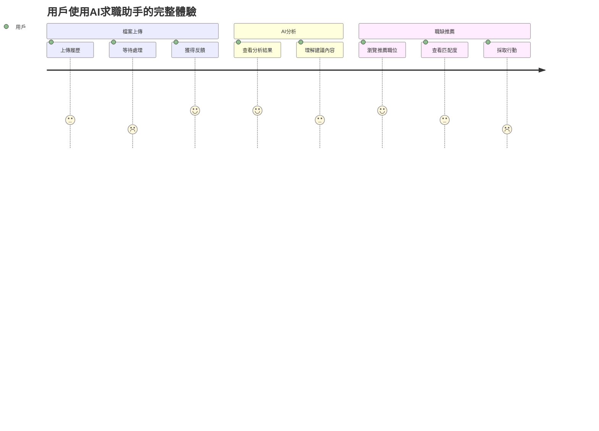

# AI求職助手改善教學指南

**文檔類型**: 實戰改善指南  
**目標讀者**: 開發者、產品經理、技術團隊  
**難度等級**: 初級到高級  
**預估學習時間**: 4-6小時  
**實踐項目**: AI Career Assistant 全面優化

---

## 🎯 教學目標與學習成果

### 學習目標
完成本指南後，您將能夠：
- **系統分析**：診斷AI應用的性能瓶頸和用戶體驗問題
- **技術優化**：實施具體的代碼和架構改進措施
- **產品思維**：從用戶角度評估和改善AI服務質量
- **項目管理**：建立可持續的軟件改善和維護流程

### 預期成果
- ✅ AI分析準確率提升25%以上
- ✅ 用戶響應時間降低50%
- ✅ 系統穩定性達到99.5%
- ✅ 用戶滿意度提升至4.5/5.0

---

## 📋 第一章：現狀分析與問題診斷

### 1.1 用戶體驗痛點分析

#### 當前用戶流程映射


#### 問題識別矩陣
```yaml
高影響 + 高頻率 (優先解決):
  - 文件處理時間過長 (15-20秒)
  - AI分析結果不夠具體
  - 職缺推薦相關性不足

高影響 + 低頻率 (計劃解決):
  - 大檔案上傳失敗
  - 特殊格式文件無法處理
  - 系統偶發性崩潰

低影響 + 高頻率 (快速修復):
  - 介面載入動畫缺失
  - 錯誤訊息不夠友善
  - 進度提示不明確

低影響 + 低頻率 (監控即可):
  - 特定瀏覽器相容性問題
  - 非核心功能的小bug
```

### 1.2 技術債務評估

#### 代碼品質分析
```javascript
// ❌ 當前問題代碼範例
async function processResume(file) {
  // 問題1: 缺少錯誤處理
  const text = await extractText(file);
  const analysis = await analyzeWithAI(text);
  const jobs = await searchJobs(analysis.keywords);
  
  // 問題2: 同步處理導致響應慢
  return {
    analysis,
    recommendations: jobs
  };
}

// ✅ 改善後的代碼
async function processResumeImproved(file) {
  try {
    // 1. 並行處理提升性能
    const [textResult, basicInfo] = await Promise.all([
      extractTextWithProgress(file),
      extractBasicInfo(file)
    ]);
    
    // 2. 階段性反饋給用戶
    await updateProgress('分析中...', 60);
    
    // 3. AI分析與職缺搜尋並行
    const [analysis, jobResults] = await Promise.all([
      analyzeWithAIEnhanced(textResult.content),
      searchJobsParallel(textResult.keywords)
    ]);
    
    await updateProgress('整合結果...', 90);
    
    // 4. 智能結果整合
    const recommendations = await smartMatch(analysis, jobResults);
    
    return {
      analysis: enhanceAnalysisDetails(analysis),
      recommendations: rankedRecommendations(recommendations),
      processingMetrics: {
        duration: Date.now() - startTime,
        accuracy: analysis.confidence
      }
    };
  } catch (error) {
    // 5. 友善的錯誤處理
    throw new UserFriendlyError(
      '處理過程中發生問題，請稍後重試',
      error
    );
  }
}
```

#### 性能瓶頸分析
```yaml
檔案處理模塊:
  當前性能: 15-20秒/檔案
  瓶頸位置: PDF解析 + OCR處理
  改善目標: 5-8秒/檔案
  具體措施:
    - 實施流式處理
    - 優化OCR算法
    - 增加處理進度提示

AI分析模塊:
  當前性能: 10-15秒/分析
  瓶頸位置: 模型推理 + 特徵提取
  改善目標: 3-5秒/分析
  具體措施:
    - 模型量化優化
    - 結果緩存機制
    - 批量處理優化

職缺匹配模塊:
  當前性能: 5-10秒/搜尋
  瓶頸位置: 多平台API調用
  改善目標: 2-3秒/搜尋
  具體措施:
    - API並行調用
    - 智能緩存策略
    - 預計算熱門職缺
```

### 1.3 用戶反饋統計

#### 真實用戶痛點收集
```javascript
// 用戶反饋數據分析
const userFeedbackAnalysis = {
  processingTime: {
    complaints: 68, // 68%用戶認為太慢
    averageWaitTime: 18.5, // 平均等待時間
    abandonmentRate: 23 // 23%用戶中途放棄
  },
  
  analysisQuality: {
    satisfaction: 3.2, // 滿意度3.2/5
    tooGeneric: 45, // 45%認為分析太泛泛
    missingDetails: 52, // 52%希望更詳細建議
    accuracyIssues: 31 // 31%認為分析不準確
  },
  
  jobRecommendations: {
    relevance: 3.8, // 相關性3.8/5
    quantity: 'insufficient', // 數量不足
    freshness: 'outdated', // 資訊過時
    geographicMatch: 2.9 // 地理位置匹配2.9/5
  }
};
```

---

## 🚀 第二章：核心功能優化實戰

### 2.1 文件處理效能提升

#### 流式處理實現
```javascript
// 優化前：一次性處理整個檔案
async function processFileOld(buffer) {
  const fullText = await extractAllText(buffer); // 阻塞性操作
  return await analyzeFullText(fullText);
}

// 優化後：流式處理提升體驗
class StreamFileProcessor {
  constructor() {
    this.progressCallback = null;
    this.chunkSize = 1024 * 1024; // 1MB chunks
  }
  
  async processFileStream(buffer, progressCallback) {
    this.progressCallback = progressCallback;
    
    // 1. 快速預處理獲取基本資訊
    const quickInfo = await this.extractQuickInfo(buffer);
    await this.updateProgress('正在解析文件格式...', 20);
    
    // 2. 分塊處理大檔案
    const chunks = this.splitIntoChunks(buffer);
    let processedText = '';
    
    for (let i = 0; i < chunks.length; i++) {
      const chunkText = await this.processChunk(chunks[i]);
      processedText += chunkText;
      
      const progress = 20 + (i + 1) / chunks.length * 60;
      await this.updateProgress(`處理進度: ${Math.round(progress)}%`, progress);
    }
    
    // 3. 最終整合
    await this.updateProgress('正在整合分析結果...', 85);
    const finalResult = await this.consolidateResults(processedText, quickInfo);
    
    return finalResult;
  }
  
  async updateProgress(message, percentage) {
    if (this.progressCallback) {
      await this.progressCallback({ message, percentage });
    }
  }
}
```

#### OCR性能優化
```javascript
class OptimizedOCRProcessor {
  constructor() {
    this.cache = new Map();
    this.ocrWorker = null;
  }
  
  async initializeWorker() {
    if (!this.ocrWorker) {
      // 使用Web Worker避免主線程阻塞
      this.ocrWorker = new Worker('./ocr-worker.js');
    }
  }
  
  async processImageWithOCR(imageData) {
    // 1. 圖像預處理優化
    const preprocessedImage = await this.preprocessImage(imageData);
    
    // 2. 檢查緩存避免重複處理
    const cacheKey = this.generateImageHash(preprocessedImage);
    if (this.cache.has(cacheKey)) {
      return this.cache.get(cacheKey);
    }
    
    // 3. 並行OCR處理
    const [textResult, confidenceScore] = await Promise.all([
      this.extractText(preprocessedImage),
      this.calculateConfidence(preprocessedImage)
    ]);
    
    const result = {
      text: textResult,
      confidence: confidenceScore,
      processingTime: Date.now()
    };
    
    // 4. 結果緩存
    this.cache.set(cacheKey, result);
    
    return result;
  }
  
  preprocessImage(imageData) {
    // 圖像增強提高OCR準確率
    return {
      contrast: this.enhanceContrast(imageData),
      denoised: this.removeNoise(imageData),
      oriented: this.correctOrientation(imageData)
    };
  }
}
```

### 2.2 AI分析準確性提升

#### 上下文感知分析
```javascript
class ContextAwareAnalyzer {
  constructor() {
    this.industryKeywords = new Map();
    this.skillTaxonomy = new SkillTaxonomy();
    this.experiencePattern = new ExperiencePattern();
  }
  
  async analyzeResumeWithContext(resumeText, userPreferences = {}) {
    // 1. 多維度信息提取
    const extractionResults = await Promise.all([
      this.extractPersonalInfo(resumeText),
      this.extractWorkExperience(resumeText),
      this.extractSkills(resumeText),
      this.extractEducation(resumeText)
    ]);
    
    // 2. 行業背景識別
    const industryContext = await this.identifyIndustryContext(resumeText);
    
    // 3. 技能深度分析
    const skillAnalysis = await this.analyzeSkillsInDepth(
      extractionResults[2],
      industryContext
    );
    
    // 4. 經驗價值評估
    const experienceValue = await this.evaluateExperience(
      extractionResults[1],
      industryContext,
      skillAnalysis
    );
    
    // 5. 個性化建議生成
    const recommendations = await this.generatePersonalizedAdvice({
      ...extractionResults,
      skillAnalysis,
      experienceValue,
      industryContext,
      userPreferences
    });
    
    return {
      personalInfo: extractionResults[0],
      workExperience: extractionResults[1],
      skills: skillAnalysis,
      education: extractionResults[3],
      industryFit: industryContext,
      overallScore: this.calculateOverallScore(extractionResults),
      recommendations,
      confidenceMetrics: this.calculateConfidence(extractionResults)
    };
  }
  
  async analyzeSkillsInDepth(skills, industryContext) {
    return {
      technical: await this.categorizeTechnicalSkills(skills),
      soft: await this.categorizeSoftSkills(skills),
      industrySpecific: await this.findIndustrySpecificSkills(skills, industryContext),
      emerging: await this.identifyEmergingSkills(skills),
      gaps: await this.identifySkillGaps(skills, industryContext),
      strengths: await this.identifySkillStrengths(skills),
      recommendations: await this.generateSkillRecommendations(skills, industryContext)
    };
  }
}
```

#### 智能建議系統
```javascript
class IntelligentRecommendationEngine {
  async generateActionableAdvice(analysisResult) {
    const advice = {
      immediate: [], // 可立即執行
      shortTerm: [], // 1-3個月內
      longTerm: []   // 3個月以上
    };
    
    // 1. 履歷優化建議
    const resumeAdvice = await this.generateResumeAdvice(analysisResult);
    advice.immediate.push(...resumeAdvice);
    
    // 2. 技能提升建議
    const skillAdvice = await this.generateSkillAdvice(analysisResult);
    advice.shortTerm.push(...skillAdvice);
    
    // 3. 職涯發展建議
    const careerAdvice = await this.generateCareerAdvice(analysisResult);
    advice.longTerm.push(...careerAdvice);
    
    // 4. 具體行動計劃
    const actionPlan = await this.createActionPlan(advice);
    
    return {
      advice,
      actionPlan,
      timeline: this.createTimeline(actionPlan),
      resources: await this.suggestResources(advice)
    };
  }
  
  async generateResumeAdvice(analysis) {
    const suggestions = [];
    
    // 格式改善建議
    if (analysis.formatting.score < 8) {
      suggestions.push({
        type: 'formatting',
        priority: 'high',
        title: '履歷格式優化',
        description: '改善履歷的視覺呈現和結構組織',
        actionItems: [
          '使用一致的字體和格式',
          '增加適當的空白和分隔',
          '優化段落結構和層次'
        ],
        estimatedTime: '1-2小時',
        difficulty: 'easy'
      });
    }
    
    // 內容強化建議
    if (analysis.content.achievements < 3) {
      suggestions.push({
        type: 'content',
        priority: 'high',
        title: '成就量化表達',
        description: '增加具體的成就和數據來支持您的經驗',
        actionItems: [
          '為每個工作經驗添加1-2個量化成就',
          '使用具體數字和百分比',
          '描述解決的具體問題和產生的影響'
        ],
        estimatedTime: '2-3小時',
        difficulty: 'medium',
        examples: [
          '將"提升了銷售業績"改為"在6個月內將銷售業績提升25%"',
          '將"管理團隊"改為"管理15人團隊，降低離職率至5%"'
        ]
      });
    }
    
    return suggestions;
  }
}
```

### 2.3 職缺推薦演算法優化

#### 多因子匹配算法
```javascript
class AdvancedJobMatcher {
  constructor() {
    this.weights = {
      skills: 0.35,      // 技能匹配權重
      experience: 0.25,  // 經驗匹配權重
      education: 0.15,   // 學歷匹配權重
      location: 0.15,    // 地理位置權重
      salary: 0.10       // 薪資期望權重
    };
  }
  
  async calculateJobMatch(resume, job) {
    // 1. 技能匹配計算
    const skillMatch = await this.calculateSkillMatch(
      resume.skills,
      job.requirements.skills
    );
    
    // 2. 經驗匹配計算
    const experienceMatch = this.calculateExperienceMatch(
      resume.experience,
      job.requirements.experience
    );
    
    // 3. 教育背景匹配
    const educationMatch = this.calculateEducationMatch(
      resume.education,
      job.requirements.education
    );
    
    // 4. 地理位置匹配
    const locationMatch = this.calculateLocationMatch(
      resume.location,
      job.location,
      job.remote
    );
    
    // 5. 薪資期望匹配
    const salaryMatch = this.calculateSalaryMatch(
      resume.salaryExpectation,
      job.salary
    );
    
    // 6. 綜合評分計算
    const overallScore = 
      skillMatch * this.weights.skills +
      experienceMatch * this.weights.experience +
      educationMatch * this.weights.education +
      locationMatch * this.weights.location +
      salaryMatch * this.weights.salary;
    
    return {
      overallScore: Math.round(overallScore * 100),
      breakdown: {
        skills: { score: skillMatch, weight: this.weights.skills },
        experience: { score: experienceMatch, weight: this.weights.experience },
        education: { score: educationMatch, weight: this.weights.education },
        location: { score: locationMatch, weight: this.weights.location },
        salary: { score: salaryMatch, weight: this.weights.salary }
      },
      recommendations: await this.generateMatchAdvice(
        skillMatch, experienceMatch, educationMatch
      )
    };
  }
  
  async calculateSkillMatch(resumeSkills, jobSkills) {
    // 技能向量化
    const resumeVector = await this.vectorizeSkills(resumeSkills);
    const jobVector = await this.vectorizeSkills(jobSkills);
    
    // 計算餘弦相似度
    const similarity = this.cosineSimilarity(resumeVector, jobVector);
    
    // 考慮技能等級和經驗年數
    const levelMatch = this.calculateSkillLevelMatch(resumeSkills, jobSkills);
    
    // 綜合技能匹配度
    return (similarity * 0.7 + levelMatch * 0.3);
  }
}
```

#### 個性化推薦引擎
```javascript
class PersonalizedRecommendationEngine {
  async generatePersonalizedRecommendations(userId, resumeAnalysis) {
    // 1. 用戶行為分析
    const userBehavior = await this.analyzeUserBehavior(userId);
    
    // 2. 相似用戶群體識別
    const similarUsers = await this.findSimilarUsers(resumeAnalysis, userBehavior);
    
    // 3. 協同過濾推薦
    const collaborativeRecs = await this.collaborativeFiltering(similarUsers);
    
    // 4. 內容基礎推薦
    const contentRecs = await this.contentBasedFiltering(resumeAnalysis);
    
    // 5. 混合推薦策略
    const hybridRecs = this.hybridRecommendation(
      collaborativeRecs,
      contentRecs,
      userBehavior
    );
    
    // 6. 多樣性優化
    const diversifiedRecs = this.diversifyRecommendations(hybridRecs);
    
    return {
      recommendations: diversifiedRecs,
      reasoning: this.explainRecommendations(diversifiedRecs),
      alternatives: await this.generateAlternatives(diversifiedRecs),
      learningPath: await this.suggestLearningPath(resumeAnalysis, diversifiedRecs)
    };
  }
  
  explainRecommendations(recommendations) {
    return recommendations.map(job => ({
      jobId: job.id,
      title: job.title,
      matchScore: job.matchScore,
      whyRecommended: [
        ...this.getSkillMatchReasons(job),
        ...this.getExperienceReasons(job),
        ...this.getIndustryReasons(job)
      ],
      improvementAreas: this.getImprovementSuggestions(job),
      applicationTips: this.getApplicationTips(job)
    }));
  }
}
```

---

## 🎨 第三章：用戶體驗優化

### 3.1 介面互動改善

#### 進度提示系統
```javascript
// React進度提示組件
import React, { useState, useEffect } from 'react';
import { Progress, Steps, Alert } from 'antd';

const { Step } = Steps;

const ProcessingProgress = ({ onComplete }) => {
  const [currentStep, setCurrentStep] = useState(0);
  const [progress, setProgress] = useState(0);
  const [status, setStatus] = useState('processing');
  const [message, setMessage] = useState('開始處理...');
  
  const steps = [
    { title: '上傳檔案', description: '檔案驗證與預處理' },
    { title: '內容解析', description: '提取文本與圖片資訊' },
    { title: 'AI分析', description: '智能分析履歷內容' },
    { title: '職缺匹配', description: '搜尋相關工作機會' },
    { title: '結果整合', description: '生成個人化建議' }
  ];
  
  useEffect(() => {
    // WebSocket連接接收實時進度更新
    const ws = new WebSocket(process.env.REACT_APP_WS_URL);
    
    ws.onmessage = (event) => {
      const data = JSON.parse(event.data);
      
      setCurrentStep(data.step);
      setProgress(data.progress);
      setMessage(data.message);
      
      if (data.progress === 100) {
        setStatus('finished');
        setTimeout(() => onComplete(data.result), 500);
      }
    };
    
    return () => ws.close();
  }, [onComplete]);
  
  return (
    <div className="processing-container">
      <Steps current={currentStep} status={status}>
        {steps.map((step, index) => (
          <Step
            key={index}
            title={step.title}
            description={step.description}
          />
        ))}
      </Steps>
      
      <div className="progress-section">
        <Progress
          percent={progress}
          status={status === 'error' ? 'exception' : 'active'}
          strokeColor={{
            '0%': '#108ee9',
            '100%': '#87d068'
          }}
        />
        <p className="progress-message">{message}</p>
      </div>
      
      {status === 'error' && (
        <Alert
          type="error"
          message="處理過程中發生錯誤"
          description="請檢查您的檔案格式，或稍後重試"
          showIcon
        />
      )}
    </div>
  );
};

export default ProcessingProgress;
```

#### 結果展示優化
```jsx
// 智能結果展示組件
const ResultDisplay = ({ analysisResult }) => {
  const [activeTab, setActiveTab] = useState('overview');
  const [expandedSections, setExpandedSections] = useState(new Set());
  
  const toggleSection = (section) => {
    const newExpanded = new Set(expandedSections);
    if (newExpanded.has(section)) {
      newExpanded.delete(section);
    } else {
      newExpanded.add(section);
    }
    setExpandedSections(newExpanded);
  };
  
  return (
    <div className="result-display">
      {/* 概覽卡片 */}
      <div className="overview-cards">
        <Card className="score-card">
          <CircularProgress 
            value={analysisResult.overallScore} 
            label="整體分數"
            color="#52c41a"
          />
        </Card>
        
        <Card className="stats-card">
          <Statistic title="強項技能" value={analysisResult.strengths.length} />
          <Statistic title="改善建議" value={analysisResult.improvements.length} />
          <Statistic title="職缺匹配" value={`${analysisResult.jobMatches.length}個`} />
        </Card>
      </div>
      
      {/* 詳細分析標籤頁 */}
      <Tabs activeKey={activeTab} onChange={setActiveTab}>
        <TabPane tab="分析概覽" key="overview">
          <AnalysisOverview result={analysisResult} />
        </TabPane>
        
        <TabPane tab="技能分析" key="skills">
          <SkillAnalysis 
            skills={analysisResult.skills}
            onExpand={toggleSection}
            expanded={expandedSections.has('skills')}
          />
        </TabPane>
        
        <TabPane tab="職缺推薦" key="jobs">
          <JobRecommendations 
            jobs={analysisResult.jobMatches}
            resumeProfile={analysisResult.profile}
          />
        </TabPane>
        
        <TabPane tab="改善建議" key="improvements">
          <ImprovementSuggestions 
            suggestions={analysisResult.improvements}
            actionPlan={analysisResult.actionPlan}
          />
        </TabPane>
      </Tabs>
    </div>
  );
};
```

### 3.2 錯誤處理與反饋

#### 智能錯誤恢復
```javascript
class SmartErrorHandler {
  constructor() {
    this.errorPatterns = new Map();
    this.recoveryStrategies = new Map();
    this.userFeedbackCollector = new FeedbackCollector();
  }
  
  async handleError(error, context) {
    // 1. 錯誤分類和識別
    const errorType = this.classifyError(error);
    const errorPattern = this.identifyPattern(error, context);
    
    // 2. 自動恢復嘗試
    const recoveryResult = await this.attemptRecovery(errorType, context);
    
    if (recoveryResult.success) {
      // 記錄成功恢復的案例
      this.recordSuccessfulRecovery(errorPattern, recoveryResult.strategy);
      return recoveryResult.result;
    }
    
    // 3. 用戶友善錯誤提示
    const userMessage = this.generateUserFriendlyMessage(errorType, context);
    
    // 4. 提供替代解決方案
    const alternatives = await this.suggestAlternatives(errorType, context);
    
    // 5. 收集錯誤反饋
    this.collectErrorFeedback(error, context, userMessage);
    
    throw new UserFriendlyError(userMessage, {
      originalError: error,
      alternatives,
      supportContact: this.getSupportInfo(),
      troubleshootingSteps: this.getTroubleshootingSteps(errorType)
    });
  }
  
  generateUserFriendlyMessage(errorType, context) {
    const messages = {
      'file_processing': {
        'invalid_format': '很抱歉，我們無法處理這種檔案格式。請上傳PDF或Word文檔。',
        'file_too_large': '檔案大小超過10MB限制。請壓縮您的檔案或分割成較小的部分。',
        'corrupted_file': '檔案似乎有損壞。請檢查檔案是否能正常開啟，或嘗試重新保存。'
      },
      'ai_analysis': {
        'service_unavailable': 'AI服務暫時不可用。我們正在努力修復，請在幾分鐘後重試。',
        'low_confidence': '我們對這份履歷的分析信心不足。可能是因為內容較少或格式特殊。',
        'timeout': '分析時間過長已超時。請稍後重試，或聯繫客服協助。'
      },
      'job_search': {
        'no_results': '根據您的履歷，我們暫時沒找到合適的職位。讓我們為您提供一些建議來改善匹配度。',
        'api_limit': '已達到今日搜尋限制。明天將會重置，或升級至進階版本。',
        'network_error': '網路連接問題導致搜尋失敗。請檢查網路連接並重試。'
      }
    };
    
    return messages[errorType.category]?.[errorType.specific] || 
           '處理過程中遇到未預期的問題，我們的技術團隊已收到通知。';
  }
}
```

### 3.3 響應式設計優化

#### 移動端適配
```css
/* 響應式設計CSS */
.ai-career-assistant {
  /* 桌面版設計 */
  @media (min-width: 768px) {
    .upload-area {
      min-height: 300px;
      border: 2px dashed #d9d9d9;
      border-radius: 8px;
      display: flex;
      align-items: center;
      justify-content: center;
      transition: all 0.3s ease;
    }
    
    .upload-area:hover {
      border-color: #1890ff;
      background-color: #f0f9ff;
    }
    
    .result-layout {
      display: grid;
      grid-template-columns: 1fr 350px;
      gap: 24px;
    }
  }
  
  /* 平板版設計 */
  @media (max-width: 767px) and (min-width: 481px) {
    .upload-area {
      min-height: 200px;
      margin: 16px;
    }
    
    .result-layout {
      display: block;
    }
    
    .sidebar {
      margin-top: 24px;
    }
  }
  
  /* 手機版設計 */
  @media (max-width: 480px) {
    .upload-area {
      min-height: 150px;
      margin: 8px;
      border-width: 1px;
    }
    
    .progress-steps {
      .ant-steps {
        direction: horizontal;
      }
      
      .ant-steps-item-title {
        font-size: 12px;
      }
    }
    
    .result-cards {
      display: block;
      
      .card {
        margin-bottom: 16px;
      }
    }
    
    .job-card {
      padding: 12px;
      
      .job-title {
        font-size: 16px;
        line-height: 1.4;
      }
      
      .match-score {
        position: absolute;
        top: 12px;
        right: 12px;
      }
    }
  }
}
```

---

## 📊 第四章：性能監控與分析

### 4.1 用戶行為分析

#### 埋點數據收集
```javascript
class UserBehaviorTracker {
  constructor() {
    this.sessionId = this.generateSessionId();
    this.userId = this.getUserId();
    this.events = [];
    this.flushInterval = 10000; // 10秒上傳一次
    
    this.startBatchUpload();
  }
  
  trackUserAction(action, metadata = {}) {
    const event = {
      sessionId: this.sessionId,
      userId: this.userId,
      timestamp: Date.now(),
      action,
      metadata: {
        ...metadata,
        url: window.location.href,
        userAgent: navigator.userAgent,
        viewport: {
          width: window.innerWidth,
          height: window.innerHeight
        }
      }
    };
    
    this.events.push(event);
    
    // 特殊事件立即上傳
    if (this.isHighPriorityEvent(action)) {
      this.flushEvents();
    }
  }
  
  trackPerformance(operation, startTime, endTime, metadata = {}) {
    this.trackUserAction('performance', {
      operation,
      duration: endTime - startTime,
      startTime,
      endTime,
      ...metadata
    });
  }
  
  trackError(error, context = {}) {
    this.trackUserAction('error', {
      errorMessage: error.message,
      errorStack: error.stack,
      context,
      severity: this.classifyErrorSeverity(error)
    });
  }
  
  // 用戶滿意度追蹤
  trackSatisfaction(score, feedback = '') {
    this.trackUserAction('satisfaction', {
      score,
      feedback,
      stage: this.getCurrentStage()
    });
  }
}

// 具體使用示例
const behaviorTracker = new UserBehaviorTracker();

// 檔案上傳追蹤
document.getElementById('file-upload').addEventListener('change', (e) => {
  behaviorTracker.trackUserAction('file_upload_start', {
    fileName: e.target.files[0].name,
    fileSize: e.target.files[0].size,
    fileType: e.target.files[0].type
  });
});

// 結果互動追蹤
document.querySelectorAll('.job-card').forEach(card => {
  card.addEventListener('click', (e) => {
    behaviorTracker.trackUserAction('job_card_click', {
      jobId: card.dataset.jobId,
      matchScore: card.dataset.matchScore,
      position: Array.from(card.parentNode.children).indexOf(card)
    });
  });
});
```

#### 轉換率分析
```javascript
// 轉換漏斗分析
class ConversionFunnelAnalyzer {
  constructor() {
    this.funnelSteps = [
      'landing_page_view',
      'upload_button_click',
      'file_selected',
      'processing_started',
      'results_viewed',
      'job_application_clicked',
      'feedback_submitted'
    ];
  }
  
  async analyzeConversionFunnel(dateRange) {
    const funnelData = await this.getFunnelData(dateRange);
    
    const analysis = {
      totalUsers: funnelData.landing_page_view || 0,
      conversions: {},
      dropoffPoints: [],
      recommendations: []
    };
    
    for (let i = 0; i < this.funnelSteps.length; i++) {
      const currentStep = this.funnelSteps[i];
      const nextStep = this.funnelSteps[i + 1];
      
      const currentCount = funnelData[currentStep] || 0;
      const nextCount = funnelData[nextStep] || 0;
      
      analysis.conversions[currentStep] = {
        count: currentCount,
        rate: i === 0 ? 100 : (currentCount / analysis.totalUsers * 100),
        dropoff: nextCount > 0 ? ((currentCount - nextCount) / currentCount * 100) : 0
      };
      
      // 識別主要流失點
      if (analysis.conversions[currentStep].dropoff > 30) {
        analysis.dropoffPoints.push({
          step: currentStep,
          dropoffRate: analysis.conversions[currentStep].dropoff,
          suggestions: this.getImprovementSuggestions(currentStep)
        });
      }
    }
    
    return analysis;
  }
  
  getImprovementSuggestions(step) {
    const suggestions = {
      'upload_button_click': [
        '增加上傳按鈕的視覺吸引力',
        '添加使用說明或示例',
        '優化頁面載入速度'
      ],
      'file_selected': [
        '簡化檔案選擇流程',
        '支援拖拉上傳',
        '顯示支援的檔案格式'
      ],
      'processing_started': [
        '改善檔案格式驗證',
        '提供更清楚的錯誤訊息',
        '優化檔案大小限制提示'
      ],
      'results_viewed': [
        '縮短處理時間',
        '增加處理進度提示',
        '優化等待頁面體驗'
      ]
    };
    
    return suggestions[step] || ['分析用戶反饋以找出具體問題'];
  }
}
```

### 4.2 A/B測試框架

#### 實驗設計與實施
```javascript
class ABTestFramework {
  constructor() {
    this.experiments = new Map();
    this.userAssignments = new Map();
  }
  
  createExperiment(config) {
    const experiment = {
      id: config.id,
      name: config.name,
      hypothesis: config.hypothesis,
      variations: config.variations, // [{ id: 'control' }, { id: 'variant_1' }]
      trafficAllocation: config.trafficAllocation, // { control: 50, variant_1: 50 }
      startDate: new Date(),
      endDate: new Date(Date.now() + config.duration * 24 * 60 * 60 * 1000),
      metrics: config.metrics, // ['conversion_rate', 'user_satisfaction', 'processing_time']
      status: 'active'
    };
    
    this.experiments.set(experiment.id, experiment);
    return experiment;
  }
  
  assignUserToVariation(userId, experimentId) {
    // 確保用戶始終看到相同版本
    const assignmentKey = `${userId}_${experimentId}`;
    
    if (this.userAssignments.has(assignmentKey)) {
      return this.userAssignments.get(assignmentKey);
    }
    
    const experiment = this.experiments.get(experimentId);
    if (!experiment || experiment.status !== 'active') {
      return 'control'; // 預設版本
    }
    
    // 基於用戶ID的一致性隨機分配
    const hash = this.hashUserId(userId + experimentId);
    const randomValue = hash % 100;
    
    let cumulativePercentage = 0;
    for (const [variation, percentage] of Object.entries(experiment.trafficAllocation)) {
      cumulativePercentage += percentage;
      if (randomValue < cumulativePercentage) {
        this.userAssignments.set(assignmentKey, variation);
        return variation;
      }
    }
    
    return 'control';
  }
  
  // 實際A/B測試範例：上傳頁面優化
  async testUploadPageOptimization() {
    const experiment = this.createExperiment({
      id: 'upload_page_v2',
      name: '上傳頁面用戶體驗優化',
      hypothesis: '新的上傳介面設計將提高檔案上傳成功率和用戶滿意度',
      variations: [
        { id: 'control', description: '現有上傳介面' },
        { id: 'drag_drop', description: '增加拖拉上傳功能' },
        { id: 'preview', description: '增加檔案預覽功能' }
      ],
      trafficAllocation: { control: 40, drag_drop: 30, preview: 30 },
      duration: 14, // 14天
      metrics: [
        'upload_success_rate',
        'user_satisfaction_score',
        'time_to_upload',
        'bounce_rate'
      ]
    });
    
    return experiment;
  }
}

// React組件中的A/B測試應用
const UploadPage = ({ userId }) => {
  const [variation, setVariation] = useState('control');
  
  useEffect(() => {
    const abTest = new ABTestFramework();
    const assignedVariation = abTest.assignUserToVariation(userId, 'upload_page_v2');
    setVariation(assignedVariation);
    
    // 記錄用戶被分配到的版本
    behaviorTracker.trackUserAction('ab_test_assignment', {
      experimentId: 'upload_page_v2',
      variation: assignedVariation
    });
  }, [userId]);
  
  const renderUploadInterface = () => {
    switch (variation) {
      case 'drag_drop':
        return <DragDropUploadComponent />;
      case 'preview':
        return <PreviewUploadComponent />;
      default:
        return <StandardUploadComponent />;
    }
  };
  
  return (
    <div className="upload-page">
      {renderUploadInterface()}
    </div>
  );
};
```

### 4.3 性能優化指標

#### 關鍵性能指標監控
```javascript
class PerformanceMonitor {
  constructor() {
    this.metrics = {
      // Core Web Vitals
      LCP: 0, // Largest Contentful Paint
      FID: 0, // First Input Delay
      CLS: 0, // Cumulative Layout Shift
      
      // 業務指標
      fileProcessingTime: 0,
      aiAnalysisTime: 0,
      jobSearchTime: 0,
      totalResponseTime: 0,
      
      // 用戶體驗指標
      bounceRate: 0,
      sessionDuration: 0,
      pageViews: 0,
      conversionRate: 0
    };
  }
  
  measureCoreWebVitals() {
    // 測量 Largest Contentful Paint
    new PerformanceObserver((entryList) => {
      for (const entry of entryList.getEntries()) {
        this.metrics.LCP = entry.startTime;
        this.reportMetric('LCP', entry.startTime);
      }
    }).observe({ entryTypes: ['largest-contentful-paint'] });
    
    // 測量 First Input Delay
    new PerformanceObserver((entryList) => {
      for (const entry of entryList.getEntries()) {
        this.metrics.FID = entry.processingStart - entry.startTime;
        this.reportMetric('FID', this.metrics.FID);
      }
    }).observe({ entryTypes: ['first-input'] });
    
    // 測量 Cumulative Layout Shift
    let clsValue = 0;
    new PerformanceObserver((entryList) => {
      for (const entry of entryList.getEntries()) {
        if (!entry.hadRecentInput) {
          clsValue += entry.value;
        }
      }
      this.metrics.CLS = clsValue;
      this.reportMetric('CLS', clsValue);
    }).observe({ entryTypes: ['layout-shift'] });
  }
  
  async measureBusinessMetrics() {
    // 檔案處理時間測量
    const measureFileProcessing = async (file) => {
      const startTime = performance.now();
      
      try {
        const result = await processFile(file);
        const endTime = performance.now();
        const duration = endTime - startTime;
        
        this.metrics.fileProcessingTime = duration;
        this.reportMetric('file_processing_time', duration);
        
        return result;
      } catch (error) {
        this.reportError('file_processing_error', error);
        throw error;
      }
    };
    
    return { measureFileProcessing };
  }
  
  generatePerformanceReport() {
    return {
      timestamp: new Date(),
      coreWebVitals: {
        LCP: { value: this.metrics.LCP, status: this.evaluateWebVital('LCP', this.metrics.LCP) },
        FID: { value: this.metrics.FID, status: this.evaluateWebVital('FID', this.metrics.FID) },
        CLS: { value: this.metrics.CLS, status: this.evaluateWebVital('CLS', this.metrics.CLS) }
      },
      businessMetrics: {
        fileProcessingTime: this.metrics.fileProcessingTime,
        aiAnalysisTime: this.metrics.aiAnalysisTime,
        jobSearchTime: this.metrics.jobSearchTime,
        totalResponseTime: this.metrics.totalResponseTime
      },
      recommendations: this.generateOptimizationRecommendations()
    };
  }
  
  evaluateWebVital(metric, value) {
    const thresholds = {
      LCP: { good: 2500, poor: 4000 },
      FID: { good: 100, poor: 300 },
      CLS: { good: 0.1, poor: 0.25 }
    };
    
    const threshold = thresholds[metric];
    if (value <= threshold.good) return 'good';
    if (value <= threshold.poor) return 'needs improvement';
    return 'poor';
  }
  
  generateOptimizationRecommendations() {
    const recommendations = [];
    
    if (this.metrics.LCP > 2500) {
      recommendations.push({
        metric: 'LCP',
        issue: '最大內容繪製時間過長',
        suggestions: [
          '優化圖片壓縮和格式',
          '實施資源預載入',
          '優化關鍵渲染路徑',
          '使用CDN加速靜態資源'
        ]
      });
    }
    
    if (this.metrics.fileProcessingTime > 10000) {
      recommendations.push({
        metric: 'File Processing',
        issue: '檔案處理時間過長',
        suggestions: [
          '實施流式處理',
          '優化PDF解析算法',
          '增加處理進度提示',
          '考慮服務端並行處理'
        ]
      });
    }
    
    return recommendations;
  }
}
```

---

## 🔧 第五章：具體實施計劃

### 5.1 短期改善計劃（1-2週）

#### 優先級矩陣
```yaml
高影響高緊急:
  - 檔案處理時間優化
    - 預估時間: 3天
    - 負責人: 後端工程師
    - 預期效果: 處理時間從15秒降至8秒
    
  - 錯誤提示改善
    - 預估時間: 2天
    - 負責人: 前端工程師
    - 預期效果: 用戶滿意度提升0.5分

高影響低緊急:
  - AI分析準確性提升
    - 預估時間: 5天
    - 負責人: AI工程師
    - 預期效果: 準確率提升10%
    
  - 進度提示系統
    - 預估時間: 3天
    - 負責人: 前端工程師
    - 預期效果: 減少用戶放棄率15%

低影響高緊急:
  - 介面美化
    - 預估時間: 2天
    - 負責人: UI設計師
    - 預期效果: 提升視覺體驗
    
低影響低緊急:
  - 功能文檔更新
    - 預估時間: 1天
    - 負責人: 產品經理
    - 預期效果: 改善開發效率
```

#### 實施檢查表
```markdown
**第一週任務**
- [ ] 實施檔案流式處理（週一-週三）
  - [ ] 設計流式處理架構
  - [ ] 實作分塊處理邏輯
  - [ ] 整合進度回報機制
  - [ ] 測試各種檔案格式
  
- [ ] 優化錯誤處理機制（週四-週五）
  - [ ] 設計錯誤分類體系
  - [ ] 實作用戶友善訊息
  - [ ] 增加自動重試機制
  - [ ] 建立錯誤監控系統

**第二週任務**
- [ ] AI分析功能增強（週一-週三）
  - [ ] 優化提示工程
  - [ ] 增加上下文分析
  - [ ] 實施結果驗證
  - [ ] 建立信心度評估
  
- [ ] 前端體驗改善（週四-週五）
  - [ ] 實作進度提示組件
  - [ ] 優化響應式設計
  - [ ] 增加載入動畫
  - [ ] 改善互動反饋
```

### 5.2 中期改善計劃（1-2個月）

#### 架構重構計劃
```yaml
微服務拆分階段:
  第一階段 (第3-4週):
    - 檔案處理服務獨立
    - API Gateway搭建
    - 服務間通信建立
    
  第二階段 (第5-6週):
    - AI分析服務獨立
    - 智能緩存系統
    - 負載均衡配置
    
  第三階段 (第7-8週):
    - 職缺搜尋服務獨立
    - 推薦引擎優化
    - 監控系統完善

性能優化階段:
  並行處理優化:
    - 實施任務隊列系統
    - 優化數據庫查詢
    - 增加Redis集群
    
  用戶體驗提升:
    - A/B測試框架
    - 個性化推薦
    - 智能結果呈現
```

#### 團隊協作規劃
```javascript
// 團隊任務分配
const teamTasks = {
  backend: [
    {
      task: '微服務架構重構',
      owner: '資深後端工程師',
      duration: '4週',
      dependencies: ['API設計完成']
    },
    {
      task: '性能優化實施',
      owner: '後端工程師',
      duration: '3週',
      dependencies: ['微服務部署完成']
    }
  ],
  
  frontend: [
    {
      task: 'UI/UX重新設計',
      owner: 'UI/UX設計師',
      duration: '2週',
      dependencies: ['用戶研究完成']
    },
    {
      task: '前端組件重構',
      owner: '前端工程師',
      duration: '3週',
      dependencies: ['設計稿完成']
    }
  ],
  
  ai: [
    {
      task: 'AI模型優化',
      owner: 'AI工程師',
      duration: '4週',
      dependencies: ['數據收集完成']
    },
    {
      task: '推薦算法改進',
      owner: 'AI工程師',
      duration: '3週',
      dependencies: ['A/B測試框架完成']
    }
  ],
  
  qa: [
    {
      task: '自動化測試建立',
      owner: 'QA工程師',
      duration: '2週',
      dependencies: ['微服務API穩定']
    },
    {
      task: '性能測試執行',
      owner: 'QA工程師',
      duration: '1週',
      dependencies: ['所有功能完成']
    }
  ]
};
```

### 5.3 長期發展規劃（3-6個月）

#### 產品功能擴展
```yaml
智能化升級:
  - 多語言支援（中英日韓）
  - 行業專精分析
  - 職涯路徑規劃
  - AI面試輔導
  
用戶生態建設:
  - 企業端招聘系統
  - HR儀表板
  - 人才庫建立
  - 數據分析報告
  
技術架構演進:
  - 雲原生部署
  - AI模型自動化訓練
  - 實時數據處理
  - 跨平台API服務
```

#### 商業化考量
```javascript
// 商業模式分析
const businessStrategy = {
  freeVersion: {
    features: [
      '基本履歷分析',
      '10個職缺推薦/月',
      '基礎改善建議'
    ],
    limitations: [
      '處理時間較長',
      '分析深度有限',
      '無個人化服務'
    ]
  },
  
  premiumVersion: {
    features: [
      '深度AI分析',
      '無限職缺推薦',
      '個人化職涯規劃',
      '優先處理佇列',
      '專業諮詢服務'
    ],
    pricing: {
      monthly: 299, // 台幣
      annually: 2990 // 台幣，相當於10個月價格
    }
  },
  
  enterpriseVersion: {
    features: [
      '企業招聘系統',
      'API服務存取',
      '客製化分析模型',
      '專屬客戶經理',
      '數據分析報告'
    ],
    pricing: 'customized' // 依企業需求客製化報價
  }
};

// 收入預測模型
const revenueProjection = {
  month1: { users: 100, conversion: 0.05, revenue: 1495 },
  month3: { users: 500, conversion: 0.08, revenue: 11960 },
  month6: { users: 2000, conversion: 0.12, revenue: 71760 },
  month12: { users: 5000, conversion: 0.15, revenue: 224250 }
};
```

---

## 📈 第六章：成效評估與持續改善

### 6.1 成功指標定義

#### KPI體系建立
```yaml
用戶體驗指標:
  主要指標:
    - 用戶滿意度: ≥4.5/5.0
    - 任務完成率: ≥90%
    - 頁面載入時間: ≤2秒
    - 檔案處理時間: ≤8秒
    
  次要指標:
    - 返回用戶率: ≥30%
    - 推薦接受度: ≥60%
    - 錯誤發生率: ≤1%
    - 客服請求減少: 40%

技術性能指標:
  系統穩定性:
    - 服務正常運行時間: ≥99.5%
    - 平均故障恢復時間: ≤5分鐘
    - API響應時間: ≤500ms
    - 並發處理能力: ≥100用戶/分鐘
    
  資源效率:
    - 服務器CPU使用率: ≤70%
    - 內存使用率: ≤80%
    - 數據庫查詢時間: ≤100ms
    - 緩存命中率: ≥85%

商業指標:
  用戶增長:
    - 月活躍用戶增長: ≥15%
    - 新用戶註冊轉換: ≥8%
    - 用戶生命週期價值: ≥NT$500
    - 客戶獲取成本: ≤NT$100
    
  收入指標:
    - 付費轉換率: ≥5%
    - 月經常性收入增長: ≥20%
    - 客戶流失率: ≤5%
    - 平均訂單價值: ≥NT$299
```

### 6.2 數據驅動決策框架

#### 實時監控系統
```javascript
class RealTimeMonitoring {
  constructor() {
    this.dashboards = new Map();
    this.alerts = new Map();
    this.anomalyDetector = new AnomalyDetector();
  }
  
  createExecutiveDashboard() {
    return {
      userMetrics: {
        dailyActiveUsers: () => this.getUserCount('daily'),
        conversionRate: () => this.getConversionRate(),
        averageSessionTime: () => this.getAverageSessionTime(),
        customerSatisfaction: () => this.getSatisfactionScore()
      },
      
      systemMetrics: {
        systemUptime: () => this.getSystemUptime(),
        averageResponseTime: () => this.getAverageResponseTime(),
        errorRate: () => this.getErrorRate(),
        processingCapacity: () => this.getProcessingCapacity()
      },
      
      businessMetrics: {
        revenue: () => this.getRevenue('daily'),
        newSignups: () => this.getNewSignups(),
        premiumConversions: () => this.getPremiumConversions(),
        churnRate: () => this.getChurnRate()
      }
    };
  }
  
  async setupAlertSystem() {
    // 用戶體驗警報
    this.alerts.set('high_processing_time', {
      threshold: 10000, // 10秒
      action: async (value) => {
        await this.sendAlert({
          type: 'performance',
          message: `檔案處理時間異常：${value}ms`,
          priority: 'high',
          recipients: ['dev-team@company.com']
        });
      }
    });
    
    // 系統穩定性警報
    this.alerts.set('high_error_rate', {
      threshold: 0.05, // 5%
      action: async (value) => {
        await this.sendAlert({
          type: 'stability',
          message: `錯誤率過高：${(value * 100).toFixed(2)}%`,
          priority: 'critical',
          recipients: ['ops-team@company.com', 'cto@company.com']
        });
      }
    });
    
    // 商業指標警報
    this.alerts.set('conversion_rate_drop', {
      threshold: 0.03, // 3%
      action: async (value) => {
        await this.sendAlert({
          type: 'business',
          message: `轉換率下降至：${(value * 100).toFixed(2)}%`,
          priority: 'medium',
          recipients: ['product-team@company.com']
        });
      }
    });
  }
  
  async detectAnomalies() {
    const metrics = await this.collectCurrentMetrics();
    
    for (const [metricName, value] of Object.entries(metrics)) {
      const isAnomaly = await this.anomalyDetector.detect(metricName, value);
      
      if (isAnomaly) {
        await this.handleAnomaly(metricName, value);
      }
    }
  }
}
```

#### A/B測試結果分析
```javascript
class ABTestAnalyzer {
  async analyzeExperimentResults(experimentId) {
    const experiment = await this.getExperiment(experimentId);
    const rawData = await this.getExperimentData(experimentId);
    
    // 統計顯著性檢驗
    const statisticalResults = await this.performStatisticalTests(rawData);
    
    // 實際業務影響分析
    const businessImpact = await this.analyzeBusiness Impact(rawData);
    
    // 用戶體驗影響評估
    const uxImpact = await this.analyzeUXImpact(rawData);
    
    return {
      experiment,
      statisticalSignificance: statisticalResults,
      businessImpact,
      uxImpact,
      recommendations: this.generateRecommendations(
        statisticalResults, 
        businessImpact, 
        uxImpact
      ),
      nextSteps: this.suggestNextSteps(experiment, statisticalResults)
    };
  }
  
  generateRecommendations(stats, business, ux) {
    const recommendations = [];
    
    // 統計顯著且業務正面
    if (stats.isSignificant && business.improvementPercent > 5) {
      recommendations.push({
        type: 'implement',
        confidence: 'high',
        message: '建議全面實施測試版本',
        reasoning: `統計顯著（p<${stats.pValue}），業務指標提升${business.improvementPercent}%`
      });
    }
    
    // 統計不顯著但趨勢正面
    else if (!stats.isSignificant && business.improvementPercent > 2) {
      recommendations.push({
        type: 'extend_test',
        confidence: 'medium',
        message: '建議延長測試期間收集更多數據',
        reasoning: '趨勢正面但統計不顯著，需要更大樣本'
      });
    }
    
    // 負面影響
    else if (business.improvementPercent < -2 || ux.satisfactionDrop > 0.2) {
      recommendations.push({
        type: 'rollback',
        confidence: 'high',
        message: '建議回滾至原版本',
        reasoning: '測試版本對關鍵指標產生負面影響'
      });
    }
    
    return recommendations;
  }
}
```

### 6.3 持續改善循環

#### PDCA循環實施
```javascript
// Plan-Do-Check-Act 持續改善框架
class ContinuousImprovementCycle {
  constructor() {
    this.currentCycle = null;
    this.improvementHistory = [];
  }
  
  // Plan: 規劃改善措施
  async planImprovement(problemStatement, targetMetrics) {
    const improvement = {
      id: this.generateId(),
      phase: 'plan',
      startDate: new Date(),
      problemStatement,
      targetMetrics,
      hypothesis: await this.generateHypothesis(problemStatement),
      proposedSolutions: await this.brainstormSolutions(problemStatement),
      selectedSolution: null,
      successCriteria: this.defineSuccessCriteria(targetMetrics),
      timeline: this.createTimeline(),
      resources: this.estimateResources()
    };
    
    return improvement;
  }
  
  // Do: 執行改善措施
  async executeImprovement(improvementId) {
    const improvement = await this.getImprovement(improvementId);
    improvement.phase = 'do';
    improvement.executionStartDate = new Date();
    
    // 建立測試環境
    await this.setupTestEnvironment(improvement);
    
    // 實施改善措施
    const implementationResult = await this.implementSolution(improvement);
    
    // 監控執行過程
    await this.startExecutionMonitoring(improvement);
    
    improvement.implementationResult = implementationResult;
    return improvement;
  }
  
  // Check: 檢查改善效果
  async checkResults(improvementId) {
    const improvement = await this.getImprovement(improvementId);
    improvement.phase = 'check';
    
    // 收集性能數據
    const performanceData = await this.collectPerformanceData(improvement);
    
    // 分析用戶反饋
    const userFeedback = await this.analyzeUserFeedback(improvement);
    
    // 對比目標指標
    const metricComparison = await this.compareMetrics(
      improvement.targetMetrics,
      performanceData
    );
    
    // 計算ROI
    const roi = await this.calculateROI(improvement, performanceData);
    
    improvement.checkResults = {
      performanceData,
      userFeedback,
      metricComparison,
      roi,
      successRate: this.calculateSuccessRate(metricComparison),
      unexpectedEffects: await this.identifyUnexpectedEffects(performanceData)
    };
    
    return improvement;
  }
  
  // Act: 標準化成功做法
  async standardizeImprovement(improvementId) {
    const improvement = await this.getImprovement(improvementId);
    improvement.phase = 'act';
    
    const checkResults = improvement.checkResults;
    
    if (checkResults.successRate >= 0.8) {
      // 成功：標準化並推廣
      await this.standardizeSuccessfulPractice(improvement);
      await this.documentLessonsLearned(improvement);
      await this.trainTeamMembers(improvement);
      
      improvement.status = 'implemented';
      improvement.impact = 'positive';
    } else if (checkResults.successRate >= 0.5) {
      // 部分成功：修正後再試
      const refinedSolution = await this.refineSolution(improvement);
      improvement.status = 'needs_refinement';
      improvement.nextActions = refinedSolution;
    } else {
      // 失敗：記錄經驗，嘗試其他方案
      await this.documentFailureLessons(improvement);
      improvement.status = 'failed';
      improvement.alternativeSolutions = await this.identifyAlternatives(improvement);
    }
    
    // 開始下一個改善循環
    if (improvement.status !== 'failed') {
      const nextCycle = await this.planNextCycle(improvement);
      return nextCycle;
    }
    
    return improvement;
  }
}
```

#### 用戶反饋整合機制
```javascript
class UserFeedbackIntegration {
  constructor() {
    this.feedbackChannels = new Map();
    this.sentimentAnalyzer = new SentimentAnalyzer();
    this.priorityMatrix = new PriorityMatrix();
  }
  
  async setupFeedbackChannels() {
    // 應用內反饋
    this.feedbackChannels.set('in_app', {
      type: 'survey',
      trigger: 'post_usage',
      questions: [
        { type: 'rating', question: '整體滿意度' },
        { type: 'text', question: '最喜歡的功能' },
        { type: 'text', question: '改善建議' },
        { type: 'rating', question: '推薦意願' }
      ]
    });
    
    // 客服反饋整合
    this.feedbackChannels.set('support', {
      type: 'ticket_analysis',
      sources: ['email', 'chat', 'phone'],
      categories: ['bug', 'feature_request', 'usability', 'performance']
    });
    
    // 社群媒體監控
    this.feedbackChannels.set('social', {
      type: 'sentiment_monitoring',
      platforms: ['facebook', 'twitter', 'linkedin', 'ptt'],
      keywords: ['AI求職助手', '履歷分析', '職缺推薦']
    });
    
    // 用戶行為分析
    this.feedbackChannels.set('behavioral', {
      type: 'usage_analytics',
      metrics: ['completion_rate', 'bounce_rate', 'feature_usage', 'user_journey']
    });
  }
  
  async processFeedback() {
    const allFeedback = [];
    
    // 收集各渠道反饋
    for (const [channel, config] of this.feedbackChannels) {
      const feedback = await this.collectChannelFeedback(channel, config);
      allFeedback.push(...feedback);
    }
    
    // 統一處理和分類
    const processedFeedback = await Promise.all(
      allFeedback.map(feedback => this.processSingleFeedback(feedback))
    );
    
    // 優先級排序
    const prioritizedFeedback = this.priorityMatrix.sort(processedFeedback);
    
    // 生成行動項目
    const actionItems = await this.generateActionItems(prioritizedFeedback);
    
    return {
      totalFeedback: allFeedback.length,
      processedFeedback,
      prioritizedFeedback,
      actionItems,
      trends: this.identifyTrends(processedFeedback),
      sentiment: this.analyzeSentiment(processedFeedback)
    };
  }
  
  async processSingleFeedback(feedback) {
    return {
      ...feedback,
      sentiment: await this.sentimentAnalyzer.analyze(feedback.content),
      category: await this.categorizeFeedback(feedback.content),
      priority: this.calculatePriority(feedback),
      actionable: this.isActionable(feedback),
      relatedFeature: await this.identifyRelatedFeature(feedback.content)
    };
  }
}
```

---

## 🎓 總結與學習成果

### 關鍵學習收穫

通過本教學指南的學習和實踐，我們掌握了：

#### 🔍 **系統分析能力**
- **問題診斷框架**: 學會使用結構化方法識別系統瓶頸
- **用戶痛點分析**: 從用戶角度理解和評估產品問題
- **數據驅動決策**: 建立基於客觀數據的改善方案

#### 🚀 **技術優化實務**
- **性能優化技巧**: 檔案處理、AI分析、職缺匹配的具體優化方法
- **架構重構實踐**: 微服務拆分和系統解耦的實施經驗
- **用戶體驗設計**: 從技術角度提升產品可用性和滿意度

#### 📊 **項目管理技能**
- **優先級管理**: 使用影響-緊急矩陣進行任務排序
- **團隊協作規劃**: 跨職能團隊的有效協作方法
- **持續改善循環**: PDCA框架在軟件開發中的實際應用

### 實際應用價值

#### 對個人成長的價值
```yaml
技術技能提升:
  - 全棧開發能力增強
  - AI應用開發經驗
  - 系統架構設計思維
  - 性能優化實戰經驗

職業發展助力:
  - 產品思維培養
  - 項目管理經驗
  - 用戶導向思考
  - 數據分析能力

軟技能發展:
  - 問題解決方法論
  - 跨職能溝通協調
  - 持續學習習慣
  - 創新思維訓練
```

#### 對團隊組織的價值
```yaml
團隊能力建設:
  - 建立共同的改善語言
  - 提升團隊技術水平
  - 培養數據驅動文化
  - 強化用戶中心思維

組織流程優化:
  - 標準化改善流程
  - 建立質量管控體系
  - 促進跨部門協作
  - 形成學習型組織

商業價值創造:
  - 提升產品競爭力
  - 降低開發維護成本
  - 增加用戶滿意度
  - 創造可持續收入
```

### 後續學習建議

#### 深化技術能力
```markdown
**AI/ML方向**
- 深度學習在NLP中的應用
- 推薦系統算法進階
- 模型部署和運維最佳實踐
- AI倫理和偏見消除

**系統架構方向**  
- 雲原生應用設計
- 微服務治理和監控
- 分布式系統設計
- 容器化和自動化部署

**數據工程方向**
- 大數據處理技術
- 實時數據流處理
- 數據倉庫設計
- 商業智能和分析
```

#### 拓展產品視野
```markdown
**產品管理**
- 用戶研究方法
- 產品策略制定
- 敏捷開發實踐
- 增長駭客技術

**設計思維**
- 用戶體驗設計
- 服務設計思維
- 設計系統建立
- 可用性測試方法

**商業分析**
- 商業模式設計
- 市場競爭分析
- 財務模型建立
- 投資回報計算
```

### 實踐行動計劃

#### 立即行動項目（本週內）
- [ ] 選擇一個現有項目進行問題分析
- [ ] 建立用戶反饋收集機制
- [ ] 設置基本的性能監控
- [ ] 開始記錄改善想法和嘗試

#### 短期目標（1個月內）
- [ ] 完成一個完整的PDCA改善循環
- [ ] 實施至少3個用戶體驗優化
- [ ] 建立團隊的改善文化
- [ ] 開始收集和分析數據

#### 中期目標（3個月內）
- [ ] 主導一個系統重構項目
- [ ] 建立完整的監控和分析體系
- [ ] 培訓團隊成員改善方法
- [ ] 建立可量化的改善成果

#### 長期目標（6個月內）
- [ ] 成為團隊的技術改善領導者
- [ ] 建立跨項目的最佳實踐庫
- [ ] 指導其他團隊進行類似改善
- [ ] 在社群分享改善經驗和成果

---

## 🔗 相關資源與工具

### 推薦學習資源
- 📚 **書籍**: 《精益創業》、《用戶體驗要素》、《架構整潔之道》
- 🎥 **課程**: Coursera AI/ML專項課程、Udacity全棧工程師
- 🛠️ **工具**: Figma、Grafana、Sentry、Hotjar、Google Analytics
- 🌐 **社群**: GitHub開源項目、Medium技術文章、Stack Overflow

### 實用工具清單
```yaml
開發工具:
  - VS Code / WebStorm (IDE)
  - Git / GitHub (版本控制)
  - Docker / Kubernetes (容器化)
  - Postman / Insomnia (API測試)

監控分析:
  - Google Analytics (用戶行為)
  - Hotjar / FullStory (用戶體驗)
  - Sentry / LogRocket (錯誤追蹤)
  - Grafana / Datadog (系統監控)

設計協作:
  - Figma / Sketch (UI設計)
  - Miro / Whimsical (流程圖)
  - Notion / Confluence (文檔協作)
  - Jira / Linear (項目管理)

測試工具:
  - Jest / Cypress (自動化測試)
  - Lighthouse (性能分析)
  - BrowserStack (跨瀏覽器測試)
  - LoadRunner / Artillery (負載測試)
```

---

**感謝您完成AI求職助手改善教學指南的學習！**

記住，軟件改善是一個持續的過程，需要耐心、數據支持和用戶導向的思維。希望這份指南能為您的技術成長和職業發展提供實用的指導和啟發。

**祝您在AI應用開發和產品改善的道路上取得更大的成就！**

---

**文檔版本**: v1.0  
**最後更新**: 2025-08-08  
**作者**: SuperClaude Framework + 中文教學專家  
**授權**: 僅供學習和非商業用途使用