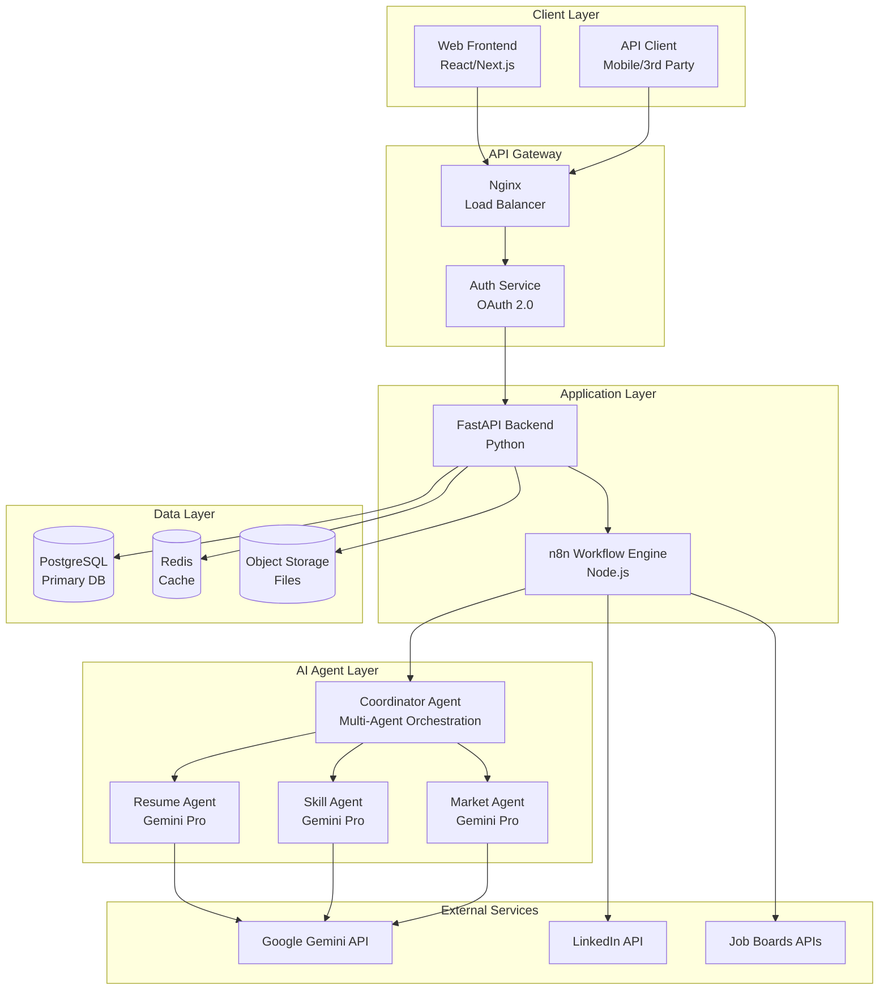
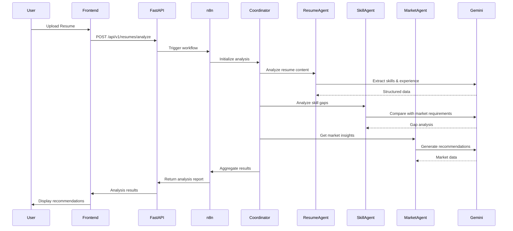
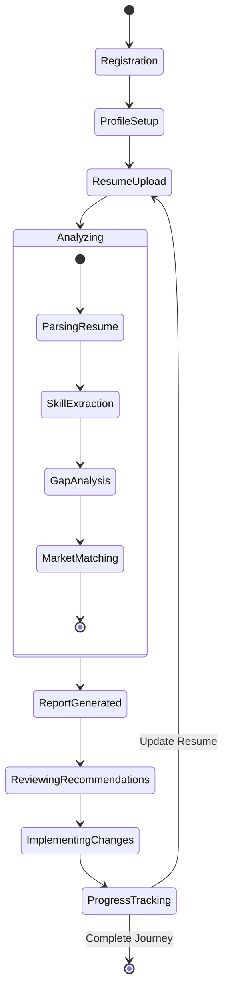
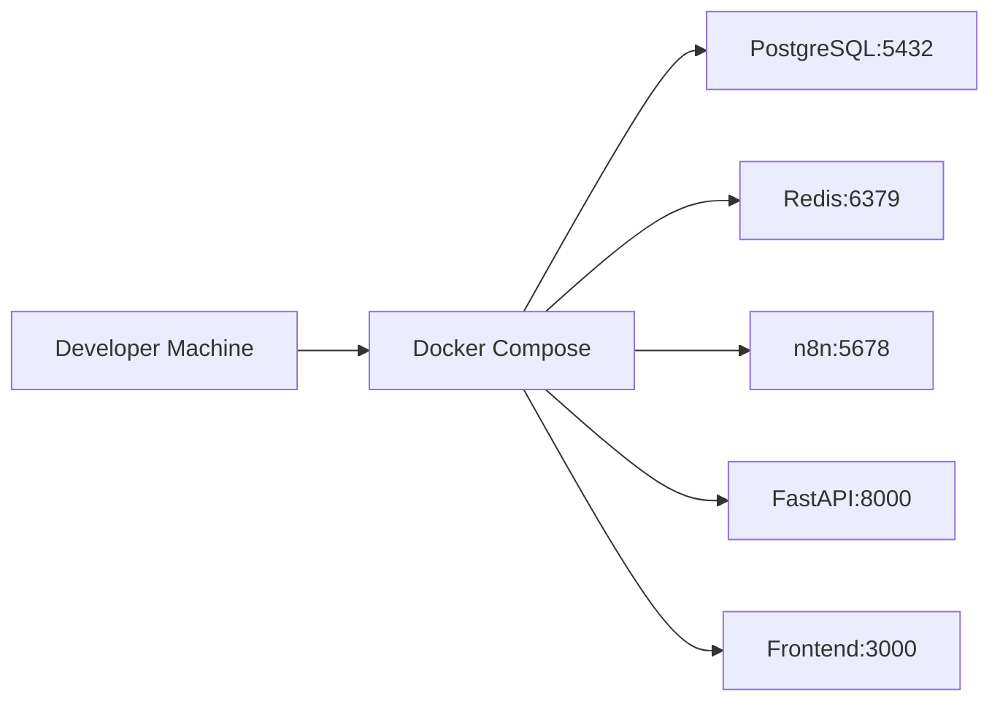
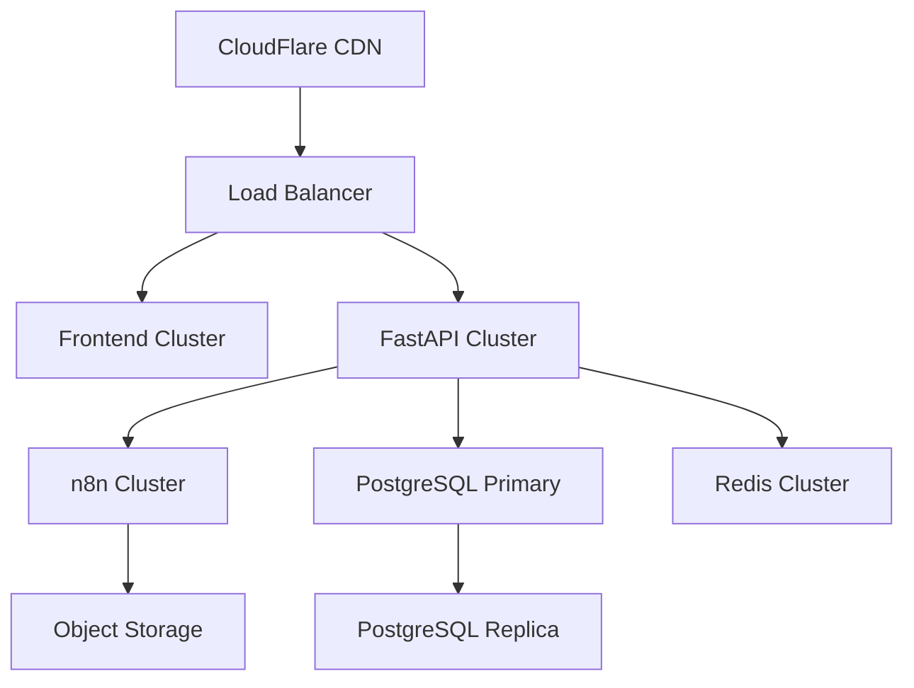

# AI Career Assistant - Architecture Overview

## Context
AI Career Assistant 是一個基於 Gemini Multi-Agent 架構的智能職涯輔助平台。系統通過 n8n 工作流引擎整合多個 AI Agent，為用戶提供履歷優化、技能分析、職涯建議等服務。目標是建構可擴展、模組化的 AI 驅動職涯輔助生態系統。

## High-level System Architecture

## Data Flow - Resume Analysis Process

## State Machine - User Journey

## API 邊界與整合

### Internal APIs
- **User Management API**: `/api/v1/users/*`
- **Resume API**: `/api/v1/resumes/*`
- **Analysis API**: `/api/v1/analysis/*`
- **Recommendations API**: `/api/v1/recommendations/*`

### External Integrations
- **Google Gemini API**: AI 分析與建議生成
- **LinkedIn API**: 職位與公司資訊
- **Job Boards APIs**: 104, 1111 等求職平台

### n8n Workflow Endpoints
- **Resume Processing**: 履歷解析與標準化
- **Multi-Agent Coordination**: AI Agent 協調
- **Report Generation**: 報告生成與格式化

## 部署拓撲

### Development Environment

### Production Environment

## NFR 對應策略

### 效能 (Performance)
- **API 響應時間**: < 200ms (90th percentile)
- **AI 分析處理**: < 30 秒
- **快取策略**: Redis 快取熱點資料 (TTL: 1hour)
- **資料庫優化**: 讀寫分離、索引優化

### 可靠性 (Reliability)
- **服務可用性**: 99.9% uptime
- **錯誤處理**: Circuit breaker pattern
- **重試機制**: Exponential backoff
- **資料備份**: 每日自動備份

### 安全性 (Security)
- **認證**: OAuth 2.0 + JWT
- **加密**: TLS 1.3, AES-256 資料加密
- **API 限流**: Rate limiting (100 req/min per user)
- **資料隱私**: GDPR 合規，資料匿名化

### 可擴展性 (Scalability)
- **水平擴展**: Kubernetes auto-scaling
- **微服務化**: 按業務領域拆分服務
- **非同步處理**: Celery + Redis queue
- **CDN**: 靜態資源全球分發

### 觀測性 (Observability)
- **監控**: Prometheus + Grafana
- **日誌**: ELK Stack (Elasticsearch, Logstash, Kibana)
- **追蹤**: Jaeger distributed tracing
- **告警**: PagerDuty integration

## 《建議與風險》

### 高優先級
1. **AI API 成本控制**: Gemini API 調用成本可能快速累積，需實作智能快取與批量處理
2. **資料隱私合規**: 履歷包含敏感個資，必須符合 GDPR/CCPA 規範
3. **多 Agent 協調複雜度**: 需要強化錯誤處理與降級機制

### 中優先級
1. **n8n 工作流版本控制**: 建立工作流 CI/CD 管道
2. **效能瓶頸監控**: 建立完整 APM 系統監控各層效能
3. **災難恢復計劃**: 制定 RTO/RPO 目標與演練計劃

### 低優先級
1. **多語言支援**: 國際化架構設計
2. **第三方整合擴展**: 為更多求職平台預留介面
3. **機器學習模型訓練**: 建立模型訓練與部署管道