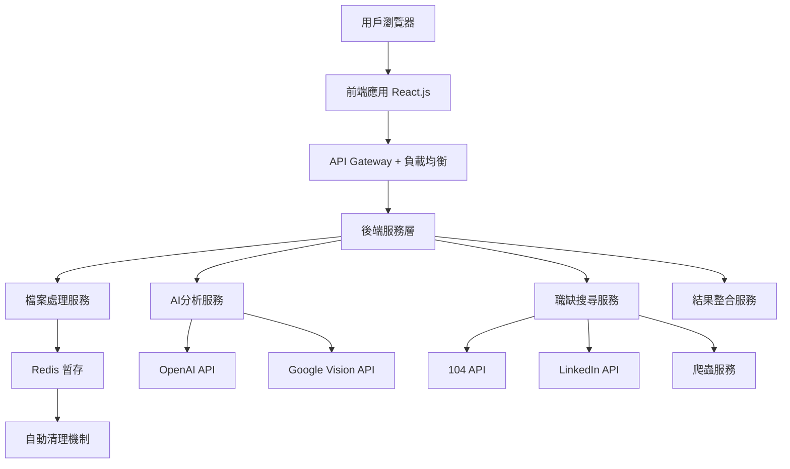
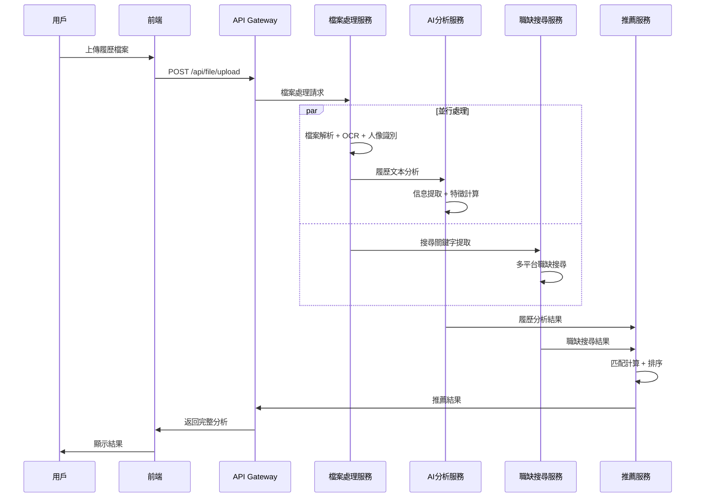

# AI Career Assistant - 系統架構文檔

## 🏗️ 整體架構概覽

### 系統架構圖



### 技術棧總覽

| 層級 | 技術選擇 | 用途 |
|------|----------|------|
| **前端** | React.js + Ant Design | 用戶界面 |
| **API層** | Express.js + Node.js | 業務邏輯 |
| **緩存** | Redis + Bull Queue | 並發控制 |
| **AI服務** | OpenAI GPT-4, Google Vision | 智能分析 |
| **數據源** | 104 API, LinkedIn, 爬蟲 | 職缺數據 |
| **部署** | Docker + Cloud Platform | 服務部署 |

## 🎯 微服務架構設計

### 服務拆分策略

#### 1. 檔案處理服務 (File Processing Service)
**職責**:
- 檔案上傳驗證 (格式、大小、安全檢查)
- PDF/Word文檔解析
- OCR文字提取 (Google Vision API)
- 人像識別檢測
- 檔案暫存管理

**API端點**:
```javascript
POST /api/file/upload        // 檔案上傳
GET  /api/file/status/{id}   // 處理狀態
POST /api/file/parse         // 文檔解析
POST /api/file/ocr           // OCR識別
```

**技術實現**:
```javascript
// 檔案處理核心邏輯
const fileProcessor = {
  validateFile: (file) => { /* 格式驗證 */ },
  extractText: async (buffer) => { /* PDF/Word解析 */ },
  detectImage: async (buffer) => { /* 人像識別 */ },
  storeTemp: (data, ttl) => { /* Redis暫存 */ }
};
```

#### 2. AI分析服務 (AI Analysis Service)
**職責**:
- 履歷信息結構化提取
- 技能分析與分類
- 工作經驗評估
- 職涯建議生成
- 特徵向量計算

**API端點**:
```javascript
POST /api/ai/extract         // 信息提取
POST /api/ai/analyze         // 履歷分析
POST /api/ai/suggest         // 建議生成
GET  /api/ai/skills          // 技能庫查詢
```

**AI模型整合**:
```javascript
const aiService = {
  extractResume: async (text) => {
    const prompt = `分析以下履歷，提取關鍵信息：${text}`;
    return await openai.chat.completions.create({
      model: "gpt-4",
      messages: [{ role: "user", content: prompt }],
      temperature: 0.3
    });
  }
};
```

#### 3. 職缺搜尋服務 (Job Search Service)
**職責**:
- 多平台職缺數據整合
- RAG增強搜尋
- 數據清理與去重
- 搜尋結果排序

**API端點**:
```javascript
POST /api/jobs/search        // 職缺搜尋
GET  /api/jobs/platforms     // 支援平台列表
POST /api/jobs/rag           // RAG增強搜尋
GET  /api/jobs/cache/{key}   // 緩存查詢
```

**數據源整合**:
```javascript
const jobSources = {
  job104: new Job104API(config.job104),
  linkedin: new LinkedInScraper(config.linkedin),
  job518: new Job518Scraper(config.job518),
  chickpt: new ChickPtScraper(config.chickpt)
};

const searchJobs = async (criteria) => {
  const results = await Promise.all([
    jobSources.job104.search(criteria),
    jobSources.linkedin.search(criteria),
    jobSources.job518.search(criteria),
    jobSources.chickpt.search(criteria)
  ]);
  return deduplicateJobs(results.flat());
};
```

#### 4. 推薦引擎服務 (Recommendation Service)
**職責**:
- 履歷-職缺匹配算法
- 個性化推薦排序
- 匹配度評分計算
- 結果格式化輸出

**匹配算法**:
```javascript
const matchingEngine = {
  calculateSkillMatch: (userSkills, jobRequirements) => {
    // TF-IDF + 語義相似度計算
    const skillSimilarity = cosineSimilarity(
      vectorizeSkills(userSkills),
      vectorizeSkills(jobRequirements)
    );
    return skillSimilarity * 100;
  },
  
  calculateExperienceMatch: (userExp, jobExp) => {
    // 年資匹配度計算
    const expDiff = Math.abs(userExp - jobExp);
    return Math.max(0, 100 - expDiff * 10);
  },
  
  generateRecommendations: (resume, jobs) => {
    return jobs.map(job => ({
      ...job,
      skillMatch: this.calculateSkillMatch(resume.skills, job.requirements),
      expMatch: this.calculateExperienceMatch(resume.years, job.experience),
      overallScore: this.calculateOverallScore(resume, job)
    })).sort((a, b) => b.overallScore - a.overallScore);
  }
};
```

## 🔄 數據流設計

### 主要處理流程



### 並發控制機制

```javascript
// Redis Queue 配置
const Queue = require('bull');
const resumeQueue = new Queue('resume processing', {
  redis: { host: 'localhost', port: 6379 },
  settings: {
    stalledInterval: 30000,    // 30秒
    maxStalledCount: 1,
    retryDelayOnFailure: 5000
  }
});

// 限制同時處理3個請求
resumeQueue.process(3, async (job) => {
  const { fileId, userId } = job.data;
  
  try {
    // 並行處理
    const [parseResult, jobResults] = await Promise.all([
      processResume(fileId),
      searchJobs(extractKeywords(fileId))
    ]);
    
    const recommendations = generateRecommendations(parseResult, jobResults);
    
    // 清理暫存
    await cleanupTempFiles(fileId);
    
    return {
      analysis: parseResult,
      jobs: recommendations,
      timestamp: new Date()
    };
  } catch (error) {
    logger.error('Resume processing failed:', error);
    throw error;
  }
});
```

## 🗄️ 數據存儲設計

### Redis 暫存策略

```javascript
const redisClient = new Redis({
  host: process.env.REDIS_HOST,
  port: process.env.REDIS_PORT,
  password: process.env.REDIS_PASSWORD,
  maxRetriesPerRequest: 3
});

// 數據存儲結構
const cacheKeys = {
  userFile: (userId, fileId) => `user:${userId}:file:${fileId}`,
  jobCache: (keywords) => `jobs:${hashKeywords(keywords)}`,
  aiResult: (fileId) => `ai:result:${fileId}`,
  processing: (jobId) => `processing:${jobId}`
};

// TTL設定
const cacheTTL = {
  userFile: 600,      // 10分鐘
  jobCache: 3600,     // 1小時  
  aiResult: 300,      // 5分鐘
  processing: 900     // 15分鐘
};
```

### 暫時檔案管理

```javascript
const fileManager = {
  store: async (buffer, metadata) => {
    const fileId = generateFileId();
    const key = cacheKeys.userFile(metadata.userId, fileId);
    
    await redisClient.setex(key, cacheTTL.userFile, JSON.stringify({
      buffer: buffer.toString('base64'),
      metadata,
      uploadTime: new Date()
    }));
    
    return fileId;
  },
  
  cleanup: async (fileId) => {
    const pattern = `*:file:${fileId}`;
    const keys = await redisClient.keys(pattern);
    
    if (keys.length > 0) {
      await redisClient.del(...keys);
    }
  },
  
  // 定期清理過期檔案
  scheduleCleanup: () => {
    setInterval(async () => {
      const expiredKeys = await redisClient.keys('user:*:file:*');
      // 檢查並清理過期檔案
    }, 60000); // 每分鐘執行
  }
};
```

## 🚀 效能優化策略

### 並行處理優化

```javascript
const parallelProcessor = {
  processResume: async (fileId) => {
    const fileData = await fileManager.get(fileId);
    
    // 階段1: 檔案解析 (並行)
    const [textContent, hasImage] = await Promise.all([
      extractText(fileData.buffer),
      detectImage(fileData.buffer)
    ]);
    
    // 階段2: AI分析 + 職缺搜尋 (並行)
    const [aiAnalysis, jobResults] = await Promise.all([
      analyzeResume(textContent),
      searchJobsParallel(extractKeywords(textContent))
    ]);
    
    // 階段3: 結果整合
    return integrateResults(aiAnalysis, jobResults, hasImage);
  }
};
```

### 緩存策略實施

```javascript
const cacheManager = {
  // 熱門職缺預載
  preloadPopularJobs: async () => {
    const popularKeywords = ['software engineer', 'data scientist', 'product manager'];
    
    for (const keyword of popularKeywords) {
      const jobs = await searchJobs({ keywords: [keyword] });
      const cacheKey = cacheKeys.jobCache(keyword);
      await redisClient.setex(cacheKey, cacheTTL.jobCache, JSON.stringify(jobs));
    }
  },
  
  // 智能緩存命中
  getCachedJobs: async (keywords) => {
    const cacheKey = cacheKeys.jobCache(keywords.join(','));
    const cached = await redisClient.get(cacheKey);
    
    if (cached) {
      return JSON.parse(cached);
    }
    
    const jobs = await searchJobs({ keywords });
    await redisClient.setex(cacheKey, cacheTTL.jobCache, JSON.stringify(jobs));
    return jobs;
  }
};
```

## 🔒 安全性設計

### 檔案安全檢查

```javascript
const securityChecker = {
  validateFile: (file) => {
    // 檔案類型白名單
    const allowedTypes = ['application/pdf', 'application/msword', 
                         'application/vnd.openxmlformats-officedocument.wordprocessingml.document'];
    
    if (!allowedTypes.includes(file.mimetype)) {
      throw new Error('不支援的檔案格式');
    }
    
    // 檔案大小限制 (10MB)
    if (file.size > 10 * 1024 * 1024) {
      throw new Error('檔案大小超過限制');
    }
    
    // 惡意檔案掃描 (簡化版)
    if (this.containsMaliciousContent(file.buffer)) {
      throw new Error('檔案包含可疑內容');
    }
    
    return true;
  },
  
  sanitizeText: (text) => {
    // 移除潛在的敏感信息
    return text
      .replace(/\b\d{4}-\d{4}-\d{4}-\d{4}\b/g, '[CARD_NUMBER]')  // 信用卡號
      .replace(/\b\d{10,11}\b/g, '[PHONE_NUMBER]')               // 電話號碼
      .replace(/\b[A-Z]\d{9}\b/g, '[ID_NUMBER]');                // 身份證號
  }
};
```

### API安全措施

```javascript
const securityMiddleware = {
  rateLimit: rateLimit({
    windowMs: 15 * 60 * 1000, // 15分鐘
    max: 10, // 每個IP最多10次請求
    message: '請求次數過多，請稍後再試'
  }),
  
  validateRequest: (req, res, next) => {
    // 請求驗證
    if (!req.headers['content-type']?.includes('multipart/form-data')) {
      return res.status(400).json({ error: '無效的請求格式' });
    }
    
    // 檔案存在性檢查
    if (!req.file) {
      return res.status(400).json({ error: '未找到上傳檔案' });
    }
    
    next();
  },
  
  errorHandler: (err, req, res, next) => {
    logger.error('API Error:', err);
    
    // 不洩露內部錯誤信息
    const publicError = {
      error: '處理請求時發生錯誤',
      code: err.code || 'INTERNAL_ERROR',
      timestamp: new Date()
    };
    
    res.status(500).json(publicError);
  }
};
```

## 📊 監控與日誌

### 效能監控

```javascript
const performanceMonitor = {
  trackProcessingTime: async (operation, fn) => {
    const startTime = Date.now();
    
    try {
      const result = await fn();
      const duration = Date.now() - startTime;
      
      // 記錄效能指標
      metrics.timing(`operation.${operation}.duration`, duration);
      
      if (duration > 10000) { // 超過10秒警告
        logger.warn(`Operation ${operation} took ${duration}ms`);
      }
      
      return result;
    } catch (error) {
      metrics.increment(`operation.${operation}.error`);
      throw error;
    }
  },
  
  healthCheck: async () => {
    const health = {
      redis: await checkRedisHealth(),
      apis: await checkAPIHealth(),
      system: getSystemMetrics()
    };
    
    return health;
  }
};
```

### 結構化日誌

```javascript
const logger = winston.createLogger({
  level: 'info',
  format: winston.format.combine(
    winston.format.timestamp(),
    winston.format.errors({ stack: true }),
    winston.format.json()
  ),
  transports: [
    new winston.transports.File({ filename: 'error.log', level: 'error' }),
    new winston.transports.File({ filename: 'combined.log' })
  ]
});

// 用戶操作追蹤
const auditLogger = {
  logUserAction: (userId, action, metadata) => {
    logger.info('User Action', {
      userId,
      action,
      metadata,
      timestamp: new Date(),
      ip: metadata.ip,
      userAgent: metadata.userAgent
    });
  }
};
```

---

**文檔版本**: v1.0  
**最後更新**: 2025-01-01  
**架構負責人**: AI Development Team