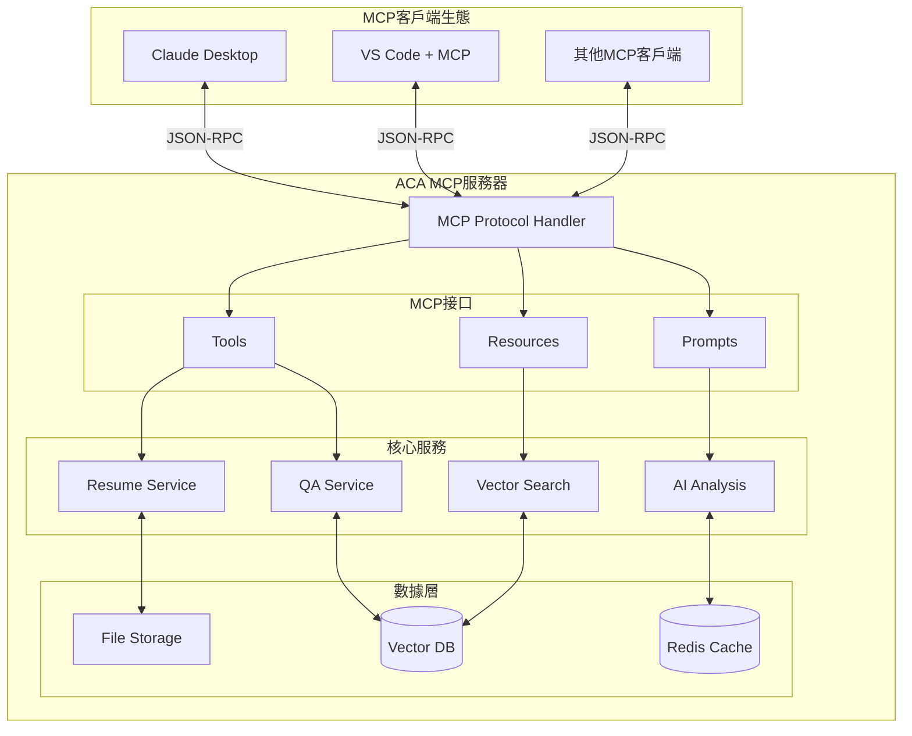
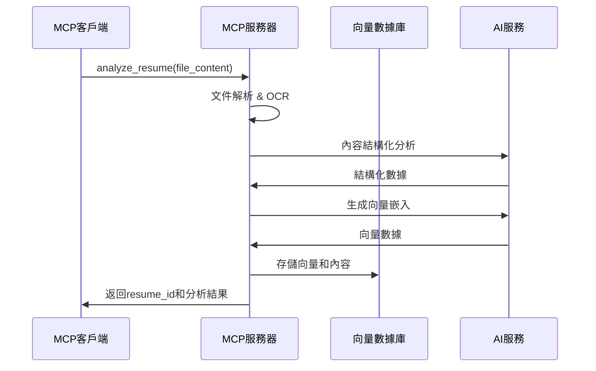
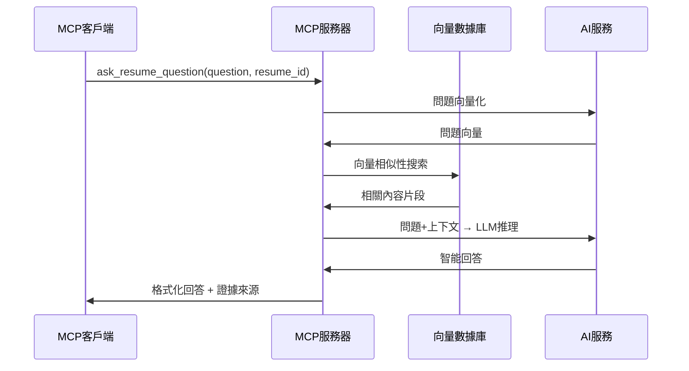

# AI Career Assistant MCP服務器架構設計

## 📋 概述

將AI Career Assistant轉換為MCP（Model Context Protocol）服務器，新增履歷問答功能，使其可被任何MCP客戶端（如Claude Desktop、IDEs等）調用。

## 🏗️ MCP服務器架構

### 核心架構圖



## 🔧 MCP服務接口設計

### 1. Tools（工具接口）

#### `analyze_resume`
```json
{
  "name": "analyze_resume",
  "description": "分析上傳的履歷並提取關鍵信息",
  "inputSchema": {
    "type": "object",
    "properties": {
      "file_content": {
        "type": "string",
        "description": "履歷檔案內容（base64編碼）"
      },
      "file_type": {
        "type": "string", 
        "enum": ["pdf", "docx"],
        "description": "檔案類型"
      },
      "analysis_depth": {
        "type": "string",
        "enum": ["basic", "detailed", "comprehensive"],
        "default": "detailed"
      }
    },
    "required": ["file_content", "file_type"]
  }
}
```

#### `ask_resume_question`
```json
{
  "name": "ask_resume_question",
  "description": "對履歷內容提問並獲得智能回答",
  "inputSchema": {
    "type": "object",
    "properties": {
      "question": {
        "type": "string",
        "description": "關於履歷的問題"
      },
      "resume_id": {
        "type": "string",
        "description": "履歷ID（來自analyze_resume的結果）"
      },
      "context_window": {
        "type": "integer",
        "default": 3,
        "description": "搜索上下文窗口大小"
      }
    },
    "required": ["question", "resume_id"]
  }
}
```

#### `search_job_matches`
```json
{
  "name": "search_job_matches",
  "description": "基於履歷尋找匹配的職缺",
  "inputSchema": {
    "type": "object",
    "properties": {
      "resume_id": {
        "type": "string",
        "description": "履歷ID"
      },
      "job_preferences": {
        "type": "object",
        "properties": {
          "location": {"type": "string"},
          "salary_range": {"type": "object"},
          "remote_work": {"type": "boolean"}
        }
      },
      "match_count": {
        "type": "integer",
        "default": 10,
        "description": "返回的職缺數量"
      }
    },
    "required": ["resume_id"]
  }
}
```

### 2. Resources（資源接口）

#### 履歷內容資源
```json
{
  "uri": "resume://{resume_id}/content",
  "name": "履歷原始內容",
  "description": "完整的履歷文本內容",
  "mimeType": "text/plain"
}
```

#### 分析結果資源
```json
{
  "uri": "resume://{resume_id}/analysis",
  "name": "履歷分析結果", 
  "description": "結構化的履歷分析數據",
  "mimeType": "application/json"
}
```

#### 職缺匹配資源
```json
{
  "uri": "resume://{resume_id}/job-matches",
  "name": "職缺匹配結果",
  "description": "基於履歷的職缺推薦列表",
  "mimeType": "application/json"
}
```

### 3. Prompts（提示模板）

#### 履歷分析提示
```json
{
  "name": "analyze_resume_prompt",
  "description": "專業履歷分析提示模板",
  "arguments": [
    {
      "name": "resume_content",
      "description": "履歷內容文本",
      "required": true
    },
    {
      "name": "focus_area", 
      "description": "分析重點領域",
      "required": false
    }
  ]
}
```

#### 問答提示
```json
{
  "name": "resume_qa_prompt",
  "description": "履歷問答對話提示模板",
  "arguments": [
    {
      "name": "question",
      "description": "用戶問題",
      "required": true
    },
    {
      "name": "context",
      "description": "相關履歷上下文",
      "required": true
    }
  ]
}
```

## 💾 數據架構設計

### 履歷數據結構
```json
{
  "resume_id": "uuid-string",
  "metadata": {
    "upload_time": "2025-01-01T12:00:00Z",
    "file_type": "pdf",
    "file_size": 2048576,
    "processing_status": "completed"
  },
  "content": {
    "raw_text": "原始文本內容...",
    "structured_data": {
      "basic_info": {...},
      "education": [...],
      "experience": [...],
      "skills": [...],
      "achievements": [...]
    }
  },
  "analysis": {
    "summary": "履歷摘要",
    "strengths": [...],
    "suggestions": [...],
    "career_level": "中級"
  },
  "vectors": {
    "content_embedding": [0.1, 0.2, ...],
    "skills_embedding": [0.3, 0.4, ...],
    "experience_embedding": [0.5, 0.6, ...]
  }
}
```

### 向量搜索架構
```yaml
向量數據庫設計:
  collection: "resume_chunks"
  vector_dimension: 1536  # OpenAI embedding
  索引類型: HNSW
  相似度計算: cosine
  
分塊策略:
  - 按段落分塊 (max 512 tokens)
  - 重疊窗口 (50 tokens overlap)
  - 語義邊界識別
  
檢索策略:
  - 混合搜索 (向量 + 關鍵詞)
  - 重排序 (Reranking)
  - 上下文融合
```

## 🔄 問答系統工作流程

### 1. 履歷上傳與處理


### 2. 問答查詢流程


### 3. 上下文管理
```yaml
會話管理:
  - session_id: 唯一會話標識
  - conversation_history: 對話歷史
  - context_window: 滑動窗口上下文
  - memory_retention: 關鍵信息保持

上下文融合:
  - 短期記憶: 當前對話內容
  - 長期記憶: 履歷結構化數據
  - 語義記憶: 向量搜索結果
  - 程序記憶: 分析模板和規則
```

## 🛠️ 實施技術棧

### MCP服務器實現
```typescript
// 基於官方TypeScript SDK
import { Server } from "@modelcontextprotocol/sdk/server/index.js";
import { StdioServerTransport } from "@modelcontextprotocol/sdk/server/stdio.js";

const server = new Server({
  name: "ai-career-assistant-mcp",
  version: "1.0.0"
}, {
  capabilities: {
    tools: {},
    resources: {},
    prompts: {}
  }
});
```

### 向量搜索服務
```python
# 使用Pinecone或Weaviate
import pinecone
from sentence_transformers import SentenceTransformer

class ResumeVectorSearch:
    def __init__(self):
        self.encoder = SentenceTransformer('all-MiniLM-L6-v2')
        self.index = pinecone.Index("resume-vectors")
    
    async def search_similar_content(self, query: str, resume_id: str, top_k=5):
        query_vector = self.encoder.encode([query])
        results = self.index.query(
            vector=query_vector[0].tolist(),
            filter={"resume_id": resume_id},
            top_k=top_k,
            include_metadata=True
        )
        return results.matches
```

### AI問答服務
```python
from openai import AsyncOpenAI

class ResumeQAService:
    def __init__(self):
        self.client = AsyncOpenAI()
    
    async def answer_question(self, question: str, context: list[str]):
        prompt = f"""
        基於以下履歷內容回答問題:
        
        履歷內容: {' '.join(context)}
        
        問題: {question}
        
        請提供準確、具體的回答，並引用相關的履歷內容作為證據。
        """
        
        response = await self.client.chat.completions.create(
            model="gpt-4",
            messages=[{"role": "user", "content": prompt}]
        )
        
        return response.choices[0].message.content
```

## 🔒 安全與隱私設計

### 數據保護機制
```yaml
隱私保護:
  - 履歷數據加密存儲
  - 傳輸過程TLS加密
  - 定期數據清理（30天TTL）
  - 用戶數據匿名化選項

訪問控制:
  - API Key認證
  - 請求頻率限制
  - IP白名單（可選）
  - 審計日誌記錄

數據合規:
  - GDPR合規設計
  - 數據最小化原則
  - 用戶數據刪除權
  - 透明的隱私政策
```

## 📊 效能指標

### 目標效能標準
```yaml
響應時間:
  - 履歷分析: <30秒
  - 問答查詢: <3秒
  - 向量搜索: <500ms
  
併發能力:
  - 同時處理: 10個分析請求
  - QPS: 100次問答/秒
  
準確性:
  - 問答準確率: >90%
  - 搜索相關性: >85%
  - 分析完整性: >95%
```

## 🚀 部署架構

### Docker容器化部署
```yaml
services:
  mcp-server:
    build: ./mcp-server
    ports:
      - "8080:8080"
    environment:
      - OPENAI_API_KEY=${OPENAI_API_KEY}
      - PINECONE_API_KEY=${PINECONE_API_KEY}
    
  vector-db:
    image: weaviate/weaviate:latest
    ports:
      - "8081:8080"
    
  redis:
    image: redis:alpine
    ports:
      - "6379:6379"
```

### MCP客戶端配置
```json
{
  "mcpServers": {
    "ai-career-assistant": {
      "command": "node",
      "args": ["/path/to/mcp-server.js"],
      "env": {
        "OPENAI_API_KEY": "your-key-here"
      }
    }
  }
}
```

## 📋 開發里程碑

### Phase 1: MCP基礎架構 (1週)
- [ ] MCP服務器框架搭建
- [ ] 基礎Tools接口實現
- [ ] 簡單的履歷解析功能

### Phase 2: 向量搜索系統 (1週)
- [ ] 向量數據庫集成
- [ ] 履歷內容向量化
- [ ] 語義搜索功能

### Phase 3: 問答系統 (1週)
- [ ] AI問答服務實現
- [ ] 上下文管理機制
- [ ] 對話歷史功能

### Phase 4: 集成測試 (1週)
- [ ] 端到端功能測試
- [ ] 效能優化調整
- [ ] Claude Desktop整合測試

---

**文檔版本**: v1.0  
**創建時間**: 2025-08-05  
**更新者**: AI Architecture Team