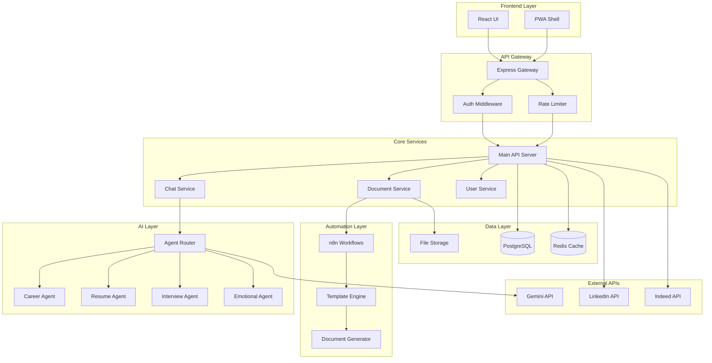
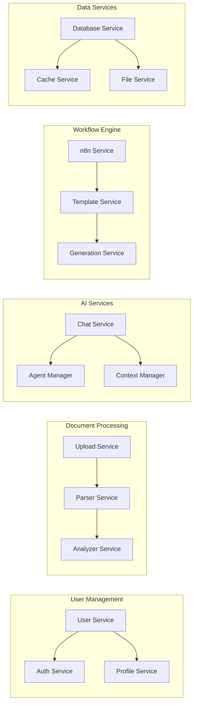
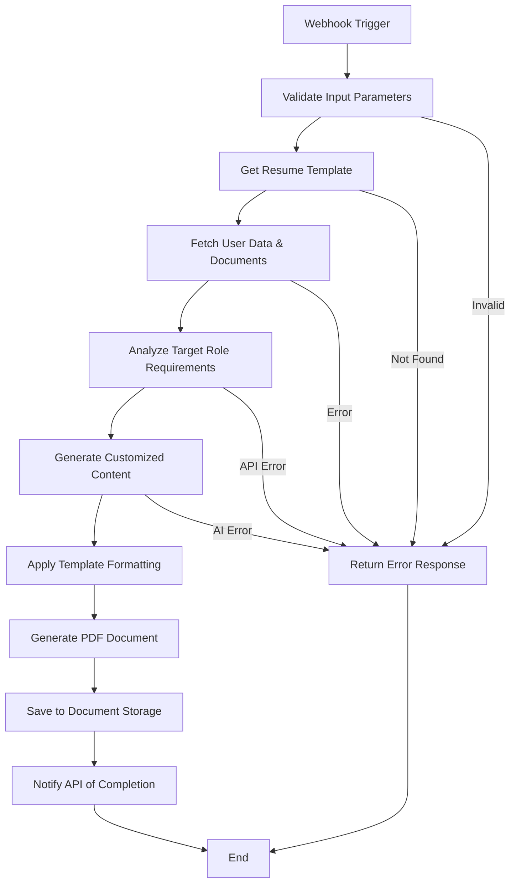
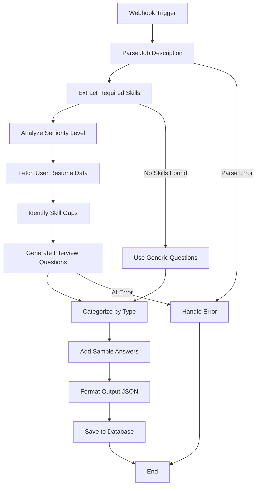
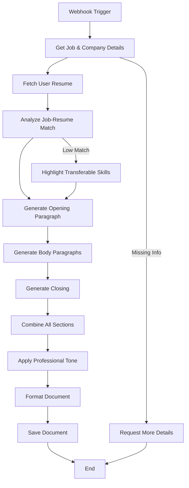

# AI Career Assistant - 技術設計規格

## 1. 概述

本文檔詳細描述 AI Career Assistant 的技術架構設計，包含 API 規格、資料模型、n8n 工作流設計，以及 Gemini Multi-Agent 架構。

## 2. 系統架構

### 2.1 整體架構



### 2.2 微服務架構詳細設計



## 3. API 設計規格

### 3.1 RESTful API 端點

#### 3.1.1 用戶管理 API

```typescript
// POST /api/v1/auth/register
interface RegisterRequest {
  email: string;
  password: string;
  firstName: string;
  lastName: string;
  agreedToTerms: boolean;
}

interface RegisterResponse {
  user: User;
  tokens: AuthTokens;
}

// POST /api/v1/auth/login
interface LoginRequest {
  email: string;
  password: string;
}

interface LoginResponse {
  user: User;
  tokens: AuthTokens;
}

// GET /api/v1/users/profile
interface UserProfile {
  id: string;
  email: string;
  firstName: string;
  lastName: string;
  createdAt: Date;
  updatedAt: Date;
  preferences: UserPreferences;
}
```

#### 3.1.2 文件處理 API

```typescript
// POST /api/v1/documents/upload
interface UploadRequest {
  file: File; // multipart/form-data
  type: 'resume' | 'cover_letter' | 'other';
}

interface UploadResponse {
  documentId: string;
  filename: string;
  size: number;
  mimeType: string;
  parsedContent?: ParsedDocument;
}

// GET /api/v1/documents/{id}/analyze
interface DocumentAnalysis {
  documentId: string;
  score: number;
  suggestions: Suggestion[];
  missingFields: string[];
  strengthsAndWeaknesses: {
    strengths: string[];
    weaknesses: string[];
  };
}

// POST /api/v1/documents/{id}/improve
interface ImprovementRequest {
  targetRole?: string;
  industry?: string;
  improvementAreas: string[];
}

interface ImprovementResponse {
  improvedContent: string;
  changes: Change[];
  explanation: string;
}
```

#### 3.1.3 AI 聊天 API

```typescript
// POST /api/v1/chat/conversations
interface CreateConversationRequest {
  type: 'career_advice' | 'resume_review' | 'interview_prep' | 'general';
  context?: {
    documentId?: string;
    targetRole?: string;
    industry?: string;
  };
}

interface Conversation {
  id: string;
  type: string;
  createdAt: Date;
  lastMessageAt: Date;
  context: ConversationContext;
}

// POST /api/v1/chat/conversations/{id}/messages
interface SendMessageRequest {
  content: string;
  attachments?: string[]; // document IDs
}

interface ChatMessage {
  id: string;
  conversationId: string;
  role: 'user' | 'assistant';
  content: string;
  timestamp: Date;
  metadata?: {
    agentType?: string;
    confidence?: number;
    processingTime?: number;
  };
}

// WebSocket API for real-time chat
interface WebSocketMessage {
  type: 'message' | 'typing' | 'error' | 'agent_thinking';
  conversationId: string;
  data: any;
}
```

#### 3.1.4 工作流 API

```typescript
// POST /api/v1/workflows/execute
interface ExecuteWorkflowRequest {
  workflowType: 'generate_resume' | 'generate_cover_letter' | 'interview_questions';
  parameters: {
    templateId?: string;
    targetRole?: string;
    company?: string;
    customizations?: Record<string, any>;
  };
  documentIds?: string[];
}

interface WorkflowExecution {
  executionId: string;
  workflowType: string;
  status: 'pending' | 'running' | 'completed' | 'failed';
  progress: number;
  result?: {
    generatedDocumentId?: string;
    downloadUrl?: string;
  };
  error?: string;
}

// GET /api/v1/workflows/executions/{id}
// 返回 WorkflowExecution

// GET /api/v1/workflows/templates
interface WorkflowTemplate {
  id: string;
  name: string;
  description: string;
  category: string;
  parameters: TemplateParameter[];
  previewImage?: string;
}
```

### 3.2 GraphQL Schema（可選增強）

```graphql
type Query {
  user: User
  conversations(first: Int, after: String): ConversationConnection
  documents(type: DocumentType): [Document]
  workflowTemplates(category: String): [WorkflowTemplate]
}

type Mutation {
  uploadDocument(input: UploadDocumentInput!): UploadDocumentPayload
  sendMessage(input: SendMessageInput!): SendMessagePayload
  executeWorkflow(input: ExecuteWorkflowInput!): ExecuteWorkflowPayload
}

type Subscription {
  messageAdded(conversationId: ID!): ChatMessage
  workflowProgress(executionId: ID!): WorkflowExecution
}
```

## 4. 資料模型設計

### 4.1 PostgreSQL Schema

```sql
-- Users table
CREATE TABLE users (
    id UUID PRIMARY KEY DEFAULT gen_random_uuid(),
    email VARCHAR(255) UNIQUE NOT NULL,
    password_hash VARCHAR(255) NOT NULL,
    first_name VARCHAR(100),
    last_name VARCHAR(100),
    created_at TIMESTAMP WITH TIME ZONE DEFAULT NOW(),
    updated_at TIMESTAMP WITH TIME ZONE DEFAULT NOW(),
    last_login_at TIMESTAMP WITH TIME ZONE,
    is_active BOOLEAN DEFAULT true,
    preferences JSONB DEFAULT '{}'::jsonb
);

-- Documents table
CREATE TABLE documents (
    id UUID PRIMARY KEY DEFAULT gen_random_uuid(),
    user_id UUID NOT NULL REFERENCES users(id) ON DELETE CASCADE,
    filename VARCHAR(255) NOT NULL,
    original_filename VARCHAR(255) NOT NULL,
    file_path VARCHAR(500) NOT NULL,
    mime_type VARCHAR(100) NOT NULL,
    file_size INTEGER NOT NULL,
    document_type VARCHAR(50) NOT NULL, -- 'resume', 'cover_letter', 'other'
    parsed_content JSONB,
    analysis_result JSONB,
    created_at TIMESTAMP WITH TIME ZONE DEFAULT NOW(),
    updated_at TIMESTAMP WITH TIME ZONE DEFAULT NOW()
);

-- Conversations table
CREATE TABLE conversations (
    id UUID PRIMARY KEY DEFAULT gen_random_uuid(),
    user_id UUID NOT NULL REFERENCES users(id) ON DELETE CASCADE,
    conversation_type VARCHAR(50) NOT NULL,
    title VARCHAR(255),
    context JSONB DEFAULT '{}'::jsonb,
    created_at TIMESTAMP WITH TIME ZONE DEFAULT NOW(),
    updated_at TIMESTAMP WITH TIME ZONE DEFAULT NOW(),
    last_message_at TIMESTAMP WITH TIME ZONE
);

-- Messages table
CREATE TABLE messages (
    id UUID PRIMARY KEY DEFAULT gen_random_uuid(),
    conversation_id UUID NOT NULL REFERENCES conversations(id) ON DELETE CASCADE,
    role VARCHAR(20) NOT NULL, -- 'user', 'assistant'
    content TEXT NOT NULL,
    metadata JSONB DEFAULT '{}'::jsonb,
    created_at TIMESTAMP WITH TIME ZONE DEFAULT NOW()
);

-- Workflow executions table
CREATE TABLE workflow_executions (
    id UUID PRIMARY KEY DEFAULT gen_random_uuid(),
    user_id UUID NOT NULL REFERENCES users(id) ON DELETE CASCADE,
    workflow_type VARCHAR(100) NOT NULL,
    status VARCHAR(20) NOT NULL DEFAULT 'pending',
    progress INTEGER DEFAULT 0,
    parameters JSONB NOT NULL,
    result JSONB,
    error_message TEXT,
    started_at TIMESTAMP WITH TIME ZONE DEFAULT NOW(),
    completed_at TIMESTAMP WITH TIME ZONE,
    n8n_execution_id VARCHAR(255)
);

-- User sessions table (for JWT refresh tokens)
CREATE TABLE user_sessions (
    id UUID PRIMARY KEY DEFAULT gen_random_uuid(),
    user_id UUID NOT NULL REFERENCES users(id) ON DELETE CASCADE,
    refresh_token_hash VARCHAR(255) NOT NULL,
    expires_at TIMESTAMP WITH TIME ZONE NOT NULL,
    created_at TIMESTAMP WITH TIME ZONE DEFAULT NOW(),
    last_used_at TIMESTAMP WITH TIME ZONE DEFAULT NOW(),
    ip_address INET,
    user_agent TEXT
);

-- Indexes for performance
CREATE INDEX idx_documents_user_id ON documents(user_id);
CREATE INDEX idx_documents_type ON documents(document_type);
CREATE INDEX idx_conversations_user_id ON conversations(user_id);
CREATE INDEX idx_messages_conversation_id ON messages(conversation_id);
CREATE INDEX idx_workflow_executions_user_id ON workflow_executions(user_id);
CREATE INDEX idx_workflow_executions_status ON workflow_executions(status);
CREATE INDEX idx_user_sessions_user_id ON user_sessions(user_id);
CREATE INDEX idx_user_sessions_expires_at ON user_sessions(expires_at);
```

### 4.2 Redis 資料結構

```typescript
// Session cache
interface SessionCache {
  userId: string;
  email: string;
  firstName: string;
  lastName: string;
  permissions: string[];
  expiresAt: number;
}
// Key: `session:${sessionId}`, TTL: 24 hours

// Conversation context cache
interface ConversationContext {
  conversationId: string;
  userId: string;
  messages: ChatMessage[];
  agentState: Record<string, any>;
  metadata: {
    lastActivity: Date;
    messageCount: number;
  };
}
// Key: `conversation:${conversationId}`, TTL: 7 days

// Rate limiting
interface RateLimitData {
  requests: number;
  resetTime: number;
}
// Key: `rate_limit:${endpoint}:${userId}`, TTL: window duration

// Document processing cache
interface ProcessingStatus {
  documentId: string;
  status: 'processing' | 'completed' | 'failed';
  progress: number;
  result?: any;
}
// Key: `processing:${documentId}`, TTL: 1 hour

// Agent response cache
interface AgentResponseCache {
  questionHash: string;
  response: string;
  agentType: string;
  confidence: number;
  timestamp: Date;
}
// Key: `agent_cache:${questionHash}`, TTL: 1 hour
```

## 5. n8n 工作流設計

### 5.1 履歷生成工作流



### 5.2 面試問題生成工作流



### 5.3 求職信生成工作流



### 5.4 n8n 工作流配置範例

```json
{
  "name": "Generate Resume Workflow",
  "active": true,
  "nodes": [
    {
      "parameters": {
        "httpMethod": "POST",
        "path": "generate-resume",
        "responseMode": "responseNode",
        "responseData": "allEntries"
      },
      "name": "Webhook",
      "type": "n8n-nodes-base.webhook",
      "typeVersion": 1,
      "position": [240, 300]
    },
    {
      "parameters": {
        "functionCode": "// Validate required parameters\nconst requiredFields = ['userId', 'templateId', 'targetRole'];\nconst missingFields = [];\n\nfor (const field of requiredFields) {\n  if (!items[0].json.body[field]) {\n    missingFields.push(field);\n  }\n}\n\nif (missingFields.length > 0) {\n  throw new Error(`Missing required fields: ${missingFields.join(', ')}`);\n}\n\nreturn items;"
      },
      "name": "Validate Input",
      "type": "n8n-nodes-base.function",
      "typeVersion": 1,
      "position": [460, 300]
    },
    {
      "parameters": {
        "url": "={{$node[\"Webhook\"].json[\"body\"][\"apiUrl\"]}}/templates/{{$node[\"Webhook\"].json[\"body\"][\"templateId\"]}}",
        "authentication": "genericCredentialType",
        "genericAuthType": "httpHeaderAuth",
        "sendHeaders": true,
        "headerParameters": {
          "parameters": [
            {
              "name": "Authorization",
              "value": "Bearer {{$node[\"Webhook\"].json[\"body\"][\"apiToken\"]}}"
            }
          ]
        }
      },
      "name": "Get Template",
      "type": "n8n-nodes-base.httpRequest",
      "typeVersion": 3,
      "position": [680, 300]
    },
    {
      "parameters": {
        "url": "={{$node[\"Webhook\"].json[\"body\"][\"apiUrl\"]}}/users/{{$node[\"Webhook\"].json[\"body\"][\"userId\"]}}/profile",
        "authentication": "genericCredentialType",
        "genericAuthType": "httpHeaderAuth"
      },
      "name": "Fetch User Data",
      "type": "n8n-nodes-base.httpRequest",
      "typeVersion": 3,
      "position": [900, 300]
    },
    {
      "parameters": {
        "url": "https://generativelanguage.googleapis.com/v1beta/models/gemini-pro:generateContent",
        "sendHeaders": true,
        "headerParameters": {
          "parameters": [
            {
              "name": "Authorization",
              "value": "Bearer {{$credentials.geminiApi.apiKey}}"
            }
          ]
        },
        "sendBody": true,
        "bodyContentType": "json",
        "jsonBody": "{\n  \"contents\": [{\n    \"parts\": [{\n      \"text\": \"Based on the following user profile and target role, generate an optimized resume content:\\n\\nUser Profile: {{$node[\"Fetch User Data\"].json}}\\n\\nTarget Role: {{$node[\"Webhook\"].json[\"body\"][\"targetRole\"]}}\\n\\nTemplate Structure: {{$node[\"Get Template\"].json}}\\n\\nPlease generate professional, tailored content for each section.\"\n    }]\n  }],\n  \"generationConfig\": {\n    \"temperature\": 0.7,\n    \"topK\": 40,\n    \"topP\": 0.95,\n    \"maxOutputTokens\": 2048\n  }\n}"
      },
      "name": "Generate Content with Gemini",
      "type": "n8n-nodes-base.httpRequest",
      "typeVersion": 3,
      "position": [1120, 300]
    }
  ],
  "connections": {
    "Webhook": {
      "main": [[{"node": "Validate Input", "type": "main", "index": 0}]]
    },
    "Validate Input": {
      "main": [[{"node": "Get Template", "type": "main", "index": 0}]]
    },
    "Get Template": {
      "main": [[{"node": "Fetch User Data", "type": "main", "index": 0}]]
    },
    "Fetch User Data": {
      "main": [[{"node": "Generate Content with Gemini", "type": "main", "index": 0}]]
    }
  }
}
```

## 6. Gemini Multi-Agent 架構設計

### 6.1 Agent Router 設計

```typescript
interface AgentRouter {
  route(message: string, context: ConversationContext): Promise<Agent>;
  getAvailableAgents(): Agent[];
  registerAgent(agent: Agent): void;
  unregisterAgent(agentId: string): void;
}

class SmartAgentRouter implements AgentRouter {
  private agents: Map<string, Agent> = new Map();
  private routingModel: GeminiModel;

  async route(message: string, context: ConversationContext): Promise<Agent> {
    const routingPrompt = this.buildRoutingPrompt(message, context);
    const response = await this.routingModel.generate(routingPrompt);
    const selectedAgentId = this.parseRoutingResponse(response);
    
    return this.agents.get(selectedAgentId) || this.getDefaultAgent();
  }

  private buildRoutingPrompt(message: string, context: ConversationContext): string {
    return `
      Analyze the following user message and determine the most appropriate agent:
      
      Message: "${message}"
      Context: ${JSON.stringify(context)}
      
      Available agents:
      ${Array.from(this.agents.values()).map(a => `- ${a.id}: ${a.description}`).join('\n')}
      
      Respond with only the agent ID.
    `;
  }
}
```

### 6.2 專業 Agent 設計

```typescript
interface Agent {
  id: string;
  name: string;
  description: string;
  capabilities: string[];
  process(message: string, context: ConversationContext): Promise<AgentResponse>;
}

class CareerAdviceAgent implements Agent {
  id = 'career-advice';
  name = 'Career Advice Specialist';
  description = 'Provides professional career guidance and strategic advice';
  capabilities = ['career_planning', 'industry_insights', 'skill_development'];

  private geminiModel: GeminiModel;

  async process(message: string, context: ConversationContext): Promise<AgentResponse> {
    const systemPrompt = this.getSystemPrompt();
    const enhancedMessage = this.enhanceMessageWithContext(message, context);
    
    const response = await this.geminiModel.generate([
      { role: 'system', content: systemPrompt },
      { role: 'user', content: enhancedMessage }
    ]);

    return {
      content: response.text,
      confidence: this.calculateConfidence(response),
      metadata: {
        agentId: this.id,
        processingTime: Date.now(),
        capabilities: this.capabilities
      }
    };
  }

  private getSystemPrompt(): string {
    return `
      You are a professional career advisor with 15+ years of experience.
      Your expertise includes:
      - Career transition strategies
      - Industry trend analysis
      - Professional development planning
      - Networking strategies
      - Salary negotiation
      
      Guidelines:
      - Provide actionable, specific advice
      - Consider current market conditions
      - Be empathetic to career challenges
      - Offer step-by-step guidance
      - Include relevant examples when possible
    `;
  }
}

class ResumeAnalysisAgent implements Agent {
  id = 'resume-analysis';
  name = 'Resume Analysis Expert';
  description = 'Analyzes and improves resume content and structure';
  capabilities = ['resume_review', 'content_optimization', 'formatting_advice'];

  async process(message: string, context: ConversationContext): Promise<AgentResponse> {
    // Check if resume document is available in context
    const resumeDocument = context.attachments?.find(doc => doc.type === 'resume');
    
    if (!resumeDocument) {
      return {
        content: "I'd be happy to help analyze your resume! Please upload your resume document so I can provide specific feedback.",
        confidence: 1.0,
        metadata: { needsDocument: true }
      };
    }

    const analysisPrompt = this.buildAnalysisPrompt(message, resumeDocument);
    const response = await this.geminiModel.generate(analysisPrompt);

    return {
      content: response.text,
      confidence: this.calculateConfidence(response),
      metadata: {
        agentId: this.id,
        analyzedDocument: resumeDocument.id,
        analysisType: this.detectAnalysisType(message)
      }
    };
  }
}

class InterviewPrepAgent implements Agent {
  id = 'interview-prep';
  name = 'Interview Preparation Coach';
  description = 'Helps with interview preparation and practice';
  capabilities = ['mock_interviews', 'question_practice', 'answer_feedback'];

  async process(message: string, context: ConversationContext): Promise<AgentResponse> {
    const interviewType = this.detectInterviewType(message);
    const systemPrompt = this.getInterviewSystemPrompt(interviewType);
    
    const response = await this.geminiModel.generate([
      { role: 'system', content: systemPrompt },
      { role: 'user', content: message }
    ]);

    return {
      content: response.text,
      confidence: this.calculateConfidence(response),
      metadata: {
        agentId: this.id,
        interviewType,
        practiceMode: this.isPracticeMode(message)
      }
    };
  }

  private detectInterviewType(message: string): string {
    const types = {
      'technical': ['coding', 'technical', 'algorithm', 'system design'],
      'behavioral': ['behavioral', 'situational', 'experience', 'teamwork'],
      'case_study': ['case study', 'business case', 'consulting'],
      'general': []
    };

    for (const [type, keywords] of Object.entries(types)) {
      if (keywords.some(keyword => message.toLowerCase().includes(keyword))) {
        return type;
      }
    }
    return 'general';
  }
}

class EmotionalSupportAgent implements Agent {
  id = 'emotional-support';
  name = 'Career Emotional Support Specialist';
  description = 'Provides emotional support for job search stress and career transitions';
  capabilities = ['emotional_support', 'stress_management', 'confidence_building'];

  async process(message: string, context: ConversationContext): Promise<AgentResponse> {
    const emotionalState = await this.analyzeEmotionalState(message);
    const supportPrompt = this.buildSupportPrompt(message, emotionalState);
    
    const response = await this.geminiModel.generate(supportPrompt);

    return {
      content: response.text,
      confidence: this.calculateConfidence(response),
      metadata: {
        agentId: this.id,
        emotionalState,
        supportType: this.determineSupportType(emotionalState)
      }
    };
  }

  private async analyzeEmotionalState(message: string): Promise<EmotionalState> {
    const analysisPrompt = `
      Analyze the emotional state of this message. Look for indicators of:
      - Stress level (1-10)
      - Confidence level (1-10)
      - Frustration indicators
      - Anxiety indicators
      - Depression indicators
      
      Message: "${message}"
      
      Respond in JSON format with the analysis.
    `;

    const response = await this.geminiModel.generate(analysisPrompt);
    return JSON.parse(response.text);
  }
}
```

### 6.3 Context Manager

```typescript
interface ConversationContext {
  conversationId: string;
  userId: string;
  type: string;
  messages: ChatMessage[];
  attachments: Document[];
  metadata: Record<string, any>;
  activeAgent?: string;
  agentStates: Record<string, any>;
}

class ContextManager {
  private redis: Redis;
  private contextTTL = 7 * 24 * 60 * 60; // 7 days

  async getContext(conversationId: string): Promise<ConversationContext | null> {
    const cached = await this.redis.get(`conversation:${conversationId}`);
    return cached ? JSON.parse(cached) : null;
  }

  async updateContext(context: ConversationContext): Promise<void> {
    await this.redis.setex(
      `conversation:${context.conversationId}`,
      this.contextTTL,
      JSON.stringify(context)
    );
  }

  async addMessage(conversationId: string, message: ChatMessage): Promise<void> {
    const context = await this.getContext(conversationId);
    if (context) {
      context.messages.push(message);
      context.metadata.lastActivity = new Date();
      context.metadata.messageCount = context.messages.length;
      await this.updateContext(context);
    }
  }

  async getRecentContext(conversationId: string, messageCount: number = 10): Promise<ChatMessage[]> {
    const context = await this.getContext(conversationId);
    if (!context) return [];
    
    return context.messages.slice(-messageCount);
  }
}
```

## 7. 安全設計

### 7.1 認證與授權

```typescript
// JWT Token Structure
interface JWTPayload {
  sub: string; // user ID
  email: string;
  iat: number; // issued at
  exp: number; // expires at
  scope: string[]; // permissions
}

// Role-Based Access Control
enum Permission {
  READ_OWN_DATA = 'read:own:data',
  WRITE_OWN_DATA = 'write:own:data',
  DELETE_OWN_DATA = 'delete:own:data',
  EXECUTE_WORKFLOWS = 'execute:workflows',
  ADMIN_ACCESS = 'admin:access'
}

interface UserRole {
  id: string;
  name: string;
  permissions: Permission[];
}

const roles: UserRole[] = [
  {
    id: 'user',
    name: 'Regular User',
    permissions: [
      Permission.READ_OWN_DATA,
      Permission.WRITE_OWN_DATA,
      Permission.DELETE_OWN_DATA,
      Permission.EXECUTE_WORKFLOWS
    ]
  },
  {
    id: 'admin',
    name: 'Administrator',
    permissions: [
      ...Object.values(Permission)
    ]
  }
];
```

### 7.2 資料加密與隱私

```typescript
// Data encryption utilities
interface EncryptionService {
  encrypt(data: string, key?: string): Promise<string>;
  decrypt(encryptedData: string, key?: string): Promise<string>;
  hash(data: string): Promise<string>;
  compareHash(data: string, hash: string): Promise<boolean>;
}

class AESEncryptionService implements EncryptionService {
  private algorithm = 'aes-256-gcm';
  private keyLength = 32;

  async encrypt(data: string, key?: string): Promise<string> {
    const encryptionKey = key || await this.generateKey();
    const iv = crypto.randomBytes(16);
    const cipher = crypto.createCipher(this.algorithm, encryptionKey);
    cipher.setAAD(Buffer.from('additional-auth-data'));
    
    let encrypted = cipher.update(data, 'utf8', 'hex');
    encrypted += cipher.final('hex');
    
    const authTag = cipher.getAuthTag();
    
    return JSON.stringify({
      encrypted,
      iv: iv.toString('hex'),
      authTag: authTag.toString('hex')
    });
  }
}

// Sensitive data handling
interface SensitiveDataProcessor {
  detectSensitiveContent(text: string): SensitiveDataFlag[];
  anonymize(text: string): string;
  redact(text: string, fields: string[]): string;
}

enum SensitiveDataType {
  SSN = 'ssn',
  CREDIT_CARD = 'credit_card',
  EMAIL = 'email',
  PHONE = 'phone',
  ADDRESS = 'address',
  EMPLOYMENT_GAP = 'employment_gap',
  MEDICAL_INFO = 'medical_info'
}

interface SensitiveDataFlag {
  type: SensitiveDataType;
  position: [number, number];
  confidence: number;
  suggestedAction: 'redact' | 'anonymize' | 'flag' | 'none';
}
```

## 8. 監控與日誌

### 8.1 應用性能監控

```typescript
// Metrics collection
interface MetricsCollector {
  recordAPICall(endpoint: string, method: string, duration: number, status: number): void;
  recordAIAgentCall(agentId: string, duration: number, confidence: number): void;
  recordWorkflowExecution(workflowType: string, duration: number, success: boolean): void;
  recordUserAction(userId: string, action: string, metadata?: any): void;
}

class PrometheusMetricsCollector implements MetricsCollector {
  private apiCallDuration = new prometheus.Histogram({
    name: 'api_call_duration_seconds',
    help: 'Duration of API calls',
    labelNames: ['endpoint', 'method', 'status']
  });

  private aiAgentCalls = new prometheus.Counter({
    name: 'ai_agent_calls_total',
    help: 'Total number of AI agent calls',
    labelNames: ['agent_id', 'success']
  });

  recordAPICall(endpoint: string, method: string, duration: number, status: number): void {
    this.apiCallDuration
      .labels(endpoint, method, status.toString())
      .observe(duration / 1000);
  }
}
```

### 8.2 結構化日誌

```typescript
enum LogLevel {
  ERROR = 'error',
  WARN = 'warn',
  INFO = 'info',
  DEBUG = 'debug'
}

interface LogEntry {
  timestamp: string;
  level: LogLevel;
  message: string;
  service: string;
  userId?: string;
  conversationId?: string;
  requestId?: string;
  metadata?: Record<string, any>;
}

class StructuredLogger {
  private winston: winston.Logger;

  constructor() {
    this.winston = winston.createLogger({
      format: winston.format.combine(
        winston.format.timestamp(),
        winston.format.json()
      ),
      transports: [
        new winston.transports.Console(),
        new winston.transports.File({ filename: 'app.log' })
      ]
    });
  }

  log(level: LogLevel, message: string, metadata: Partial<LogEntry> = {}): void {
    this.winston.log(level, message, {
      service: process.env.SERVICE_NAME || 'ai-career-assistant',
      ...metadata
    });
  }

  logAIInteraction(agentId: string, message: string, response: string, metadata: any = {}): void {
    this.log(LogLevel.INFO, 'AI Agent Interaction', {
      agentId,
      inputLength: message.length,
      outputLength: response.length,
      ...metadata
    });
  }
}
```

## 9. 部署架構

### 9.1 Docker 容器化

```dockerfile
# API Server Dockerfile
FROM node:18-alpine

WORKDIR /app

COPY package*.json ./
RUN npm ci --only=production

COPY . .

EXPOSE 3000

CMD ["node", "dist/index.js"]
```

### 9.2 Kubernetes 部署

```yaml
# deployment.yaml
apiVersion: apps/v1
kind: Deployment
metadata:
  name: ai-career-assistant-api
spec:
  replicas: 3
  selector:
    matchLabels:
      app: ai-career-assistant-api
  template:
    metadata:
      labels:
        app: ai-career-assistant-api
    spec:
      containers:
      - name: api
        image: ai-career-assistant/api:latest
        ports:
        - containerPort: 3000
        env:
        - name: DATABASE_URL
          valueFrom:
            secretKeyRef:
              name: database-secret
              key: url
        - name: REDIS_URL
          valueFrom:
            secretKeyRef:
              name: redis-secret
              key: url
        resources:
          requests:
            memory: "256Mi"
            cpu: "250m"
          limits:
            memory: "512Mi"
            cpu: "500m"
---
apiVersion: v1
kind: Service
metadata:
  name: ai-career-assistant-api-service
spec:
  selector:
    app: ai-career-assistant-api
  ports:
  - port: 80
    targetPort: 3000
  type: LoadBalancer
```

## 10. 性能優化策略

### 10.1 快取策略

```typescript
interface CacheStrategy {
  get(key: string): Promise<any>;
  set(key: string, value: any, ttl?: number): Promise<void>;
  invalidate(pattern: string): Promise<void>;
}

class MultiLayerCache implements CacheStrategy {
  private memoryCache: Map<string, CacheEntry> = new Map();
  private redisCache: Redis;

  async get(key: string): Promise<any> {
    // L1: Memory cache
    const memEntry = this.memoryCache.get(key);
    if (memEntry && !this.isExpired(memEntry)) {
      return memEntry.value;
    }

    // L2: Redis cache
    const redisValue = await this.redisCache.get(key);
    if (redisValue) {
      const value = JSON.parse(redisValue);
      this.memoryCache.set(key, {
        value,
        expiry: Date.now() + 60000 // 1 minute in memory
      });
      return value;
    }

    return null;
  }
}
```

### 10.2 資料庫優化

```sql
-- Partitioning for large tables
CREATE TABLE messages_2025_01 PARTITION OF messages
FOR VALUES FROM ('2025-01-01') TO ('2025-02-01');

CREATE TABLE messages_2025_02 PARTITION OF messages
FOR VALUES FROM ('2025-02-01') TO ('2025-03-01');

-- Materialized views for analytics
CREATE MATERIALIZED VIEW user_conversation_stats AS
SELECT 
    user_id,
    COUNT(*) as total_conversations,
    AVG(message_count) as avg_messages_per_conversation,
    MAX(last_message_at) as last_activity
FROM (
    SELECT 
        c.user_id,
        c.id as conversation_id,
        COUNT(m.id) as message_count,
        MAX(m.created_at) as last_message_at
    FROM conversations c
    LEFT JOIN messages m ON c.id = m.conversation_id
    GROUP BY c.user_id, c.id
) conversation_stats
GROUP BY user_id;

-- Refresh schedule
CREATE OR REPLACE FUNCTION refresh_user_stats()
RETURNS void AS $$
BEGIN
    REFRESH MATERIALIZED VIEW CONCURRENTLY user_conversation_stats;
END;
$$ LANGUAGE plpgsql;

-- Schedule refresh every hour
SELECT cron.schedule('refresh-user-stats', '0 * * * *', 'SELECT refresh_user_stats();');
```

---
**文檔版本**: v1.0  
**最後更新**: 2025-01-15  
**核心人**: Tech Lead  
**下次審查**: 2025-02-15