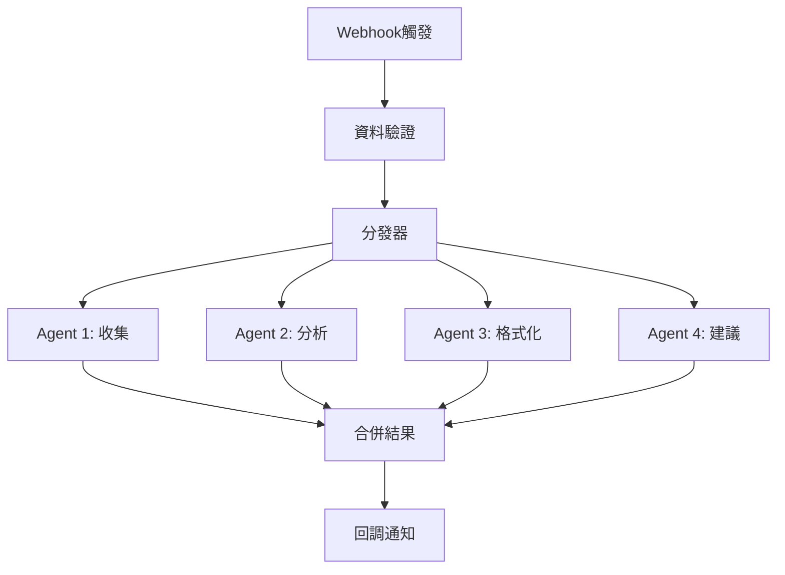

# n8n 技術參考文件
**供 steering-architect 深度架構分析使用**

---

## 1. n8n 核心架構

### 1.1 工作流程結構
```json
{
  "workflow": {
    "id": "string",
    "name": "string", 
    "active": "boolean",
    "nodes": [
      {
        "parameters": {},
        "name": "string",
        "type": "n8n-nodes-base.nodetype",
        "typeVersion": "number",
        "position": [x, y],
        "credentials": {}
      }
    ],
    "connections": {
      "NodeName": {
        "main": [
          [{"node": "NextNode", "type": "main", "index": 0}]
        ]
      }
    }
  }
}
```

### 1.2 節點類型架構
```
Core Nodes (內建)
├── Trigger Nodes (觸發器)
│   ├── Webhook
│   ├── Schedule Trigger  
│   └── Manual Trigger
├── Action Nodes (動作)
│   ├── HTTP Request
│   ├── Function
│   └── Set/Edit Fields
├── Logic Nodes (邏輯)
│   ├── If/Switch
│   ├── Merge
│   └── Split In Batches
└── AI Nodes (AI 整合)
    ├── Google Gemini
    ├── Anthropic
    └── LangChain Toolkit
```

---

## 2. Google Gemini 整合能力

### 2.1 支援的操作類型
```yaml
Document Operations:
  - Analyze Document: 文檔分析與問答
  - Upload/Manage Files: 檔案上傳與管理

Image Operations:
  - Analyze Image: 圖像分析與理解
  - Generate Image: 從文字生成圖像

Audio Operations:
  - Analyze Audio: 音頻分析
  - Transcribe Recording: 語音轉文字

Video Operations:
  - Download Video: 視頻下載與處理

Text Operations:
  - Message a Model: 文字生成與對話
  - Generate/Improve Prompts: 提示詞優化
```

### 2.2 Gemini 節點配置
```typescript
// Google Gemini Node Parameters
interface GeminiNodeConfig {
  model: 'gemini-pro' | 'gemini-pro-vision';
  prompt: string;
  options: {
    temperature: number; // 0.0 - 1.0
    maxTokens: number;   // 最大輸出長度
    topP: number;        // 核心採樣
    topK: number;        // 候選詞限制
  };
  safety_settings?: {
    category: string;
    threshold: 'BLOCK_NONE' | 'BLOCK_LOW_AND_ABOVE' | 'BLOCK_MEDIUM_AND_ABOVE' | 'BLOCK_ONLY_HIGH';
  }[];
}
```

---

## 3. REST API 架構

### 3.1 核心 API 端點
```yaml
Workflow Management:
  - GET /rest/workflows/{id}: 獲取工作流程
  - POST /rest/workflows: 創建工作流程
  - PUT /rest/workflows/{id}: 更新工作流程
  - DELETE /rest/workflows/{id}: 刪除工作流程
  - PATCH /rest/workflows/{id}: 啟用/停用工作流程

Execution Management:
  - GET /rest/executions: 獲取執行歷史
  - GET /rest/executions/{id}: 獲取執行詳情
  - DELETE /rest/executions/{id}: 刪除執行記錄

Credential Management:
  - POST /rest/credentials: 創建認證
  - GET /rest/credentials: 獲取認證列表
  - DELETE /rest/credentials/{id}: 刪除認證

Webhook Endpoints:
  - POST /webhook/{webhookId}: 觸發工作流程
  - GET /webhook-test/{webhookId}: 測試 webhook
```

### 3.2 認證與安全
```yaml
Authentication Methods:
  - Basic Auth: HTTP 基本認證
  - API Key: 標頭或查詢參數
  - OAuth 2.0: 完整 OAuth 流程
  - JWT: JSON Web Token

Security Features:
  - TLS/SSL 強制
  - 認證加密存儲
  - RBAC (Role-Based Access Control)
  - 執行日誌審計
```

---

## 4. Multi-Agent 工作流程模式

### 4.1 並行處理架構


### 4.2 Agent 間通信
```typescript
// Agent 資料交換格式
interface AgentMessage {
  agent_id: string;
  task_type: 'collection' | 'analysis' | 'formatting' | 'advice';
  input_data: any;
  output_data?: any;
  status: 'pending' | 'processing' | 'completed' | 'failed';
  confidence_score?: number;
  processing_time?: number;
  error_details?: string;
}

// 使用 Redis 作為 Agent 間的消息佇列
const agentQueue = {
  publish: (channel: string, message: AgentMessage) => void;
  subscribe: (channel: string, callback: Function) => void;
  getResult: (taskId: string) => Promise<AgentMessage>;
}
```

---

## 5. 效能與擴展性

### 5.1 工作流程最佳化
```yaml
Performance Optimizations:
  - Node Caching: 節點輸出快取
  - Batch Processing: 批次處理大量資料
  - Parallel Execution: 並行節點執行
  - Memory Management: 記憶體使用優化

Scaling Strategies:
  - Horizontal Scaling: 多實例部署
  - Load Balancing: 負載均衡
  - Database Optimization: 資料庫效能調校
  - CDN Integration: 靜態資源加速
```

### 5.2 監控與告警
```yaml
Health Monitoring:
  - /healthz: 健康檢查端點
  - /metrics: Prometheus 指標
  - Execution Metrics: 執行成功率、延遲
  - Resource Usage: CPU、記憶體、磁碟

Alert Configuration:
  - Webhook Failures: webhook 失敗告警
  - High Error Rate: 錯誤率過高告警
  - Resource Exhaustion: 資源耗盡告警
  - Queue Backlog: 佇列積壓告警
```

---

## 6. 部署架構

### 6.1 容器化部署
```yaml
# docker-compose.yml 範例
version: '3.8'
services:
  n8n:
    image: n8nio/n8n:latest
    environment:
      - DB_TYPE=postgresdb
      - DB_POSTGRESDB_HOST=postgres
      - N8N_ENCRYPTION_KEY=${N8N_ENCRYPTION_KEY}
      - WEBHOOK_URL=https://your-domain.com/
    ports:
      - "5678:5678"
    volumes:
      - n8n_data:/home/node/.n8n
    depends_on:
      - postgres
      - redis

  postgres:
    image: postgres:13
    environment:
      POSTGRES_DB: n8n
      POSTGRES_USER: n8n
      POSTGRES_PASSWORD: ${DB_PASSWORD}
    volumes:
      - postgres_data:/var/lib/postgresql/data

  redis:
    image: redis:7-alpine
    volumes:
      - redis_data:/data
```

### 6.2 Kubernetes 部署
```yaml
apiVersion: apps/v1
kind: Deployment
metadata:
  name: n8n
spec:
  replicas: 3
  selector:
    matchLabels:
      app: n8n
  template:
    metadata:
      labels:
        app: n8n
    spec:
      containers:
      - name: n8n
        image: n8nio/n8n:latest
        env:
        - name: N8N_ENCRYPTION_KEY
          valueFrom:
            secretKeyRef:
              name: n8n-secrets
              key: encryption-key
        ports:
        - containerPort: 5678
        resources:
          requests:
            memory: "512Mi"
            cpu: "500m"
          limits:
            memory: "2Gi"
            cpu: "2000m"
```

---

## 7. 錯誤處理與重試機制

### 7.1 節點級錯誤處理
```yaml
Node Error Settings:
  On Error:
    - Stop Workflow: 停止整個工作流程
    - Continue: 繼續執行下個節點
    - Continue (using error output): 傳遞錯誤資訊

  Retry Configuration:
    - Max Attempts: 最大重試次數
    - Retry Interval: 重試間隔
    - Exponential Backoff: 指數退避策略
```

### 7.2 工作流程級錯誤處理
```json
{
  "nodes": [
    {
      "name": "Error Trigger",
      "type": "n8n-nodes-base.errorTrigger",
      "parameters": {}
    },
    {
      "name": "Error Notification",
      "type": "n8n-nodes-base.slack",
      "parameters": {
        "text": "=Workflow {{$node[\"Error Trigger\"].json[\"workflow\"][\"name\"]}} failed. Error: {{$node[\"Error Trigger\"].json[\"error\"][\"message\"]}}"
      }
    }
  ]
}
```

---

## 8. 安全性考量

### 8.1 資料保護
```yaml
Data Security:
  - Encryption at Rest: 資料庫加密
  - Encryption in Transit: TLS 1.3
  - Credential Encryption: AES-256
  - Secure Headers: HSTS, CSP, X-Frame-Options

Access Control:
  - Role-Based Permissions: 基於角色的權限
  - API Key Management: API 金鑰管理
  - Webhook Security: Webhook 安全驗證
  - Network Isolation: 網路隔離
```

### 8.2 合規性
```yaml
Compliance Standards:
  - GDPR: 資料保護法規
  - SOC2: 安全控制標準
  - HIPAA: 醫療資料保護
  - PCI DSS: 支付卡資料安全

Audit Features:
  - Execution Logs: 執行日誌
  - Access Logs: 存取日誌
  - Change Tracking: 變更追蹤
  - Data Lineage: 資料血緣
```

---

## 9. 整合生態系統

### 9.1 支援的服務 (400+ 整合)
```yaml
Categories:
  Cloud Services: AWS, Azure, GCP
  Communication: Slack, Discord, Teams, Email
  CRM: Salesforce, HubSpot, Pipedrive
  Databases: PostgreSQL, MySQL, MongoDB
  AI Services: OpenAI, Anthropic, Google AI
  File Storage: Google Drive, Dropbox, S3
  Social Media: Twitter, LinkedIn, Facebook
  E-commerce: Shopify, WooCommerce, Stripe
```

### 9.2 自定義節點開發
```typescript
// 自定義節點架構
import { INodeType, INodeTypeDescription, IExecuteFunctions } from 'n8n-workflow';

export class CustomNode implements INodeType {
  description: INodeTypeDescription = {
    displayName: 'Custom Node',
    name: 'customNode',
    group: ['transform'],
    version: 1,
    properties: [
      // 節點參數定義
    ]
  };

  async execute(this: IExecuteFunctions) {
    // 節點執行邏輯
    const items = this.getInputData();
    const returnData = [];
    
    for (let i = 0; i < items.length; i++) {
      // 處理每個項目
      const item = items[i];
      const processedData = await this.processItem(item);
      returnData.push({ json: processedData });
    }
    
    return [returnData];
  }
}
```

---

## 10. 效能指標與基準

### 10.1 系統限制
```yaml
Performance Limits:
  - Max Workflow Size: 無硬性限制（建議 <100 節點）
  - Max Execution Time: 可配置（預設 2 小時）
  - Max Data Size: 64MB per item
  - Max Items: 50,000 per execution
  - Concurrent Executions: 可配置

Resource Requirements:
  - Minimum RAM: 512MB
  - Recommended RAM: 2GB+
  - CPU: 1 core minimum, 2+ recommended
  - Storage: 10GB+ for data and logs
```

### 10.2 效能基準
```yaml
Benchmarks:
  - Simple HTTP Request: ~100ms
  - Database Query: ~50-200ms  
  - File Processing: 依檔案大小
  - AI Model Call: ~1-5 seconds
  - Workflow Execution: ~5-30 seconds

Optimization Tips:
  - 使用批次處理大量資料
  - 啟用節點快取
  - 優化資料庫查詢
  - 實施並行處理
  - 監控記憶體使用
```

---

*此文檔為 steering-architect 提供 n8n 技術細節，用於深度架構分析和整合設計。*
*版本：v1.0 | 更新：2025-01-15*