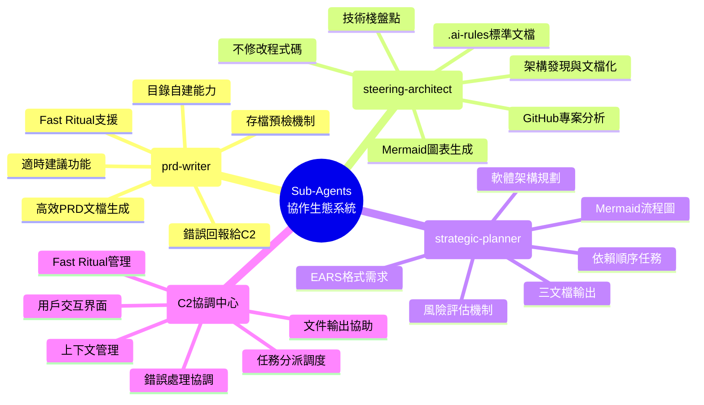
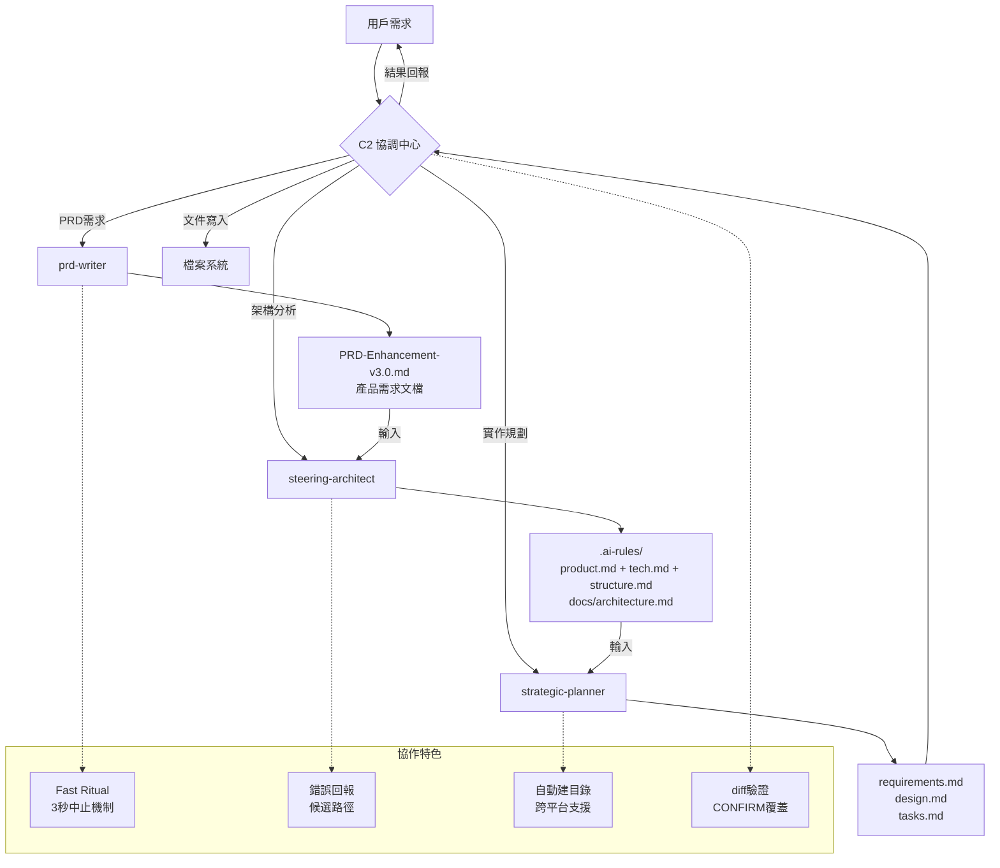

# Sub-Agents 協作心智圖與說明

## 🤖 四個專業 Sub-Agents 協作關係

## 🔄 協作工作流程

## 📋 協作關係詳細說明

### 🎯 **1. prd-writer (產品需求專家)**

**主要職責**：
- 快速產出標準化 PRD 文檔
- 提供適時建議與改進方向
- 支援 EARS 格式與用戶故事
- 自動目錄建立與存檔預檢

**協作模式**：
- **輸入來源**：用戶需求、功能描述、業務目標
- **輸出格式**：PRD-Enhancement-v3.0.md
- **與其他 agents 關係**：為後續 agents 提供產品基礎文檔

**特色功能**：
- Fast Ritual：骨架 → 全文 → 存檔（3秒可中止）
- 存檔預檢：自動建立目錄，失敗時提供候選路徑
- 版本控制：覆蓋前先 diff，需 CONFIRM 確認

### 🏗️ **2. steering-architect (架構發現專家)**

**主要職責**：
- 分析現有專案架構與技術棧
- 產出標準化 .ai-rules 文檔
- 生成系統架構圖與 Mermaid 圖表
- 技術棧盤點與依賴分析

**協作模式**：
- **輸入來源**：專案路徑、GitHub URL、prd-writer 產出
- **輸出格式**：.ai-rules/{product.md, tech.md, structure.md} + docs/architecture.md
- **與其他 agents 關係**：為 strategic-planner 提供架構基礎

**特色功能**：
- 專案來源解析：本機路徑或 GitHub 自動 clone/pull
- 跨平台目錄建立：Python + PowerShell + CMD 三連招
- 架構文檔標準化：統一的 .ai-rules 格式

### 📊 **3. strategic-planner (規劃執行專家)**

**主要職責**：
- 將 PRD 轉換為可執行規格
- 產出 EARS 格式功能需求
- 設計詳細技術規格與 API
- 建立按依賴順序的任務清單

**協作模式**：
- **輸入來源**：prd-writer + steering-architect 產出
- **輸出格式**：requirements.md + design.md + tasks.md
- **與其他 agents 關係**：整合前兩者成果，產出實作藍圖

**特色功能**：
- EARS 格式需求：Event-Action-Response-Stimulus 結構化
- 依賴順序任務：嚴格按依賴關係排列的執行清單
- 風險評估機制：每個文檔末尾附《建議與風險》

### 🎛️ **4. C2 (協調中心)**

**主要職責**：
- 任務分派與調度管理
- Sub-agents 間的上下文傳遞
- 文件輸出協助（解決沙盒問題）
- 錯誤處理與用戶交互

**協作模式**：
- **統一入口**：接收用戶需求，決定調用哪個 agent
- **中介服務**：處理 agents 間的數據流轉
- **文件操作**：代理 agents 進行實際文件寫入
- **結果整合**：統一回報給用戶

**特色功能**：
- Fast Ritual 管理：統一的 3 秒中止機制
- 沙盒問題解決：agents 產出內容，C2 負責實際寫檔
- 錯誤恢復：提供候選路徑與降級策略

## 🌟 協作優勢

### 📈 **效率提升**
- **Fast Ritual**：預設自動執行，關鍵節點可中止
- **並行處理**：不同階段可同時進行
- **錯誤恢復**：失敗時自動提供解決方案

### 🔄 **無縫銜接**
- **標準化輸出**：統一的文檔格式與結構
- **上下文傳遞**：前一個 agent 的輸出成為下一個的輸入
- **版本控制**：diff 機制確保變更透明

### 🛡️ **可靠性保證**
- **存檔預檢**：自動建立目錄，處理權限問題
- **跨平台支援**：Windows、Linux、macOS 通用
- **錯誤回報**：清楚的錯誤訊息與候選解決方案

### 🎯 **專業分工**
- **prd-writer**：專注產品需求與用戶故事
- **steering-architect**：專注架構分析與標準化
- **strategic-planner**：專注執行規劃與任務分解
- **C2**：專注協調管理與用戶交互

## 📊 協作成果展示 (AI Career Assistant 專案)

### 🎯 **prd-writer 產出**
- `docs/PRD-Enhancement-v3.0.md` (最新產品需求)
- n8n + Gemini Multi-Agent 整合需求
- 敏感話題處理機制設計

### 🏗️ **steering-architect 產出**
- `.ai-rules/product.md` (產品願景)
- `.ai-rules/tech.md` (技術棧)
- `.ai-rules/structure.md` (專案結構)
- `docs/architecture.md` (3個 Mermaid 圖表)

### 📊 **strategic-planner 產出**
- `docs/requirements.md` (10+10 EARS 需求)
- `docs/design.md` (API 規格 + Multi-Agent 架構)
- `docs/tasks.md` (35 個開發任務，6個月計劃)

### 🎛️ **C2 協調成果**
- 三件套無縫協作完成
- 從概念到實作的完整規劃
- 660 小時工時估算與風險評估
- 模組化設計與技術債務管理

## 🚀 未來擴展方向

### 🔧 **新增 Agents**
- **task-executor**：執行 tasks.md 中的開發任務
- **test-runner**：自動化測試執行與報告
- **security-auditor**：安全掃描與合規檢查
- **performance-optimizer**：性能分析與優化

### 📈 **協作優化**
- **智能路由**：根據任務類型自動選擇最適合的 agent
- **並行執行**：無依賴的任務可同時執行
- **增量更新**：只更新變更部分，提高效率
- **學習機制**：根據歷史成功率優化協作策略

---

**✨ 總結**：四個 sub-agents 形成了一個完整的協作生態系統，從產品需求到技術實作的全流程覆蓋，展現了 AI 助手協作的巨大潛力！