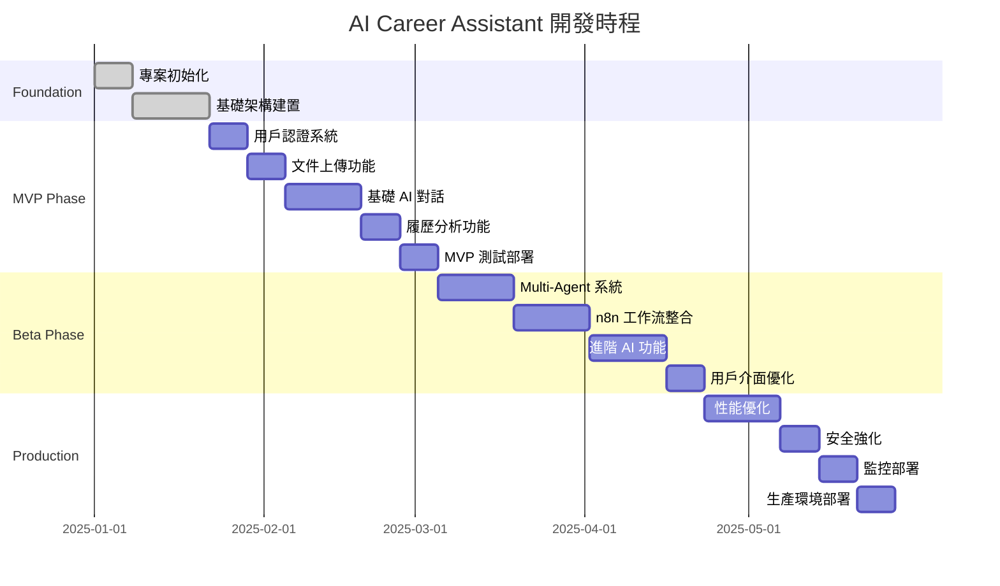
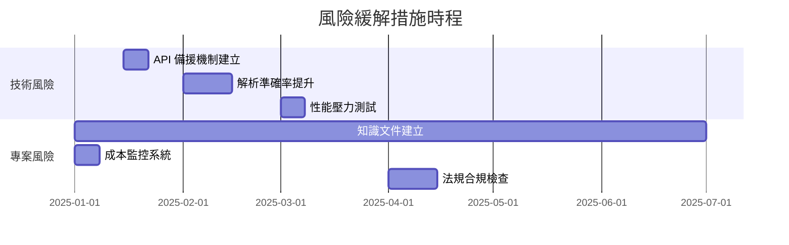

# AI Career Assistant - 開發任務規劃

## 1. 概述

本文檔詳細規劃 AI Career Assistant 的開發任務，按依賴順序排列並分為三個階段：MVP、Beta、Production。

## 2. 專案里程碑

### 階段劃分
- **MVP (Minimum Viable Product)**: 核心功能驗證 (Month 1-2)
- **Beta**: 功能完善與測試 (Month 3-4)  
- **Production**: 優化與部署 (Month 5-6)

### 總體時程

## 3. MVP 階段任務 (Month 1-2)

### 3.1 專案初始化與基礎架構

#### TASK-001: 專案骨架建置
**描述**: 建立專案基礎結構與開發環境
**優先級**: P0 (Critical)
**預估工時**: 16 hours
**負責人**: Tech Lead

**前置條件**:
- GitHub repository 建立
- 開發團隊組建完成

**實作細節**:
- [ ] 建立 monorepo 結構 (使用 Lerna 或 Nx)
- [ ] 設定 TypeScript 配置
- [ ] 建立 ESLint + Prettier 規則
- [ ] 設定 Husky pre-commit hooks
- [ ] 建立 Docker 開發環境
- [ ] 設定 CI/CD pipeline (GitHub Actions)

**驗收標準**:
- [ ] 可使用 `npm run dev` 啟動開發環境
- [ ] 通過 lint 檢查
- [ ] 所有 pre-commit hooks 正常運作
- [ ] Docker compose 可成功啟動所有服務

**技術債務風險**: 低
**阻塞因子**: 無

---

#### TASK-002: 資料庫架構建置
**描述**: 建立 PostgreSQL 資料庫結構與 Redis 快取
**優先級**: P0 (Critical)  
**預估工時**: 12 hours
**負責人**: Backend Developer

**前置條件**:
- TASK-001 完成
- 資料庫設計文檔確認

**實作細節**:
- [ ] 建立 PostgreSQL migration scripts
- [ ] 設定 Prisma ORM 或 TypeORM
- [ ] 建立初始 seed data
- [ ] 設定 Redis 連接與基礎配置
- [ ] 建立備份策略

**驗收標準**:
- [ ] 資料庫 schema 符合設計文檔
- [ ] Migration scripts 可重複執行
- [ ] 所有外鍵約束正確設定
- [ ] Redis 連接正常，支援基本操作

**技術債務風險**: 中
**阻塞因子**: 資料庫設計變更

---

#### TASK-003: 基礎 API 服務架構
**描述**: 建立 Express.js API 服務器基礎架構
**優先級**: P0 (Critical)
**預估工時**: 20 hours  
**負責人**: Backend Developer

**前置條件**:
- TASK-002 完成
- API 設計文檔確認

**實作細節**:
- [ ] 建立 Express.js 應用程式結構
- [ ] 設定中介軟體 (CORS, helmet, compression)
- [ ] 建立錯誤處理機制
- [ ] 設定 API 路由結構
- [ ] 整合資料庫連接
- [ ] 建立健康檢查端點
- [ ] 設定環境變數管理

**驗收標準**:
- [ ] API 服務器可正常啟動
- [ ] 健康檢查端點回應正常
- [ ] 錯誤處理回傳正確的 HTTP 狀態碼
- [ ] 支援 CORS 跨域請求
- [ ] 通過基本負載測試 (100 requests/second)

**技術債務風險**: 低
**阻塞因子**: TASK-002

---

### 3.2 用戶管理系統

#### TASK-004: 用戶認證與授權
**描述**: 實作 JWT 為基礎的用戶認證系統
**優先級**: P0 (Critical)
**預估工時**: 24 hours
**負責人**: Backend Developer

**前置條件**:
- TASK-003 完成
- 安全需求確認

**實作細節**:
- [ ] 實作用戶註冊 API
- [ ] 實作用戶登入 API  
- [ ] 建立 JWT token 生成與驗證
- [ ] 實作 refresh token 機制
- [ ] 建立密碼加密與驗證
- [ ] 設定 rate limiting
- [ ] 實作用戶 session 管理

**驗收標準**:
- [ ] 用戶可成功註冊並收到確認 email
- [ ] 用戶可使用正確憑證登入
- [ ] JWT token 正確包含用戶資訊
- [ ] Refresh token 機制正常運作
- [ ] 錯誤密碼嘗試受到 rate limiting 保護
- [ ] Session 逾期自動登出

**技術債務風險**: 中 (安全相關)
**阻塞因子**: TASK-003

---

#### TASK-005: 用戶個人資料管理
**描述**: 實作用戶個人資料 CRUD 操作
**優先級**: P1 (High)
**預估工時**: 16 hours
**負責人**: Backend Developer

**前置條件**:
- TASK-004 完成

**實作細節**:
- [ ] 建立用戶資料 API endpoints
- [ ] 實作資料驗證 (使用 Joi 或 Yup)
- [ ] 建立資料更新機制
- [ ] 實作頭像上傳功能
- [ ] 建立帳戶刪除機制 (GDPR 合規)

**驗收標準**:
- [ ] 用戶可查看、更新個人資料
- [ ] 輸入驗證正確處理錯誤資料
- [ ] 頭像上傳支援 JPG、PNG 格式
- [ ] 帳戶刪除會清除所有相關資料
- [ ] API 回應時間 < 500ms

**技術債務風險**: 低
**阻塞因子**: TASK-004

---

### 3.3 文件處理系統

#### TASK-006: 文件上傳與儲存
**描述**: 實作安全的文件上傳與雲端儲存
**優先級**: P0 (Critical)
**預估工時**: 18 hours
**負責人**: Backend Developer

**前置條件**:
- TASK-005 完成
- 雲端儲存服務選定

**實作細節**:
- [ ] 建立 multer 文件上傳中介軟體
- [ ] 整合雲端儲存 (AWS S3 或 Azure Blob)
- [ ] 實作文件類型與大小驗證
- [ ] 建立病毒掃描機制
- [ ] 實作文件存取權限控制
- [ ] 建立文件 metadata 儲存

**驗收標準**:
- [ ] 支援 PDF、DOC、DOCX 格式上傳
- [ ] 檔案大小限制 5MB
- [ ] 惡意檔案被正確拒絕
- [ ] 只有檔案擁有者可存取
- [ ] 上傳進度可即時顯示

**技術債務風險**: 中 (安全相關)
**阻塞因子**: TASK-005

---

#### TASK-007: PDF 文件解析
**描述**: 實作 PDF 文件內容提取與結構化
**優先級**: P0 (Critical)
**預估工時**: 22 hours
**負責人**: Backend Developer

**前置條件**:
- TASK-006 完成

**實作細節**:
- [ ] 整合 PDF.js 或 pdf-parse 函式庫
- [ ] 建立文字內容提取功能
- [ ] 實作履歷結構辨識 (姓名、聯絡資訊、經歷等)
- [ ] 建立 OCR 功能 (處理掃描檔)
- [ ] 實作解析結果驗證與糾錯
- [ ] 建立解析進度追蹤

**驗收標準**:
- [ ] 文字型 PDF 解析準確率 > 95%
- [ ] 掃描型 PDF 透過 OCR 解析準確率 > 85%
- [ ] 可正確識別履歷主要區塊 (聯絡資訊、工作經歷、學歷)
- [ ] 解析時間 < 10 秒 (5MB 以下檔案)
- [ ] 解析失敗有明確錯誤訊息

**技術債務風險**: 高 (準確率相關)
**阻塞因子**: TASK-006

---

### 3.4 基礎 AI 對話系統

#### TASK-008: Gemini API 整合
**描述**: 整合 Google Gemini API 進行基本對話
**優先級**: P0 (Critical)
**預估工時**: 16 hours
**負責人**: AI Engineer

**前置條件**:
- TASK-004 完成
- Gemini API 金鑰取得

**實作細節**:
- [ ] 建立 Gemini API 客戶端
- [ ] 實作 API 錯誤處理與重試機制
- [ ] 建立 prompt 模板系統
- [ ] 實作對話歷史管理
- [ ] 建立 API 使用量監控
- [ ] 實作回應品質評估

**驗收標準**:
- [ ] 可成功發送請求至 Gemini API
- [ ] API 錯誤自動重試最多 3 次
- [ ] 對話歷史正確維護 (最多 20 輪)
- [ ] 回應時間 < 5 秒
- [ ] API 使用量不超過每日配額 80%

**技術債務風險**: 中 (外部依賴)
**阻塞因子**: API 金鑰取得

---

#### TASK-009: 基礎聊天介面
**描述**: 建立用戶與 AI 的聊天介面
**優先級**: P1 (High)
**預估工時**: 20 hours
**負責人**: Frontend Developer

**前置條件**:
- TASK-008 完成
- 前端框架選定

**實作細節**:
- [ ] 建立 React 聊天組件
- [ ] 實作 WebSocket 即時通訊
- [ ] 建立訊息歷史顯示
- [ ] 實作打字指示器
- [ ] 建立檔案附件功能
- [ ] 實作對話匯出功能

**驗收標準**:
- [ ] 訊息即時雙向傳遞
- [ ] 支援文字與檔案訊息
- [ ] 對話歷史可捲動查看
- [ ] 響應式設計適配手機
- [ ] 可匯出對話為 PDF

**技術債務風險**: 中 (用戶體驗)
**阻塞因子**: TASK-008

---

### 3.5 履歷分析功能

#### TASK-010: 履歷內容分析
**描述**: 實作 AI 驅動的履歷分析與改善建議
**優先級**: P0 (Critical)
**預估工時**: 26 hours
**負責人**: AI Engineer

**前置條件**:
- TASK-007, TASK-008 完成

**實作細節**:
- [ ] 建立履歷評分演算法
- [ ] 實作技能匹配分析
- [ ] 建立工作經歷評估
- [ ] 實作格式與結構分析
- [ ] 建立改善建議生成
- [ ] 實作行業特定分析

**驗收標準**:
- [ ] 履歷評分範圍 0-100，與人工評估差異 < 15%
- [ ] 可識別至少 500 種技能關鍵字
- [ ] 工作經歷時間軸分析準確率 > 90%
- [ ] 每份履歷提供至少 3 個具體改善建議
- [ ] 分析完成時間 < 30 秒

**技術債務風險**: 高 (AI 準確率)
**阻塞因子**: TASK-007, TASK-008

---

#### TASK-011: MVP 整合測試與部署
**描述**: 整合所有 MVP 功能並部署至測試環境
**優先級**: P0 (Critical)
**預估工時**: 16 hours
**負責人**: DevOps Engineer

**前置條件**:
- TASK-001 到 TASK-010 完成

**實作細節**:
- [ ] 建立 end-to-end 測試套件
- [ ] 設定測試環境部署
- [ ] 建立監控與日誌系統
- [ ] 實作健康檢查與告警
- [ ] 進行負載測試
- [ ] 建立備份與災難復原程序

**驗收標準**:
- [ ] 所有 API 端點通過集成測試
- [ ] 用戶可完整完成註冊→上傳→分析流程
- [ ] 系統可處理 50 個並發用戶
- [ ] 應用程式 99% 可用性
- [ ] 所有錯誤正確記錄與告警

**技術債務風險**: 中 (系統穩定性)
**阻塞因子**: 所有前置任務

---

## 4. Beta 階段任務 (Month 3-4)

### 4.1 Multi-Agent 系統

#### TASK-012: Agent Router 開發
**描述**: 建立智能 Agent 路由與管理系統
**優先級**: P0 (Critical)
**預估工時**: 24 hours
**負責人**: AI Engineer

**前置條件**:
- MVP 階段完成
- Multi-Agent 架構設計確認

**實作細節**:
- [ ] 建立 Agent 註冊與發現機制
- [ ] 實作智能路由演算法
- [ ] 建立 Agent 負載均衡
- [ ] 實作 Agent 健康檢查
- [ ] 建立 Agent 回退機制
- [ ] 實作 Agent 性能監控

**驗收標準**:
- [ ] Agent 路由準確率 > 90%
- [ ] 支援動態 Agent 註冊/註銷
- [ ] Agent 故障自動切換至備用
- [ ] 路由決策時間 < 100ms
- [ ] 支援至少 10 個並發 Agent

**技術債務風險**: 高 (系統複雜度)
**阻塞因子**: MVP 完成

---

#### TASK-013: 專業 Agent 開發
**描述**: 開發職涯諮詢、履歷分析、面試準備等專業 Agent
**優先級**: P0 (Critical)
**預估工時**: 32 hours
**負責人**: AI Engineer

**前置條件**:
- TASK-012 完成

**實作細節**:
- [ ] 開發 Career Advice Agent
- [ ] 開發 Resume Analysis Agent  
- [ ] 開發 Interview Prep Agent
- [ ] 開發 Emotional Support Agent
- [ ] 建立 Agent 間協作機制
- [ ] 實作 Agent 專業知識庫

**驗收標準**:
- [ ] 每個 Agent 專業領域準確率 > 85%
- [ ] Agent 間可有效協作處理複雜問題
- [ ] 回應品質與人工專家差異 < 20%
- [ ] 支援多輪對話上下文記憶
- [ ] 可處理敏感話題 (就業空白期等)

**技術債務風險**: 高 (AI 品質)
**阻塞因子**: TASK-012

---

#### TASK-014: Context Management 系統
**描述**: 建立對話上下文管理與持久化
**優先級**: P1 (High)
**預估工時**: 18 hours
**負責人**: Backend Developer

**前置條件**:
- TASK-013 完成

**實作細節**:
- [ ] 建立對話上下文資料結構
- [ ] 實作上下文壓縮演算法
- [ ] 建立長期記憶機制
- [ ] 實作上下文共享機制
- [ ] 建立隱私保護機制
- [ ] 實作上下文分析與洞察

**驗收標準**:
- [ ] 對話上下文正確維護 > 50 輪
- [ ] 上下文壓縮不損失重要資訊
- [ ] 跨 Agent 上下文共享正常
- [ ] 敏感資訊自動識別與保護
- [ ] 上下文檢索時間 < 200ms

**技術債務風險**: 中 (記憶體使用)
**阻塞因子**: TASK-013

---

### 4.2 n8n 工作流整合

#### TASK-015: n8n 基礎整合
**描述**: 整合 n8n 工作流引擎並建立基礎連接
**優先級**: P1 (High)
**預估工時**: 20 hours
**負責人**: Backend Developer

**前置條件**:
- TASK-011 完成
- n8n 環境建置

**實作細節**:
- [ ] 建立 n8n Docker 容器部署
- [ ] 建立 API 與 n8n 的通訊機制
- [ ] 實作工作流觸發系統
- [ ] 建立工作流狀態監控
- [ ] 實作工作流結果回傳
- [ ] 建立錯誤處理與重試機制

**驗收標準**:
- [ ] 可透過 API 觸發 n8n 工作流
- [ ] 工作流執行狀態即時回報
- [ ] 支援參數化工作流執行
- [ ] 錯誤工作流自動重試 3 次
- [ ] 工作流執行時間 < 2 分鐘

**技術債務風險**: 中 (外部系統依賴)
**阻塞因子**: n8n 環境建置

---

#### TASK-016: 履歷生成工作流
**描述**: 建立 AI 驅動的履歷生成工作流
**優先級**: P0 (Critical)
**預估工時**: 26 hours
**負責人**: AI Engineer + Backend Developer

**前置條件**:
- TASK-015 完成

**實作細節**:
- [ ] 建立履歷模板系統
- [ ] 實作內容客製化邏輯
- [ ] 建立 PDF 生成功能
- [ ] 實作多種格式輸出 (PDF, DOC, HTML)
- [ ] 建立版本控制機制
- [ ] 實作品質檢查流程

**驗收標準**:
- [ ] 支援至少 5 種履歷模板
- [ ] 生成履歷符合目標職位要求
- [ ] PDF 格式正確，可列印
- [ ] 生成時間 < 30 秒
- [ ] 內容品質人工評估 > 80 分

**技術債務風險**: 中 (模板維護)
**阻塞因子**: TASK-015

---

#### TASK-017: 求職信生成工作流
**描述**: 建立個人化求職信生成工作流
**優先級**: P1 (High)
**預估工時**: 22 hours
**負責人**: AI Engineer

**前置條件**:
- TASK-016 完成

**實作細節**:
- [ ] 建立求職信模板庫
- [ ] 實作公司研究功能
- [ ] 建立職位匹配分析
- [ ] 實作個性化內容生成
- [ ] 建立語調調整機制
- [ ] 實作A/B測試框架

**驗收標準**:
- [ ] 求職信針對特定公司與職位客製化
- [ ] 語調符合公司文化
- [ ] 內容長度適中 (300-500 字)
- [ ] 人工評估相關性 > 85%
- [ ] 生成時間 < 20 秒

**技術債務風險**: 中 (內容品質)
**阻塞因子**: TASK-016

---

#### TASK-018: 面試準備工作流
**描述**: 建立個人化面試準備材料生成工作流
**優先級**: P1 (High)
**預估工時**: 24 hours
**負責人**: AI Engineer

**前置條件**:
- TASK-017 完成

**實作細節**:
- [ ] 建立職位分析模組
- [ ] 實作面試問題庫
- [ ] 建立STAR方法答案生成
- [ ] 實作模擬面試功能
- [ ] 建立弱點分析與改善建議
- [ ] 實作進度追蹤系統

**驗收標準**:
- [ ] 針對特定職位生成相關問題
- [ ] 提供STAR格式答案範例
- [ ] 模擬面試包含語音與文字
- [ ] 弱點分析準確識別改善點
- [ ] 準備材料全面性評分 > 85%

**技術債務風險**: 高 (面試準確性)
**阻塞因子**: TASK-017

---

### 4.3 進階 AI 功能

#### TASK-019: 敏感話題處理
**描述**: 實作就業空白期、創傷等敏感話題的智能處理
**優先級**: P0 (Critical)
**預估工時**: 20 hours
**負責人**: AI Engineer

**前置條件**:
- TASK-013 完成

**實作細節**:
- [ ] 建立敏感話題識別模型
- [ ] 實作同理心回應系統
- [ ] 建立選擇性資訊分享機制
- [ ] 實作心理支持回應
- [ ] 建立隱私保護機制
- [ ] 實作專業建議生成

**驗收標準**:
- [ ] 敏感話題識別準確率 > 90%
- [ ] 回應語調溫暖且專業
- [ ] 不強制要求透露敏感資訊
- [ ] 提供實用的應對策略
- [ ] 用戶滿意度 > 85%

**技術債務風險**: 高 (倫理與隱私)
**阻塞因子**: TASK-013

---

#### TASK-020: 智能推薦系統
**描述**: 建立基於用戶資料的職位與技能推薦系統
**優先級**: P1 (High)
**預估工時**: 28 hours
**負責人**: AI Engineer

**前置條件**:
- TASK-019 完成
- 第三方 API 整合

**實作細節**:
- [ ] 整合 LinkedIn、Indeed 等職位 API
- [ ] 建立用戶技能評估模型
- [ ] 實作協同過濾推薦演算法
- [ ] 建立內容基礎推薦系統
- [ ] 實作即時推薦更新
- [ ] 建立推薦解釋機制

**驗收標準**:
- [ ] 職位推薦相關性 > 80%
- [ ] 技能推薦符合職涯發展路徑
- [ ] 推薦更新反映用戶偏好變化
- [ ] 提供推薦理由說明
- [ ] 推薦多樣性避免過濾泡泡

**技術債務風險**: 中 (資料依賴)
**阻塞因子**: 第三方 API 整合

---

### 4.4 用戶介面優化

#### TASK-021: 響應式前端重構
**描述**: 優化前端用戶體驗與響應式設計
**優先級**: P1 (High)
**預估工時**: 24 hours
**負責人**: Frontend Developer

**前置條件**:
- Beta 核心功能完成

**實作細節**:
- [ ] 重構 React 元件結構
- [ ] 實作 PWA 功能
- [ ] 建立無障礙功能 (WCAG 2.1)
- [ ] 優化手機端體驗
- [ ] 實作離線功能
- [ ] 建立主題切換系統

**驗收標準**:
- [ ] 響應式設計適配所有裝置
- [ ] PWA 功能正常 (離線、推送通知)
- [ ] 通過 WCAG 2.1 AA 標準
- [ ] 載入時間 < 3 秒
- [ ] 用戶體驗評分 > 85%

**技術債務風險**: 中 (技術債務清理)
**阻塞因子**: 核心功能穩定

---

#### TASK-022: 進階分析儀表板
**描述**: 建立用戶職涯分析與進度追蹤儀表板
**優先級**: P2 (Medium)
**預估工時**: 20 hours
**負責人**: Frontend Developer

**前置條件**:
- TASK-021 完成

**實作細節**:
- [ ] 建立職涯進度視覺化
- [ ] 實作技能雷達圖
- [ ] 建立目標追蹤系統
- [ ] 實作成就系統
- [ ] 建立資料匯出功能
- [ ] 實作個人化洞察報告

**驗收標準**:
- [ ] 圖表清晰易懂
- [ ] 資料即時更新
- [ ] 支援多種匯出格式
- [ ] 個人化洞察準確有用
- [ ] 載入性能良好 (< 2 秒)

**技術債務風險**: 低 (視覺化為主)
**阻塞因子**: TASK-021

---

#### TASK-023: Beta 整合測試
**描述**: Beta 階段功能整合測試與優化
**優先級**: P0 (Critical)
**預估工時**: 20 hours
**負責人**: QA Engineer

**前置條件**:
- 所有 Beta 功能開發完成

**實作細節**:
- [ ] 建立完整 E2E 測試套件
- [ ] 進行多瀏覽器相容性測試
- [ ] 執行性能與負載測試
- [ ] 進行安全漏洞掃描
- [ ] 執行用戶驗收測試
- [ ] 建立回歸測試套件

**驗收標準**:
- [ ] 所有功能通過 E2E 測試
- [ ] 支援主流瀏覽器 (Chrome, Firefox, Safari, Edge)
- [ ] 系統可處理 200 並發用戶
- [ ] 無嚴重安全漏洞
- [ ] 用戶驗收測試滿意度 > 80%

**技術債務風險**: 中 (測試覆蓋率)
**阻塞因子**: 所有 Beta 功能

---

## 5. Production 階段任務 (Month 5-6)

### 5.1 性能優化

#### TASK-024: 資料庫效能優化
**描述**: 優化資料庫查詢性能與擴展性
**優先級**: P0 (Critical)
**預估工時**: 24 hours
**負責人**: Backend Developer

**前置條件**:
- Beta 測試完成
- 性能瓶頸分析

**實作細節**:
- [ ] 分析慢查詢並優化
- [ ] 建立資料庫索引策略
- [ ] 實作資料庫分區
- [ ] 建立讀寫分離
- [ ] 實作快取策略優化
- [ ] 建立資料庫連接池優化

**驗收標準**:
- [ ] 90% 查詢回應時間 < 100ms
- [ ] 支援 1000 並發資料庫連接
- [ ] 快取命中率 > 80%
- [ ] 資料庫 CPU 使用率 < 70%
- [ ] 查詢性能提升 > 50%

**技術債務風險**: 中 (資料遷移風險)
**阻塞因子**: 性能測試結果

---

#### TASK-025: API 性能優化
**描述**: 優化 API 回應時間與吞吐量
**優先級**: P0 (Critical)
**預估工時**: 20 hours
**負責人**: Backend Developer

**前置條件**:
- TASK-024 完成

**實作細節**:
- [ ] 實作 API 回應快取
- [ ] 優化資料序列化
- [ ] 建立 API 限流機制
- [ ] 實作非同步處理
- [ ] 優化記憶體使用
- [ ] 建立連接池管理

**驗收標準**:
- [ ] API 平均回應時間 < 200ms
- [ ] 支援 500 requests/second
- [ ] 記憶體使用量 < 2GB
- [ ] CPU 使用率 < 60%
- [ ] 99% 請求成功率

**技術債務風險**: 低 (主要為優化)
**阻塞因子**: TASK-024

---

#### TASK-026: 前端性能優化
**描述**: 優化前端載入速度與用戶體驗
**優先級**: P1 (High)
**預估工時**: 18 hours
**負責人**: Frontend Developer

**前置條件**:
- TASK-025 完成

**實作細節**:
- [ ] 實作程式碼分割與懶載入
- [ ] 優化圖片與靜態資源
- [ ] 建立 Service Worker 快取
- [ ] 實作虛擬滾動
- [ ] 優化 bundle 大小
- [ ] 建立預載入機制

**驗收標準**:
- [ ] 首次載入時間 < 2 秒
- [ ] 互動時間 < 1 秒
- [ ] Bundle 大小 < 500KB
- [ ] Lighthouse 效能評分 > 90
- [ ] Core Web Vitals 全部通過

**技術債務風險**: 低 (主要為優化)
**阻塞因子**: TASK-025

---

### 5.2 安全強化

#### TASK-027: 安全漏洞修復
**描述**: 修復安全掃描發現的漏洞並強化安全性
**優先級**: P0 (Critical)
**預估工時**: 16 hours
**負責人**: Security Specialist

**前置條件**:
- 安全掃描報告完成

**實作細節**:
- [ ] 修復 OWASP Top 10 漏洞
- [ ] 實作 SQL 注入防護
- [ ] 強化 XSS 防護
- [ ] 實作 CSRF 防護
- [ ] 建立安全標頭設定
- [ ] 實作輸入驗證強化

**驗收標準**:
- [ ] 無高風險安全漏洞
- [ ] 通過 OWASP ZAP 掃描
- [ ] 所有輸入正確驗證與過濾
- [ ] 安全標頭配置正確
- [ ] 通過滲透測試

**技術債務風險**: 高 (安全相關)
**阻塞因子**: 安全掃描完成

---

#### TASK-028: 資料加密強化
**描述**: 強化敏感資料加密與隱私保護
**優先級**: P0 (Critical)
**預估工時**: 14 hours
**負責人**: Backend Developer

**前置條件**:
- TASK-027 完成

**實作細節**:
- [ ] 實作端到端加密
- [ ] 強化資料庫加密
- [ ] 建立金鑰管理系統
- [ ] 實作資料匿名化
- [ ] 建立審計日誌
- [ ] 實作資料備份加密

**驗收標準**:
- [ ] 敏感資料全部加密儲存
- [ ] 金鑰輪換機制正常
- [ ] 審計日誌完整記錄
- [ ] 備份資料加密保護
- [ ] 通過 GDPR 合規檢查

**技術債務風險**: 中 (加密性能影響)
**阻塞因子**: TASK-027

---

#### TASK-029: 合規性檢查
**描述**: 確保系統符合 GDPR、個資法等法規要求
**優先級**: P1 (High)
**預估工時**: 12 hours
**負責人**: Legal + Tech Lead

**前置條件**:
- TASK-028 完成

**實作細節**:
- [ ] 建立隱私權政策頁面
- [ ] 實作資料可攜權功能
- [ ] 建立被遺忘權機制
- [ ] 實作同意管理系統
- [ ] 建立資料處理記錄
- [ ] 實作資料外洩通報機制

**驗收標準**:
- [ ] 完整的隱私權政策
- [ ] 用戶可匯出個人資料
- [ ] 帳戶刪除清除所有資料
- [ ] 同意紀錄完整保存
- [ ] 資料處理合法性文件化

**技術債務風險**: 低 (主要為文件化)
**阻塞因子**: TASK-028

---

### 5.3 監控與運維

#### TASK-030: 監控系統建置
**描述**: 建立完整的應用監控與告警系統
**優先級**: P0 (Critical)
**預估工時**: 22 hours
**負責人**: DevOps Engineer

**前置條件**:
- Production 環境準備完成

**實作細節**:
- [ ] 建立 Prometheus + Grafana 監控
- [ ] 實作應用性能監控 (APM)
- [ ] 建立日誌聚合系統
- [ ] 實作告警規則與通知
- [ ] 建立健康檢查端點
- [ ] 實作分散式追蹤

**驗收標準**:
- [ ] 監控涵蓋所有關鍵指標
- [ ] 告警及時準確 (< 1 分鐘)
- [ ] 儀表板清晰易懂
- [ ] 日誌可搜尋與分析
- [ ] 性能瓶頸可快速定位

**技術債務風險**: 中 (監控複雜度)
**阻塞因子**: Production 環境

---

#### TASK-031: CI/CD 管道優化
**描述**: 優化持續整合與部署管道
**優先級**: P1 (High)
**預估工時**: 18 hours
**負責人**: DevOps Engineer

**前置條件**:
- TASK-030 完成

**實作細節**:
- [ ] 優化建構時間
- [ ] 實作自動化測試整合
- [ ] 建立藍綠部署機制
- [ ] 實作回滾機制
- [ ] 建立環境一致性檢查
- [ ] 實作安全掃描整合

**驗收標準**:
- [ ] 建構時間 < 5 分鐘
- [ ] 部署時間 < 2 分鐘
- [ ] 零停機時間部署
- [ ] 回滾時間 < 30 秒
- [ ] 自動化測試覆蓋率 > 80%

**技術債務風險**: 低 (主要為優化)
**阻塞因子**: TASK-030

---

#### TASK-032: 備份與災難復原
**描述**: 建立完整的備份與災難復原機制
**優先級**: P0 (Critical)
**預估工時**: 16 hours
**負責人**: DevOps Engineer

**前置條件**:
- TASK-031 完成

**實作細節**:
- [ ] 建立自動化備份機制
- [ ] 實作異地備份
- [ ] 建立災難復原程序
- [ ] 實作備份驗證機制
- [ ] 建立 RTO/RPO 監控
- [ ] 實作備份加密

**驗收標準**:
- [ ] 每日自動備份正常
- [ ] 備份復原測試成功
- [ ] RTO < 4 小時, RPO < 1 小時
- [ ] 備份資料完整性 100%
- [ ] 災難復原文件完整

**技術債務風險**: 高 (資料安全)
**阻塞因子**: TASK-031

---

### 5.4 生產環境部署

#### TASK-033: 生產環境配置
**描述**: 配置生產環境基礎設施
**優先級**: P0 (Critical)
**預估工時**: 24 hours
**負責人**: DevOps Engineer

**前置條件**:
- TASK-032 完成
- 雲端環境帳號建立

**實作細節**:
- [ ] 建立 Kubernetes 叢集
- [ ] 配置負載均衡器
- [ ] 建立 SSL 憑證
- [ ] 配置 CDN
- [ ] 建立資料庫叢集
- [ ] 配置網路安全群組

**驗收標準**:
- [ ] 系統可處理 1000 並發用戶
- [ ] SSL 憑證正確配置
- [ ] CDN 快取正常運作
- [ ] 資料庫高可用性配置
- [ ] 網路安全配置正確

**技術債務風險**: 中 (基礎設施複雜度)
**阻塞因子**: 雲端帳號與權限

---

#### TASK-034: 生產環境部署與測試
**描述**: 執行生產環境部署並進行全面測試
**優先級**: P0 (Critical)
**預估工時**: 20 hours
**負責人**: 全團隊

**前置條件**:
- TASK-033 完成
- 所有功能測試通過

**實作細節**:
- [ ] 執行生產環境部署
- [ ] 進行冒煙測試
- [ ] 執行效能測試
- [ ] 進行安全測試
- [ ] 執行用戶驗收測試
- [ ] 建立運維文件

**驗收標準**:
- [ ] 所有核心功能正常運作
- [ ] 性能指標達標
- [ ] 安全測試通過
- [ ] 用戶可正常使用所有功能
- [ ] 運維文件完整

**技術債務風險**: 高 (上線風險)
**阻塞因子**: 所有前置任務

---

#### TASK-035: 上線後監控與優化
**描述**: 上線後監控系統運行狀況並進行優化
**優先級**: P1 (High)
**預估工時**: 16 hours (持續進行)
**負責人**: 全團隊

**前置條件**:
- TASK-034 完成
- 系統正式上線

**實作細節**:
- [ ] 監控用戶使用行為
- [ ] 分析系統性能指標
- [ ] 收集用戶反饋
- [ ] 修復緊急問題
- [ ] 優化用戶體驗
- [ ] 規劃後續功能

**驗收標準**:
- [ ] 系統穩定運行 (99.9% 可用性)
- [ ] 用戶反饋積極 (滿意度 > 80%)
- [ ] 性能指標穩定
- [ ] 無嚴重 Bug
- [ ] 用戶增長穩定

**技術債務風險**: 低 (主要為監控)
**阻塞因子**: 系統上線

---

## 6. 風險管理與緩解策略

### 6.1 技術風險

| 風險類型 | 可能性 | 影響程度 | 緩解策略 | 負責人 |
|----------|--------|----------|----------|---------|
| Gemini API 限制 | 中 | 高 | 建立多 API 備援機制 | AI Engineer |
| 履歷解析準確率低 | 高 | 高 | 建立人工審核流程 | AI Engineer |
| 資料庫性能瓶頸 | 中 | 中 | 提前進行壓力測試 | Backend Developer |
| 第三方 API 不穩定 | 中 | 中 | 實作重試與降級機制 | Backend Developer |
| 安全漏洞 | 低 | 高 | 定期安全掃描與審計 | Security Specialist |

### 6.2 專案風險

| 風險類型 | 可能性 | 影響程度 | 緩解策略 | 負責人 |
|----------|--------|----------|----------|---------|
| 開發時程延遲 | 中 | 高 | 每週進度檢討與調整 | Project Manager |
| 團隊成員離職 | 低 | 高 | 知識文件化與交接 | Tech Lead |
| 需求變更 | 高 | 中 | 敏捷開發與版本控制 | Product Owner |
| 預算超支 | 中 | 中 | 成本監控與預警機制 | Project Manager |
| 法規變更 | 低 | 高 | 持續關注法規動態 | Legal Advisor |

### 6.3 緩解措施時程

## 7. 成功指標 (KPIs)

### 7.1 技術指標

- **系統可用性**: > 99.9%
- **API 回應時間**: < 200ms (95% 的請求)
- **履歷解析準確率**: > 95%
- **AI 回應品質**: 人工評估 > 85 分
- **同時在線用戶**: > 500 人
- **資料庫查詢時間**: < 100ms (90% 的查詢)

### 7.2 用戶指標

- **用戶註冊率**: > 1000 人/月
- **用戶滿意度**: > 85%
- **功能使用率**: 履歷分析 > 80%, AI 諮詢 > 60%
- **用戶留存率**: 7 天 > 40%, 30 天 > 20%
- **推薦成功率**: > 70%

### 7.3 商業指標

- **開發成本控制**: 不超出預算 20%
- **上市時間**: 按計劃 6 個月內完成
- **技術債務**: < 15% 的程式碼需重構
- **安全事件**: 0 嚴重安全事件
- **合規達成率**: 100% 法規要求符合

## 8. 團隊分工與責任

### 8.1 核心團隊

| 角色 | 負責人 | 主要職責 | 關鍵任務 |
|------|--------|----------|----------|
| Tech Lead | TBD | 技術架構與決策 | TASK-001, TASK-003, TASK-034 |
| AI Engineer | TBD | AI 功能開發 | TASK-008, TASK-010, TASK-013 |
| Backend Developer | TBD | 後端服務開發 | TASK-002, TASK-004, TASK-015 |
| Frontend Developer | TBD | 前端介面開發 | TASK-009, TASK-021, TASK-022 |
| DevOps Engineer | TBD | 基礎設施與部署 | TASK-011, TASK-030, TASK-033 |
| QA Engineer | TBD | 測試與品質保證 | TASK-023, TASK-034 |

### 8.2 支援團隊

| 角色 | 負責人 | 主要職責 | 關鍵任務 |
|------|--------|----------|----------|
| Product Owner | TBD | 產品需求與優先級 | 需求評審, 驗收測試 |
| UX Designer | TBD | 用戶體驗設計 | 介面設計, 用戶測試 |
| Security Specialist | TBD | 安全審查與合規 | TASK-027, TASK-028 |
| Legal Advisor | TBD | 法規合規諮詢 | TASK-029 |

### 8.3 溝通機制

- **每日站會**: 9:00 AM (15 分鐘)
- **週會**: 每週五 2:00 PM (1 小時)
- **Sprint 規劃**: 每兩週一次 (2 小時)
- **技術評審**: 每週三 10:00 AM (1 小時)
- **代碼評審**: 每個 PR 必須經過同儕評審

---

**文檔版本**: v1.0  
**最後更新**: 2025-01-15  
**核准人**: Project Manager  
**下次審查**: 2025-01-22  

**備註**: 
- 所有工時估算包含設計、開發、測試、文件撰寫
- 任務依賴關係可能因技術決策調整
- 風險評估將每週更新