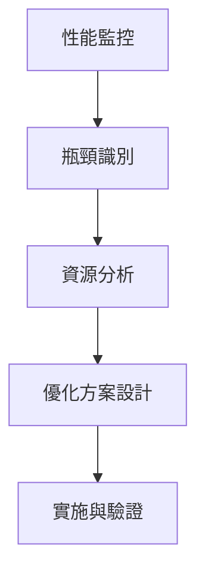

# AI Career Assistant - 階段二架構重構教學指南

**文檔類型**: 教學指南  
**適用對象**: 初學者到中級開發者  
**創建時間**: 2025-08-08  
**教學目標**: 深入理解AI應用架構設計與重構實務

---

## 🎯 學習目標

通過本教學，您將學會：
- 如何分析現有AI應用的架構瓶頸
- 系統性解決架構複雜度問題的方法
- AI服務微服務化的最佳實踐
- 從技術債務預防到架構優化的完整流程

## 📚 前置知識要求

**基礎要求**:
- JavaScript/Node.js基礎語法
- 基本的React開發經驗
- 了解Docker容器化概念
- API設計基礎知識

**進階要求** (建議具備):
- 微服務架構基本概念
- Redis緩存使用經驗
- AI/ML API集成經驗

---

## 🏗️ 第一部分：架構分析與問題識別

### 1.1 現有架構問題診斷

#### 問題一：依賴複雜度過高

**問題描述**:
```yaml
當前狀態: 50+ 依賴包跨越3種語言
影響: 維護負擔重、安全風險高、版本衝突頻繁
```

**教學示例**:
```javascript
// ❌ 問題架構 - 單一服務承載過多責任
const aiService = {
  dependencies: [
    'pytorch', 'transformers', 'opencv-python',
    'pinecone-client', 'faiss-cpu', 'chromadb',
    'pdf-parse', 'mammoth', 'tesseract.js'
  ]
};

// ✅ 優化架構 - 責任分離
const services = {
  resumeParser: ['pdf-parse', 'mammoth'],
  nlpAnalyzer: ['transformers'],
  vectorStore: ['chromadb'], // 選擇單一方案
  imageProcessor: ['tesseract.js']
};
```

**學習重點**:
- 依賴分析工具的使用
- 服務拆分決策框架
- 技術選型的trade-off分析

#### 問題二：資源消耗不均衡

**問題診斷流程**:


**實際數據分析**:
```javascript
// 資源使用分析示例
const resourceAnalysis = {
  frontend: {
    memory: '50MB',
    cpu: '低',
    瓶頸: '打包體積過大'
  },
  backend: {
    memory: '200MB + 50MB/用戶',
    cpu: '中等',
    瓶頸: '並發處理限制'
  },
  aiServices: {
    memory: '4GB',
    cpu: '極高',
    瓶頸: '模型加載時間長'
  }
};
```

### 1.2 架構評分體系

**評分維度與權重**:
```yaml
架構複雜度: 30%
  - 服務間耦合度
  - 依賴關係複雜度
  - 部署複雜度

性能表現: 25%
  - 響應時間
  - 並發處理能力
  - 資源利用效率

安全性: 20%
  - 數據保護措施
  - API安全設計
  - 漏洞風險評估

可維護性: 15%
  - 代碼品質
  - 文檔完整性
  - 測試覆蓋率

可擴展性: 10%
  - 水平擴展能力
  - 模塊化程度
  - 配置靈活性
```

**當前項目評分**:
- 🏗️ **架構設計**: 8/10 (設計完善但複雜度高)
- 🔒 **安全性**: 6/10 (關鍵安全缺口需解決)
- ⚡ **性能**: 5/10 (存在明顯瓶頸)
- 💰 **技術債務風險**: 中高 (需要預防措施)

---

## 🔧 第二部分：重構實施策略

### 2.1 服務拆分策略

#### 拆分原則與實踐

**單一職責原則應用**:
```javascript
// ❌ 違反單一職責 - 一個服務做太多事情
class AIService {
  parseFile() { /* PDF/Word解析 */ }
  extractText() { /* OCR文字提取 */ }
  analyzeResume() { /* AI分析 */ }
  searchJobs() { /* 職缺搜尋 */ }
  calculateMatch() { /* 匹配度計算 */ }
}

// ✅ 符合單一職責 - 每個服務專注一件事
class FileParserService {
  parseFile() { /* 專注檔案解析 */ }
}

class NLPAnalyzerService {
  analyzeResume() { /* 專注文本分析 */ }
}

class JobMatcherService {
  calculateMatch() { /* 專注匹配計算 */ }
}
```

**服務邊界設計**:
```yaml
文件處理服務:
  職責: 檔案上傳、解析、OCR、人像識別
  輸入: 原始檔案
  輸出: 結構化文本數據
  
NLP分析服務:
  職責: 履歷信息提取、技能分析、特徵向量化
  輸入: 結構化文本
  輸出: 分析結果JSON
  
職缺搜尋服務:
  職責: 多平台搜尋、數據清理、去重
  輸入: 搜尋關鍵字
  輸出: 職缺列表
  
推薦引擎服務:
  職責: 匹配計算、排序、結果格式化
  輸入: 分析結果 + 職缺列表
  輸出: 個性化推薦
```

### 2.2 微服務通信設計

#### API Gateway 模式實現

**設計思路**:
```javascript
// API Gateway 統一入口
class APIGateway {
  constructor() {
    this.services = {
      fileParser: new FileParserService(),
      nlpAnalyzer: new NLPAnalyzerService(),
      jobMatcher: new JobMatcherService()
    };
  }

  async processResume(fileData) {
    // 編排微服務調用流程
    try {
      // 1. 文件處理
      const parsedData = await this.services.fileParser
        .parseFile(fileData);
      
      // 2. 並行處理：AI分析 + 職缺搜尋
      const [analysis, jobs] = await Promise.all([
        this.services.nlpAnalyzer.analyze(parsedData.text),
        this.services.jobMatcher.searchJobs(parsedData.keywords)
      ]);
      
      // 3. 結果整合
      const recommendations = await this.services.jobMatcher
        .calculateMatch(analysis, jobs);
      
      return {
        analysis,
        recommendations,
        processTime: Date.now() - startTime
      };
    } catch (error) {
      // 統一錯誤處理
      throw new ServiceError('處理失敗', error);
    }
  }
}
```

**服務間通信協議**:
```yaml
通信方式: HTTP REST API + Redis Pub/Sub
數據格式: JSON
錯誤處理: 統一錯誤碼體系
超時設置: 
  - 文件處理: 30秒
  - AI分析: 60秒
  - 職缺搜尋: 15秒
重試策略: 指數退避，最多重試3次
```

### 2.3 緩存策略優化

#### 多層次緩存架構

**緩存層次設計**:
```javascript
class CacheManager {
  constructor() {
    // L1: 內存緩存 (最快，容量小)
    this.memoryCache = new Map();
    
    // L2: Redis緩存 (快，容量中等)
    this.redisCache = new RedisClient();
    
    // L3: 數據庫 (慢，容量大)
    this.database = new DatabaseClient();
  }

  async get(key) {
    // L1 緩存檢查
    if (this.memoryCache.has(key)) {
      return this.memoryCache.get(key);
    }
    
    // L2 緩存檢查
    const redisResult = await this.redisCache.get(key);
    if (redisResult) {
      // 回填 L1 緩存
      this.memoryCache.set(key, redisResult);
      return redisResult;
    }
    
    // L3 數據庫查詢
    const dbResult = await this.database.query(key);
    if (dbResult) {
      // 回填所有緩存層
      this.redisCache.setex(key, 3600, dbResult);
      this.memoryCache.set(key, dbResult);
    }
    
    return dbResult;
  }
}
```

**緩存策略配置**:
```yaml
用戶檔案緩存:
  TTL: 600秒 (10分鐘)
  策略: LRU淘汰
  容量: 1000個檔案

職缺搜尋緩存:
  TTL: 3600秒 (1小時)
  策略: 熱點數據預加載
  容量: 10000個搜尋結果

AI分析結果:
  TTL: 300秒 (5分鐘)
  策略: 基於相似度的緩存命中
  容量: 500個分析結果
```

---

## 🚀 第三部分：性能優化實踐

### 3.1 並行處理優化

#### 並行處理模式設計

**任務分解策略**:
```javascript
class ParallelProcessor {
  async processResumeOptimized(fileId) {
    const startTime = Date.now();
    
    // 階段1: 文件預處理 (並行)
    const fileData = await this.getFileData(fileId);
    const [textContent, hasImage, metadata] = await Promise.all([
      this.extractText(fileData.buffer),
      this.detectImage(fileData.buffer),
      this.extractMetadata(fileData)
    ]);
    
    // 階段2: AI分析與職缺搜尋 (並行)
    const keywords = this.extractKeywords(textContent);
    const [aiAnalysis, jobResults] = await Promise.all([
      this.analyzeResumeContent(textContent),
      this.searchJobsParallel(keywords)
    ]);
    
    // 階段3: 結果整合與優化
    const recommendations = await this.generateRecommendations(
      aiAnalysis, jobResults, hasImage
    );
    
    // 性能監控
    const processingTime = Date.now() - startTime;
    this.logPerformance('resume_processing', processingTime);
    
    return {
      analysis: aiAnalysis,
      recommendations,
      metadata: {
        processingTime,
        hasImage,
        keywordCount: keywords.length
      }
    };
  }
}
```

**並發控制與資源管理**:
```javascript
// Bull Queue 高級配置
const resumeQueue = new Queue('resume processing', {
  redis: { 
    host: process.env.REDIS_HOST,
    port: process.env.REDIS_PORT,
    maxRetriesPerRequest: 3
  },
  settings: {
    stalledInterval: 30000,    // 30秒檢查一次卡住的任務
    maxStalledCount: 1,        // 最多允許1次卡住
    retryDelayOnFailure: 5000, // 失敗後5秒重試
    removeOnComplete: 10,      // 保留10個完成的任務
    removeOnFail: 5            // 保留5個失敗的任務
  }
});

// 動態並發控制
resumeQueue.process('high-priority', 2, highPriorityProcessor);
resumeQueue.process('normal', 3, normalProcessor);
```

### 3.2 AI模型優化

#### 模型加載策略

**懶加載實現**:
```javascript
class ModelManager {
  constructor() {
    this.loadedModels = new Map();
    this.loadingPromises = new Map();
  }
  
  async getModel(modelType) {
    // 檢查是否已加載
    if (this.loadedModels.has(modelType)) {
      return this.loadedModels.get(modelType);
    }
    
    // 檢查是否正在加載
    if (this.loadingPromises.has(modelType)) {
      return this.loadingPromises.get(modelType);
    }
    
    // 開始加載模型
    const loadingPromise = this.loadModel(modelType);
    this.loadingPromises.set(modelType, loadingPromise);
    
    try {
      const model = await loadingPromise;
      this.loadedModels.set(modelType, model);
      return model;
    } finally {
      this.loadingPromises.delete(modelType);
    }
  }
  
  async loadModel(modelType) {
    const config = this.getModelConfig(modelType);
    console.log(`開始加載模型: ${modelType}`);
    
    const startTime = Date.now();
    const model = await import(config.path);
    const loadTime = Date.now() - startTime;
    
    console.log(`模型 ${modelType} 加載完成，耗時: ${loadTime}ms`);
    return model;
  }
}
```

**模型使用優化**:
```yaml
模型預加載策略:
  核心模型: 應用啟動時加載
    - 文本特徵提取模型
    - 基礎NLP處理模型
  
  專業模型: 首次使用時加載
    - 特定領域技能分析模型
    - 圖像識別模型
    
  實驗模型: 按需加載
    - A/B測試模型
    - 新功能模型

內存管理:
  - LRU緩存策略
  - 定期清理未使用模型
  - 模型版本管理
```

### 3.3 數據庫優化

#### Redis 高性能配置

**連接池與集群配置**:
```javascript
const Redis = require('ioredis');

// Redis 集群配置
const redisCluster = new Redis.Cluster([
  { host: 'redis-node-1', port: 7000 },
  { host: 'redis-node-2', port: 7000 },
  { host: 'redis-node-3', port: 7000 }
], {
  maxRetriesPerRequest: 3,
  retryDelayOnFailure: 100,
  enableOfflineQueue: false,
  lazyConnect: true
});

// 性能優化設置
const redisConfig = {
  // 連接池配置
  maxRetriesPerRequest: 3,
  connectTimeout: 5000,
  lazyConnect: true,
  
  // 性能優化
  keepAlive: 30000,
  maxMemoryPolicy: 'allkeys-lru',
  
  // 持久化配置
  save: '300 10',  // 300秒內有10個更改時保存
  rdbcompression: 'yes'
};
```

**緩存鍵設計模式**:
```javascript
// 分層鍵設計
const cacheKeys = {
  user: {
    file: (userId, fileId) => `user:${userId}:file:${fileId}`,
    analysis: (userId, fileId) => `user:${userId}:analysis:${fileId}`,
    preferences: (userId) => `user:${userId}:preferences`
  },
  
  job: {
    search: (keywordsHash) => `job:search:${keywordsHash}`,
    details: (jobId) => `job:details:${jobId}`,
    trending: () => `job:trending:${this.getDateKey()}`
  },
  
  system: {
    metrics: (date) => `metrics:${date}`,
    config: (version) => `config:${version}`
  }
};

// TTL 分級管理
const cacheTTL = {
  temporary: 300,    // 5分鐘 - 臨時數據
  session: 1800,     // 30分鐘 - 用戶會話
  hourly: 3600,      // 1小時 - 搜尋結果
  daily: 86400,      // 24小時 - 統計數據
  persistent: -1     // 永久 - 配置數據
};
```

---

## 🔒 第四部分：安全性加固

### 4.1 文件處理安全

#### 沙盒化處理實現

**Docker沙盒配置**:
```dockerfile
# 文件處理專用容器
FROM node:18-alpine

# 創建非root用戶
RUN addgroup -g 1001 -S fileprocessor && \
    adduser -S fileprocessor -u 1001

# 安全配置
RUN apk add --no-cache \
    dumb-init \
    tini

# 限制文件系統訪問
VOLUME ["/tmp"]
WORKDIR /app

# 資源限制
USER fileprocessor
ENTRYPOINT ["tini", "--"]
CMD ["node", "file-processor.js"]
```

**安全檢查流程**:
```javascript
class SecureFileProcessor {
  async processFile(fileBuffer, metadata) {
    // 1. 基礎驗證
    await this.validateFileBasics(fileBuffer, metadata);
    
    // 2. 病毒掃描
    await this.scanForMalware(fileBuffer);
    
    // 3. 內容檢查
    await this.validateFileContent(fileBuffer);
    
    // 4. 沙盒處理
    const result = await this.processInSandbox(fileBuffer);
    
    // 5. 內容清理
    return this.sanitizeOutput(result);
  }
  
  async validateFileBasics(buffer, metadata) {
    // 檔案類型白名單檢查
    const allowedTypes = [
      'application/pdf',
      'application/msword',
      'application/vnd.openxmlformats-officedocument.wordprocessingml.document'
    ];
    
    if (!allowedTypes.includes(metadata.mimetype)) {
      throw new SecurityError('不支援的檔案格式');
    }
    
    // 檔案大小檢查
    if (buffer.length > 10 * 1024 * 1024) { // 10MB
      throw new SecurityError('檔案大小超過限制');
    }
    
    // 檔案頭部驗證
    if (!this.verifyFileHeader(buffer, metadata.mimetype)) {
      throw new SecurityError('檔案頭部不匹配');
    }
  }
}
```

### 4.2 API安全設計

#### 認證與授權

**JWT Token 管理**:
```javascript
class AuthService {
  generateToken(user) {
    const payload = {
      userId: user.id,
      role: user.role,
      permissions: user.permissions,
      iat: Math.floor(Date.now() / 1000),
      exp: Math.floor(Date.now() / 1000) + (60 * 60 * 24) // 24小時
    };
    
    return jwt.sign(payload, process.env.JWT_SECRET, {
      algorithm: 'HS256'
    });
  }
  
  async validateToken(token) {
    try {
      const decoded = jwt.verify(token, process.env.JWT_SECRET);
      
      // 檢查Token是否在黑名單中
      if (await this.isTokenBlacklisted(token)) {
        throw new Error('Token已失效');
      }
      
      return decoded;
    } catch (error) {
      throw new AuthError('無效的Token');
    }
  }
}
```

**API Rate Limiting**:
```javascript
const rateLimit = require('express-rate-limit');
const RedisStore = require('rate-limit-redis');

// 分級限流策略
const rateLimiters = {
  // 一般API限制
  general: rateLimit({
    store: new RedisStore({ client: redisClient }),
    windowMs: 15 * 60 * 1000, // 15分鐘
    max: 100, // 最多100次請求
    message: '請求過於頻繁，請稍後再試'
  }),
  
  // 檔案上傳限制
  upload: rateLimit({
    store: new RedisStore({ client: redisClient }),
    windowMs: 60 * 60 * 1000, // 1小時
    max: 10, // 最多10次上傳
    message: '上傳次數達到上限'
  }),
  
  // AI分析限制 (消耗資源較多)
  aiAnalysis: rateLimit({
    store: new RedisStore({ client: redisClient }),
    windowMs: 60 * 60 * 1000, // 1小時
    max: 5, // 最多5次分析
    message: 'AI分析次數達到上限'
  })
};
```

### 4.3 數據保護

#### 敏感信息處理

**數據脫敏實現**:
```javascript
class DataSanitizer {
  sanitizeResumeText(text) {
    return text
      // 身份證號
      .replace(/[A-Z]\d{9}/g, '[身份證號]')
      // 手機號碼
      .replace(/09\d{8}/g, '[手機號碼]')
      // 信用卡號
      .replace(/\b\d{4}[-\s]?\d{4}[-\s]?\d{4}[-\s]?\d{4}\b/g, '[信用卡號]')
      // 電子郵件地址部分遮罩
      .replace(/(\w{2})\w+(@\w+\.\w+)/g, '$1***$2')
      // 地址簡化
      .replace(/\d+號\d*樓之\d*/g, '[地址]');
  }
  
  encryptSensitiveData(data) {
    const algorithm = 'aes-256-gcm';
    const key = crypto.scryptSync(process.env.ENCRYPTION_KEY, 'salt', 32);
    const iv = crypto.randomBytes(16);
    
    const cipher = crypto.createCipher(algorithm, key, iv);
    
    let encrypted = cipher.update(JSON.stringify(data), 'utf8', 'hex');
    encrypted += cipher.final('hex');
    
    const authTag = cipher.getAuthTag();
    
    return {
      encrypted,
      iv: iv.toString('hex'),
      authTag: authTag.toString('hex')
    };
  }
}
```

---

## 📊 第五部分：監控與維護

### 5.1 效能監控實現

#### 全面監控架構

**指標收集系統**:
```javascript
class MetricsCollector {
  constructor() {
    this.metrics = {
      requests: new Map(),
      errors: new Map(),
      performance: new Map(),
      resources: new Map()
    };
  }
  
  trackRequest(endpoint, method, duration, statusCode) {
    const key = `${method}_${endpoint}`;
    const stats = this.metrics.requests.get(key) || {
      count: 0,
      totalDuration: 0,
      errors: 0,
      averageResponseTime: 0
    };
    
    stats.count++;
    stats.totalDuration += duration;
    stats.averageResponseTime = stats.totalDuration / stats.count;
    
    if (statusCode >= 400) {
      stats.errors++;
    }
    
    this.metrics.requests.set(key, stats);
    
    // 異常檢測
    if (duration > 5000) { // 超過5秒
      this.alertSlowRequest(endpoint, duration);
    }
  }
  
  async generateReport() {
    return {
      timestamp: new Date(),
      requests: Object.fromEntries(this.metrics.requests),
      systemHealth: await this.getSystemHealth(),
      alerts: this.getActiveAlerts()
    };
  }
}
```

**健康檢查端點**:
```javascript
app.get('/health', async (req, res) => {
  const health = {
    status: 'healthy',
    timestamp: new Date(),
    services: {}
  };
  
  try {
    // Redis連接檢查
    health.services.redis = await checkRedisHealth();
    
    // AI服務檢查
    health.services.aiService = await checkAIServiceHealth();
    
    // 外部API檢查
    health.services.externalAPIs = await checkExternalAPIs();
    
    // 系統資源檢查
    health.system = {
      memory: process.memoryUsage(),
      cpu: process.cpuUsage(),
      uptime: process.uptime()
    };
    
    // 判斷整體健康狀態
    const allHealthy = Object.values(health.services)
      .every(service => service.status === 'healthy');
    
    health.status = allHealthy ? 'healthy' : 'degraded';
    
  } catch (error) {
    health.status = 'unhealthy';
    health.error = error.message;
  }
  
  const statusCode = health.status === 'healthy' ? 200 : 503;
  res.status(statusCode).json(health);
});
```

### 5.2 日誌系統設計

#### 結構化日誌實現

**日誌分級與格式**:
```javascript
const winston = require('winston');

const logger = winston.createLogger({
  level: process.env.LOG_LEVEL || 'info',
  format: winston.format.combine(
    winston.format.timestamp(),
    winston.format.errors({ stack: true }),
    winston.format.json(),
    winston.format.metadata({ fillExcept: ['message', 'level', 'timestamp'] })
  ),
  transports: [
    // 錯誤日誌
    new winston.transports.File({ 
      filename: 'logs/error.log', 
      level: 'error',
      maxsize: 10485760, // 10MB
      maxFiles: 5
    }),
    
    // 完整日誌
    new winston.transports.File({ 
      filename: 'logs/combined.log',
      maxsize: 10485760,
      maxFiles: 10
    }),
    
    // 控制台輸出 (開發環境)
    ...(process.env.NODE_ENV !== 'production' ? [
      new winston.transports.Console({
        format: winston.format.simple()
      })
    ] : [])
  ]
});

// 用戶行為追蹤
class UserActivityLogger {
  logUserAction(userId, action, metadata = {}) {
    logger.info('用戶操作', {
      type: 'user_action',
      userId,
      action,
      metadata: {
        ...metadata,
        timestamp: new Date(),
        sessionId: metadata.sessionId,
        ip: metadata.ip,
        userAgent: metadata.userAgent
      }
    });
  }
  
  logSystemEvent(event, details) {
    logger.info('系統事件', {
      type: 'system_event',
      event,
      details,
      timestamp: new Date()
    });
  }
}
```

### 5.3 故障處理與恢復

#### 自動故障恢復

**電路熔斷器實現**:
```javascript
class CircuitBreaker {
  constructor(options = {}) {
    this.failureThreshold = options.failureThreshold || 5;
    this.timeout = options.timeout || 60000;
    this.monitoringPeriod = options.monitoringPeriod || 10000;
    
    this.state = 'CLOSED'; // CLOSED, OPEN, HALF_OPEN
    this.failureCount = 0;
    this.lastFailureTime = null;
    this.successCount = 0;
  }
  
  async call(fn) {
    if (this.state === 'OPEN') {
      if (Date.now() - this.lastFailureTime >= this.timeout) {
        this.state = 'HALF_OPEN';
        this.successCount = 0;
      } else {
        throw new Error('服務暫時不可用 - 熔斷器開啟');
      }
    }
    
    try {
      const result = await fn();
      
      if (this.state === 'HALF_OPEN') {
        this.successCount++;
        if (this.successCount >= 3) {
          this.reset();
        }
      }
      
      return result;
    } catch (error) {
      this.recordFailure();
      throw error;
    }
  }
  
  recordFailure() {
    this.failureCount++;
    this.lastFailureTime = Date.now();
    
    if (this.failureCount >= this.failureThreshold) {
      this.state = 'OPEN';
    }
  }
  
  reset() {
    this.state = 'CLOSED';
    this.failureCount = 0;
    this.successCount = 0;
    this.lastFailureTime = null;
  }
}
```

---

## 🎓 第六部分：實戰練習

### 6.1 實踐任務一：服務拆分

**任務描述**: 將現有AI服務拆分成獨立的微服務

**步驟指引**:
1. 分析現有AI服務的功能模塊
2. 設計服務邊界和API接口
3. 實現服務間通信機制
4. 配置Docker容器化部署

**評估標準**:
- [ ] 服務職責單一且明確
- [ ] API接口設計RESTful
- [ ] 錯誤處理完善
- [ ] 性能測試通過

### 6.2 實踐任務二：緩存策略實施

**任務描述**: 實現多層次緩存架構

**關鍵實施點**:
```javascript
// 練習：實現智能緩存管理
class SmartCacheManager {
  async getCachedJobResults(keywords) {
    // TODO: 實現緩存邏輯
    // 1. 檢查本地緩存
    // 2. 檢查Redis緩存
    // 3. 查詢數據庫並更新緩存
  }
  
  async preloadPopularData() {
    // TODO: 實現預加載邏輯
    // 1. 分析熱門搜尋關鍵字
    // 2. 預載職缺數據
    // 3. 更新緩存策略
  }
}
```

### 6.3 實踐任務三：監控系統搭建

**任務目標**: 建立完整的應用監控體系

**技術要求**:
- 實時性能監控
- 異常告警機制
- 日誌聚合分析
- 健康狀態檢查

---

## 📈 學習成果評估

### 技能檢核清單

**基礎架構理解** ✓
- [ ] 能分析微服務架構的優缺點
- [ ] 理解服務拆分的原則和方法
- [ ] 掌握API Gateway設計模式

**性能優化能力** ✓
- [ ] 能設計有效的緩存策略
- [ ] 理解並行處理的實現方法
- [ ] 掌握資源監控和調優技巧

**安全防護意識** ✓
- [ ] 能識別常見的安全風險點
- [ ] 掌握檔案處理安全方法
- [ ] 理解數據保護最佳實踐

**運維監控技能** ✓
- [ ] 能設計完整的監控方案
- [ ] 掌握日誌系統的設計和使用
- [ ] 理解故障處理和恢復機制

### 進階學習建議

**後續學習路徑**:
1. **容器編排**: 學習Kubernetes進行大規模部署
2. **服務網格**: 研究Istio等服務網格技術
3. **AI/ML運維**: 深入了解模型部署和版本管理
4. **雲原生架構**: 學習無服務器和事件驅動架構

**推薦資源**:
- 📚 《微服務設計》- Sam Newman
- 🎥 [雲原生應用開發實戰課程]
- 🛠️ [AI模型部署最佳實踐工作坊]

---

## 💡 總結與反思

### 關鍵收穫

通過本階段的學習，我們完成了從**架構分析**到**重構實施**的完整流程：

1. **問題識別能力**: 學會系統性分析架構問題
2. **解決方案設計**: 掌握微服務拆分和優化方法
3. **實施執行技能**: 具備將設計轉化為代碼的能力
4. **監控維護思維**: 建立全生命週期管理意識

### 最佳實踐總結

**架構設計原則**:
- 單一職責，邊界清晰
- 高內聚，低耦合
- 漸進式演進，避免過度設計

**性能優化策略**:
- 測量驅動的優化決策
- 多層次緩存架構
- 異步並行處理模式

**安全防護體系**:
- 縱深防禦策略
- 零信任安全模型
- 持續安全監控

### 實際應用建議

將所學知識應用到實際項目中時，建議：

1. **循序漸進**: 從最關鍵的問題開始解決
2. **測試驅動**: 確保每個改動都有對應的測試
3. **監控先行**: 在重構前建立完善的監控體系
4. **文檔同步**: 保持文檔與實現的一致性

---

**文檔版本**: v2.0  
**最後更新**: 2025-08-08  
**教學負責人**: SuperClaude Framework  
**適用項目**: AI Career Assistant Phase 2 重構