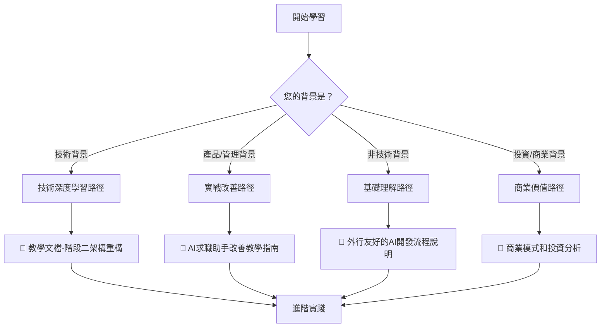

# AI Career Assistant 教學文檔導航手冊

**框架**: SuperClaude教學體系  
**創建時間**: 2025-08-08  
**文檔類型**: 學習路徑導航  
**適用範圍**: 所有學習者和利害關係人

---

## 🧭 學習路徑選擇指南

### 根據您的背景選擇最適合的學習路徑



---

## 📚 文檔地圖和學習順序

### 🎯 路徑一：技術專業深度學習

**目標用戶**: 軟體工程師、系統架構師、技術主管
**學習時間**: 6-8小時深度學習 + 實踐項目
**前置技能**: JavaScript, Node.js, React, 基礎AI/ML概念

#### 學習順序
1. **📘 [教學文檔-階段二架構重構.md](./教學文檔-階段二架構重構.md)**
   - ⏱️ **預估時間**: 3-4小時
   - 🎯 **學習重點**: 微服務架構、性能優化、安全加固
   - 💡 **實踐項目**: 完成服務拆分和緩存策略實施
   
2. **📗 [AI求職助手改善教學指南.md](./AI求職助手改善教學指南.md)** (技術章節)
   - ⏱️ **預估時間**: 2-3小時
   - 🎯 **學習重點**: 代碼優化實戰、監控系統、A/B測試
   - 💡 **實踐項目**: 實施性能監控和用戶行為分析

3. **📋 項目實戰練習**
   - ⏱️ **預估時間**: 8-12小時
   - 🛠️ **實踐內容**: 完整的架構重構項目
   - 📊 **評估標準**: 性能提升、代碼品質、系統穩定性

#### 技能檢核清單
- [ ] 能夠設計微服務架構
- [ ] 掌握性能優化技巧
- [ ] 理解AI系統的架構特點
- [ ] 能夠建立監控和分析體系
- [ ] 具備系統重構的實戰經驗

---

### 🛠️ 路徑二：產品改善實戰路徑

**目標用戶**: 產品經理、項目經理、QA工程師、創業者
**學習時間**: 4-6小時學習 + 改善項目實施
**前置技能**: 基礎技術概念、產品思維、項目管理經驗

#### 學習順序
1. **📙 [外行友好的AI開發流程說明.md](./外行友好的AI開發流程說明.md)** (前半部分)
   - ⏱️ **預估時間**: 1小時
   - 🎯 **學習重點**: 理解AI產品的基本運作原理
   - 💡 **收穫**: 建立AI產品的整體概念

2. **📗 [AI求職助手改善教學指南.md](./AI求職助手改善教學指南.md)**
   - ⏱️ **預估時間**: 3-4小時
   - 🎯 **學習重點**: 問題診斷、用戶體驗優化、數據分析
   - 💡 **實踐項目**: 設計A/B測試和用戶反饋系統

3. **📘 [教學文檔-階段二架構重構.md](./教學文檔-階段二架構重構.md)** (管理章節)
   - ⏱️ **預估時間**: 1-2小時
   - 🎯 **學習重點**: 項目規劃、團隊協作、風險管理
   - 💡 **收穫**: 技術項目管理的最佳實踐

#### 實戰項目建議
- 🎯 **用戶研究項目**: 設計並執行用戶滿意度調查
- 📊 **數據分析項目**: 建立產品關鍵指標監控體系
- 🔄 **改善流程項目**: 實施PDCA持續改善循環
- 🧪 **A/B測試項目**: 設計並執行功能優化測試

#### 技能檢核清單
- [ ] 能夠識別產品痛點和改善機會
- [ ] 掌握用戶體驗分析方法
- [ ] 理解AI產品的特殊性
- [ ] 能夠設計數據驅動的改善方案
- [ ] 具備跨職能團隊協作能力

---

### 🌟 路徑三：基礎理解入門路徑

**目標用戶**: 非技術背景人員、學生、AI興趣者
**學習時間**: 2-3小時輕鬆學習
**前置技能**: 無特殊要求，對AI感興趣即可

#### 學習順序
1. **📙 [外行友好的AI開發流程說明.md](./外行友好的AI開發流程說明.md)**
   - ⏱️ **預估時間**: 2-3小時
   - 🎯 **學習重點**: 用生活化比喻理解AI系統
   - 💡 **收穫**: 建立AI產品的基礎認知

2. **📗 [AI求職助手改善教學指南.md](./AI求職助手改善教學指南.md)** (用戶體驗章節)
   - ⏱️ **預估時間**: 30-60分鐘
   - 🎯 **學習重點**: 從用戶角度理解產品價值
   - 💡 **收穫**: 學會評估AI產品的品質

#### 延伸學習建議
- 🎥 **觀看相關影片**: AI技術科普、產品Demo
- 📱 **實際體驗**: 試用各種AI產品和服務
- 🌐 **關注趨勢**: 訂閱AI行業新聞和趨勢報告
- 💬 **參與討論**: 加入AI學習社群和討論群組

#### 理解檢核清單
- [ ] 能夠用自己的話解釋AI產品的價值
- [ ] 理解AI開發的基本流程
- [ ] 知道如何評估AI產品的品質
- [ ] 了解AI產品的商業模式
- [ ] 對AI技術發展趨勢有基本認知

---

### 💼 路徑四：商業價值分析路徑

**目標用戶**: 投資人、企業高管、商業分析師
**學習時間**: 1-2小時高效學習
**前置技能**: 商業分析思維、財務基礎知識

#### 學習順序
1. **📙 [外行友好的AI開發流程說明.md](./外行友好的AI開發流程說明.md)** (商業章節)
   - ⏱️ **預估時間**: 45-60分鐘
   - 🎯 **學習重點**: 商業模式、市場分析、投資價值
   - 💡 **收穫**: 全面的商業價值評估

2. **📗 [AI求職助手改善教學指南.md](./AI求職助手改善教學指南.md)** (ROI分析部分)
   - ⏱️ **預估時間**: 30分鐘
   - 🎯 **學習重點**: 投資回報計算、風險評估
   - 💡 **收穫**: 量化的投資分析框架

#### 商業分析工具
- 📊 **市場規模分析**: TAM、SAM、SOM模型應用
- 💰 **財務模型**: LTV、CAC、ARPU等關鍵指標
- 🎯 **競爭分析**: 波特五力、SWOT分析
- 📈 **增長策略**: 增長駭客、病毒式行銷

#### 投資評估清單
- [ ] 理解市場機會和規模
- [ ] 掌握商業模式的可行性
- [ ] 評估技術競爭優勢
- [ ] 分析財務預測的合理性
- [ ] 識別主要風險和緩解策略

---

## 🎯 進階學習和專業發展

### 🚀 後續學習建議

#### 技術進階方向
```yaml
AI/ML深化:
  - 自然語言處理(NLP)進階
  - 機器學習模型優化  
  - 推薦系統算法
  - AI模型部署運維

系統架構進階:
  - 雲原生應用設計
  - 微服務治理
  - 分布式系統
  - DevOps最佳實踐

數據工程:
  - 大數據處理技術
  - 實時數據流
  - 數據倉庫設計
  - 商業智能分析
```

#### 產品管理進階
```yaml
用戶研究:
  - 用戶訪談技巧
  - 可用性測試
  - 數據分析方法
  - 用戶心理學

產品策略:
  - 市場定位
  - 競品分析  
  - 產品路線圖
  - 增長策略

團隊管理:
  - 敏捷開發方法
  - 跨職能協作
  - 溝通協調技巧
  - 項目風險管理
```

### 📖 推薦學習資源

#### 📚 書籍推薦
**技術類**:
- 《設計數據密集型應用》- 系統設計經典
- 《機器學習實戰》- AI/ML實踐指南
- 《架構整潔之道》- 軟體架構設計

**產品類**:
- 《精益創業》- 產品開發方法論
- 《用戶體驗要素》- UX設計指南
- 《增長駭客》- 產品增長策略

**商業類**:
- 《商業模式新生代》- 商業模式設計
- 《從0到1》- 創新創業思維
- 《平台革命》- 平台經濟分析

#### 🎥 線上課程
- **Coursera**: AI/ML專項課程、產品管理課程
- **Udemy**: 全端開發、系統設計課程
- **edX**: 計算機科學、商業分析課程
- **LinkedIn Learning**: 專業技能提升課程

#### 🛠️ 實踐工具
```yaml
開發工具:
  - GitHub: 程式碼管理和協作
  - Docker: 容器化部署
  - AWS/Azure: 雲端服務平台
  - Jupyter: 數據分析和AI實驗

產品工具:
  - Figma: UI/UX設計
  - Miro: 流程圖和協作
  - Google Analytics: 數據分析
  - Mixpanel: 用戶行為分析

商業工具:
  - Excel/Google Sheets: 財務建模
  - Tableau: 數據視覺化
  - Notion: 知識管理
  - Zoom: 遠程協作
```

---

## 📞 學習支援和社群

### 🤝 學習社群

#### 線上社群
- **GitHub**: 開源項目貢獻和學習
- **Stack Overflow**: 技術問題討論
- **Reddit**: AI、創業、產品管理版塊
- **LinkedIn**: 專業網路和知識分享

#### 本地社群
- **SITCON**: 學生計算機年會
- **PyConTW**: Python程式語言年會  
- **AgileCommTW**: 敏捷開發社群
- **AIA Taiwan**: 人工智慧協會

### 📧 聯繫方式

**🎓 學習問題諮詢**: learning@ai-career-assistant.com
**💼 商業合作討論**: business@ai-career-assistant.com  
**🛠️ 技術支援**: tech-support@ai-career-assistant.com
**📊 數據和報告**: research@ai-career-assistant.com

---

## 📊 學習成果追蹤

### 🎯 學習檢核表

#### 基礎理解層次
- [ ] 能夠解釋AI求職助手的核心價值
- [ ] 理解基本的產品開發流程
- [ ] 認識主要的技術概念和術語
- [ ] 了解商業模式和市場定位

#### 應用實踐層次  
- [ ] 能夠分析產品的優劣勢
- [ ] 掌握用戶體驗評估方法
- [ ] 理解數據驅動的決策過程
- [ ] 具備基本的項目管理能力

#### 專業精通層次
- [ ] 能夠設計完整的解決方案
- [ ] 掌握先進的技術和工具
- [ ] 具備創新思維和問題解決能力
- [ ] 能夠指導團隊和培訓他人

### 📈 學習成果展示

#### 個人作品集
- 🎨 **設計作品**: UI/UX設計、系統架構圖
- 💻 **代碼項目**: GitHub repository、技術blog
- 📊 **分析報告**: 數據分析、市場研究報告
- 🎤 **分享經驗**: 會議演講、教學workshop

#### 職涯發展
- 🚀 **技術角色**: 資深工程師、架構師、技術主管
- 💼 **產品角色**: 產品經理、項目經理、創業者
- 📈 **商業角色**: 商業分析師、投資分析師、顧問
- 🎓 **教育角色**: 講師、培訓師、技術作家

---

## 🌟 結語：開啟您的AI學習之旅

恭喜您來到AI Career Assistant教學文檔體系！這套完整的學習資源將根據您的背景和目標，提供最適合的學習路徑。

### 💡 學習小貼士

1. **選擇適合的路徑**: 根據自己的背景選擇最適合的學習路徑
2. **循序漸進**: 按照建議順序學習，建立紮實基礎
3. **動手實踐**: 理論學習結合實際項目，提升實戰能力  
4. **持續更新**: AI技術發展快速，保持學習的習慣
5. **分享交流**: 加入學習社群，與同好交流心得

### 🎯 立即行動

現在就選擇您的學習路徑，開始這段精彩的學習之旅吧！

**記住：最好的學習時間就是現在！** 🚀

---

**文檔版本**: v1.0  
**最後更新**: 2025-08-08  
**維護者**: SuperClaude教學團隊  
**授權**: 僅供學習和非商業用途使用

**祝您學習愉快，收穫滿滿！** 🎓✨